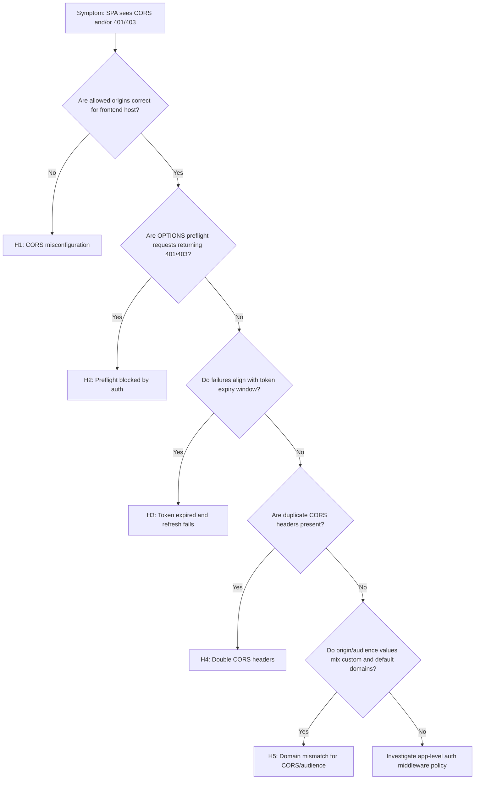
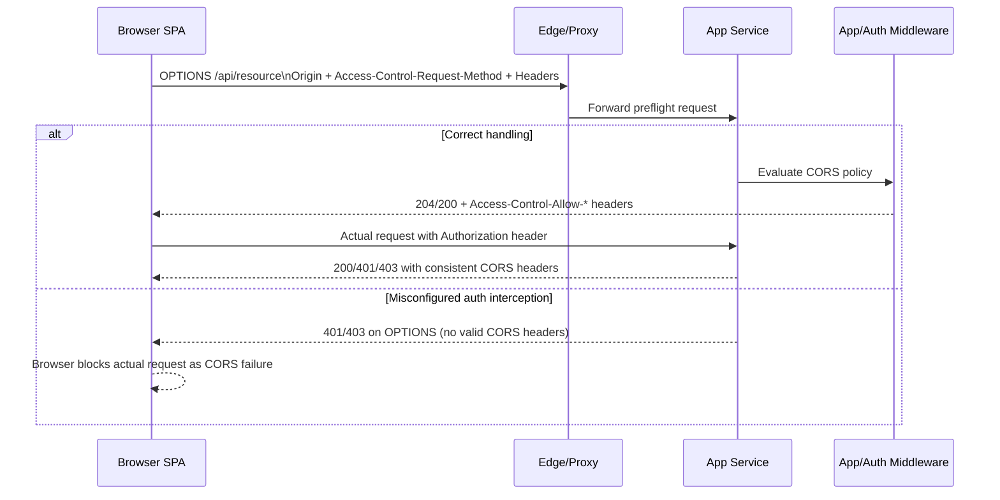
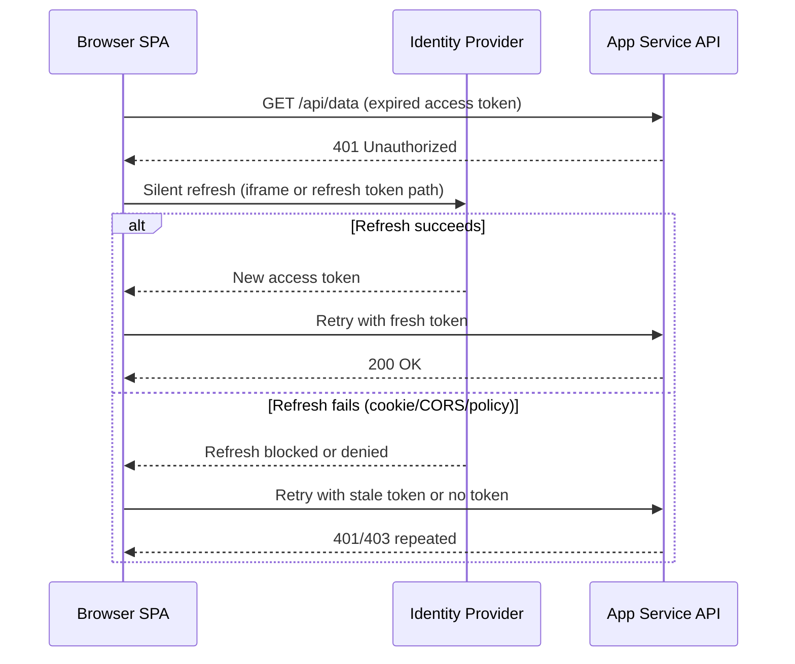

---
content_sources:
  diagrams:
    - id: cors-and-token-errors-flow
      type: flowchart
      source: self-generated
      justification: "Synthesized browser CORS and token-failure decision points from Microsoft Learn guidance on App Service authentication and authorization behavior."
      based_on:
        - https://learn.microsoft.com/en-us/azure/app-service/overview-authentication-authorization
    - id: cors-preflight-auth-flow
      type: sequence
      source: self-generated
      justification: "Synthesized the preflight-versus-auth request path from Microsoft Learn guidance on App Service authentication and authorization."
      based_on:
        - https://learn.microsoft.com/en-us/azure/app-service/overview-authentication-authorization
    - id: token-refresh-failure-flow
      type: sequence
      source: self-generated
      justification: "Synthesized token expiry and refresh failure behavior from Microsoft Learn guidance on App Service authentication and authorization."
      based_on:
        - https://learn.microsoft.com/en-us/azure/app-service/overview-authentication-authorization
content_validation:
  status: verified
  last_reviewed: "2026-04-12"
  reviewer: ai-agent
  core_claims:
    - claim: "App Service Auth or app auth layer challenges OPTIONS before CORS handling."
      source: "https://learn.microsoft.com/azure/app-service/overview-authentication-authorization"
      verified: true
    - claim: "SPA origin and token audience/issuer expectations use different domains (`contoso.com` vs `azurewebsites.net`)."
      source: "https://learn.microsoft.com/azure/app-service/overview-authentication-authorization"
      verified: true
---

# CORS Failures and Token Errors (Azure App Service Linux)

## 1. Summary

### Symptom

A frontend SPA fails to call an API hosted on App Service. Browser console shows CORS failures (for example missing `Access-Control-Allow-Origin`) or requests return unexpected `401/403` despite recent sign-in.

### Why this scenario is confusing

CORS and authentication failures overlap in browser behavior. A preflight rejection can look like an auth problem, and token validation failures can look like CORS policy problems. The same endpoint can fail differently depending on method, headers, credential mode, and token lifetime.

### Troubleshooting decision flow

<!-- diagram-id: cors-and-token-errors-flow -->


### Symptom details

- Browser console reports `Access-Control-Allow-Origin` or preflight errors.
- `OPTIONS` calls fail or do not return expected CORS headers.
- API returns `401` or `403` unexpectedly from SPA, especially after idle periods.
- Same API call may succeed in server-to-server tools but fail in-browser.

### CORS preflight flow with App Service Auth in path

<!-- diagram-id: cors-preflight-auth-flow -->


### Token expiration and refresh failure flow

<!-- diagram-id: token-refresh-failure-flow -->


## 2. Common Misreadings

- "Browser says CORS, so token is fine." (CORS may hide underlying 401/403 auth details.)
- "401 always means expired token." (Could be audience/issuer mismatch or missing credentials mode.)
- "403 means CORS denied." (403 is usually authorization/policy denial after auth pipeline.)
- "Adding `*` to CORS is the safest quick fix." (`*` is incompatible with credentialed requests and can create new failures.)
- "If Postman works, browser should also work." (Browser enforces preflight/CORS; Postman does not.)

### Common Misdiagnoses

- "Browser says CORS, so token is fine." (CORS may hide underlying 401/403 auth details.)
- "401 always means expired token." (Could be audience/issuer mismatch or missing credentials mode.)
- "403 means CORS denied." (403 is usually authorization/policy denial after auth pipeline.)
- "Adding `*` to CORS is the safest quick fix." (`*` is incompatible with credentialed requests and can create new failures.)
- "If Postman works, browser should also work." (Browser enforces preflight/CORS; Postman does not.)

## 3. Competing Hypotheses

- **H1: CORS not configured or misconfigured** — Allowed origins do not include frontend domain, or wildcard (`*`) is combined with credentials.
- **H2: Preflight OPTIONS request blocked by auth** — App Service Auth or app auth layer challenges OPTIONS before CORS handling.
- **H3: Token expired and silent refresh fails** — Access token expires, and refresh path fails due to cookie restrictions or cross-origin policy.
- **H4: Double CORS headers** — Both App Service platform CORS and application middleware emit CORS headers, causing browser rejection.
- **H5: Custom domain vs default domain mismatch** — SPA origin and token audience/issuer expectations use different domains (`contoso.com` vs `azurewebsites.net`).

## 4. What to Check First

### Metrics

- Trend of `OPTIONS` requests by status (`2xx`, `401`, `403`) for affected routes.
- Correlation of `401/403` bursts with token lifetime boundaries.
- Relative error distribution by method (`OPTIONS` vs `GET/POST`) and endpoint.

### Logs

- `AppServiceHTTPLogs` for preflight status behavior and route concentration.
- `AppServiceAuthenticationLogs` for token expiry/audience/issuer and challenge failures.
- Browser network capture for preflight + actual request pair and response headers.

### Platform Signals

- Effective App Service CORS configuration and Easy Auth/auth settings.
- Active hostname strategy (`azurewebsites.net` vs custom domain) across SPA/API.
- Any recent auth/CORS setting changes close to incident start.

## 5. Evidence to Collect

### Required Evidence

- Browser network capture including preflight `OPTIONS` and failing API call pair.
- App Service CORS/auth configuration snapshots.
- `AppServiceHTTPLogs` for `OPTIONS` + `401/403` behavior.
- `AppServiceAuthenticationLogs` for token validation/issuer/audience failures.

### Core commands

```bash
az webapp cors show --resource-group <resource-group> --name <app-name>
az webapp auth show --resource-group <resource-group> --name <app-name>
az webapp config appsettings list --resource-group <resource-group> --name <app-name>
az webapp show --resource-group <resource-group> --name <app-name>
```

### KQL: 401/403 with OPTIONS method

```kusto
AppServiceHTTPLogs
| where TimeGenerated > ago(6h)
| where CsMethod == "OPTIONS"
| summarize total=count(), s401=countif(ScStatus == 401), s403=countif(ScStatus == 403), s2xx=countif(ScStatus between (200 .. 299)) by bin(TimeGenerated, 5m), CsUriStem
| order by TimeGenerated asc
```

```kusto
AppServiceHTTPLogs
| where TimeGenerated > ago(6h)
| where ScStatus in (401, 403)
| summarize hits=count() by CsMethod, CsUriStem, ScStatus
| order by hits desc
```

### KQL: auth/token validation failure patterns

```kusto
AppServiceAuthenticationLogs
| where TimeGenerated > ago(6h)
| where ResultDescription has_any ("token", "expired", "issuer", "audience", "signature", "nonce", "forbidden", "unauthorized")
| summarize failures=count() by ResultDescription, bin(TimeGenerated, 5m)
| order by TimeGenerated asc
```

```kusto
AppServiceAuthenticationLogs
| where TimeGenerated > ago(6h)
| project TimeGenerated, OperationName, ResultDescription
| order by TimeGenerated desc
```

### Sample Log Patterns

> The following patterns are illustrative (synthetic) examples that mirror real-world App Service CORS/token incidents.

### AppServiceHTTPLogs (preflight rejected with 401/403)

```text
[AppServiceHTTPLogs]
2026-04-04T10:31:02Z  OPTIONS  /api/orders   401    38
2026-04-04T10:31:02Z  GET      /api/orders   401    112
2026-04-04T10:31:18Z  OPTIONS  /api/orders   403    44
2026-04-04T10:31:18Z  GET      /api/orders   403    129
2026-04-04T10:32:01Z  OPTIONS  /api/profile  204    16
2026-04-04T10:32:01Z  GET      /api/profile  200    84
```

### AppServiceAuthenticationLogs (token validation failures)

```text
[AppServiceAuthenticationLogs]
2026-04-04T10:31:02Z  ValidateToken  IDX10223: Lifetime validation failed. The token is expired.
2026-04-04T10:31:18Z  ValidateToken  IDX10214: Audience validation failed. Audiences: api://<wrong-api-app-id>
2026-04-04T10:31:19Z  Challenge      Unauthorized due to invalid token.
2026-04-04T10:33:11Z  ValidateToken  Token validation succeeded for audience api://<expected-api-app-id>
```

### Header conflict pattern (browser/network capture)

```text
HTTP/1.1 200 OK
Access-Control-Allow-Origin: https://spa.contoso.com
Access-Control-Allow-Origin: https://staging-spa.contoso.com
Access-Control-Allow-Credentials: true
Vary: Origin
```

!!! tip "How to Read This"
    `OPTIONS` with `401/403` is a strong indicator that preflight is being challenged before CORS handling. Authentication failures (`token expired`, `audience validation failed`) point to auth/token root causes. Duplicate `Access-Control-Allow-Origin` headers indicate double CORS ownership.

### KQL Queries with Example Output

### Query 1: Detect OPTIONS 401/403 spikes by endpoint

```kusto
AppServiceHTTPLogs
| where TimeGenerated > ago(6h)
| where CsMethod == "OPTIONS"
| summarize total=count(), s401=countif(ScStatus == 401), s403=countif(ScStatus == 403), s2xx=countif(ScStatus between (200 .. 299)) by bin(TimeGenerated, 5m), CsUriStem
| order by TimeGenerated asc
```

**Example Output:**

| TimeGenerated | CsUriStem | total | s401 | s403 | s2xx |
|---|---|---|---|---|---|
| 2026-04-04 10:30:00 | /api/orders | 12 | 8 | 3 | 1 |
| 2026-04-04 10:35:00 | /api/orders | 10 | 0 | 0 | 10 |
| 2026-04-04 10:35:00 | /api/profile | 6 | 0 | 0 | 6 |

!!! tip "How to Read This"
    High `s401/s403` on `OPTIONS` indicates preflight/auth pipeline ordering issues (H2). A later return to all `s2xx` usually means policy/middleware alignment was fixed.

### Query 2: Classify 401/403 by method and route

```kusto
AppServiceHTTPLogs
| where TimeGenerated > ago(6h)
| where ScStatus in (401, 403)
| summarize hits=count() by CsMethod, CsUriStem, ScStatus
| order by hits desc
```

**Example Output:**

| CsMethod | CsUriStem | ScStatus | hits |
|---|---|---|---|
| OPTIONS | /api/orders | 401 | 44 |
| GET | /api/orders | 401 | 31 |
| OPTIONS | /api/orders | 403 | 19 |
| GET | /api/admin | 403 | 14 |

!!! tip "How to Read This"
    If `OPTIONS` dominates, treat CORS/preflight handling as first suspect. If only `GET/POST` fail with `403` while `OPTIONS` is healthy, shift focus to role/claim authorization policy.

### Query 3: Token error signatures in auth logs

```kusto
AppServiceAuthenticationLogs
| where TimeGenerated > ago(6h)
| where ResultDescription has_any ("expired", "audience", "issuer", "signature", "unauthorized", "forbidden")
| summarize failures=count() by bin(TimeGenerated, 5m), ResultDescription
| order by TimeGenerated asc
```

**Example Output:**

| TimeGenerated | ResultDescription | failures |
|---|---|---|
| 2026-04-04 10:30:00 | IDX10223: Lifetime validation failed. The token is expired. | 27 |
| 2026-04-04 10:30:00 | IDX10214: Audience validation failed. | 11 |
| 2026-04-04 10:35:00 | Unauthorized due to invalid token. | 6 |

!!! tip "How to Read This"
    Expired-token clusters aligned with token TTL support H3. Audience/issuer errors support H5 (domain/audience mismatch) more than pure CORS misconfiguration.

### CLI Investigation Commands

```bash
# Check platform CORS configuration
az webapp cors show --resource-group <resource-group> --name <app-name> --output json

# Check App Service authentication/authorization config
az webapp auth show --resource-group <resource-group> --name <app-name> --output json

# Inspect app settings that commonly impact auth flows
az webapp config appsettings list --resource-group <resource-group> --name <app-name> --query "[?name=='WEBSITE_AUTH_ENABLED' || name=='WEBSITE_AUTH_DEFAULT_PROVIDER' || contains(name, 'AUTH_')].{name:name,value:value}" --output table
```

**Example Output:**

```text
allowedOrigins
-------------------------------------------------
https://spa.contoso.com
https://admin.contoso.com

globalValidation
-----------------------------------------------
{"requireAuthentication": true, "unauthenticatedClientAction": "Return401"}

Name                              Value
--------------------------------  -----------------------------
WEBSITE_AUTH_ENABLED              True
WEBSITE_AUTH_DEFAULT_PROVIDER     AzureActiveDirectory
WEBSITE_AUTH_ALLOWED_AUDIENCES    api://<expected-api-app-id>
```

!!! tip "How to Read This"
    Validate exact origin strings (scheme + host + port). Then validate auth audience/issuer expectations. CORS and token settings must match the same domain and API identity strategy.

### Normal vs Abnormal Comparison

| Signal | Normal | Abnormal (CORS/token incident) |
|---|---|---|
| OPTIONS preflight status | Mostly 200/204 | Frequent 401/403 |
| Access-Control-Allow-Origin | Single origin value matching request origin | Missing, wrong, or duplicated/conflicting values |
| GET/POST with valid token | 200/2xx expected | 401 (expired/invalid token) or 403 (policy/role denial) |
| Auth log signatures | Occasional normal validation entries | Repeated `expired`, `audience`, `issuer`, or `invalid token` failures |
| Browser behavior | API response visible in network panel | Browser blocks response as CORS error despite backend 401/403 details |
| Interpretation | CORS and auth contract aligned | Preflight/auth sequencing issue, token issue, or both |

## 6. Validation and Disproof by Hypothesis

### H1: CORS not configured or misconfigured

- **Signals that support**
    - Frontend origin missing from allowed origins.
    - `*` configured while requests use credentials (cookies or auth headers) and browser rejects response.
    - Preflight response lacks expected `Access-Control-Allow-*` fields.
- **Signals that weaken**
    - Allowed origins exactly match active SPA origin(s), including scheme and port.
    - Preflight succeeds with correct headers and status.
- **What to verify**
    1. Compare browser `Origin` to exact configured origins.
    2. Validate credential mode and CORS policy compatibility.

### H2: Preflight OPTIONS blocked by auth

- **Signals that support**
    - `OPTIONS` requests return `401/403` while `GET/POST` behavior differs.
    - Auth logs show challenge or unauthorized outcomes for preflight endpoints.
    - Temporarily bypassing auth for OPTIONS resolves CORS failure.
- **Signals that weaken**
    - OPTIONS consistently returns 2xx with proper CORS headers.
    - No auth events associated with preflight timing.
- **What to verify**
    1. Query `AppServiceHTTPLogs` for OPTIONS status distribution.
    2. Confirm request pipeline allows preflight before auth challenge logic.

### H3: Token expired and silent refresh fails

- **Signals that support**
    - Failures spike at token lifetime boundaries.
    - Auth logs show expired token or refresh-related failures.
    - Browser indicates blocked third-party cookie/silent refresh path.
- **Signals that weaken**
    - Fresh token acquisition works and API still returns 401/403.
    - Failures occur immediately after interactive login without expiry relation.
- **What to verify**
    1. Correlate 401 bursts to access token expiry interval.
    2. Validate refresh flow requirements (cookie policy, redirect URI, CORS allowances).

### H4: Double CORS headers

- **Signals that support**
    - Response contains duplicate or conflicting `Access-Control-Allow-Origin` headers.
    - Platform CORS and app middleware both enabled.
    - Browser rejects despite apparent allowed origin.
- **Signals that weaken**
    - Only one CORS authority emits headers consistently.
    - No duplicate header evidence in network trace.
- **What to verify**
    1. Inspect raw response headers in browser and server logs.
    2. Disable one CORS layer and retest.

### H5: Custom domain vs default domain mismatch

- **Signals that support**
    - SPA runs on custom domain, but API audience/issuer or CORS origins point to `azurewebsites.net` only.
    - Tokens minted for one audience are sent to another-domain API endpoint.
    - Failures disappear when hostnames are aligned end-to-end.
- **Signals that weaken**
    - Origin, audience, and endpoint host all use consistent domain strategy.
    - Token validation passes for same domain endpoints.
- **What to verify**
    1. Compare SPA origin, API URL, token audience, and issuer values.
    2. Ensure CORS origins and auth audiences cover active production hostnames only.

## 7. Likely Root Cause Patterns

- **Preflight is challenged before CORS handling**: `OPTIONS` receives `401/403`, browser reports CORS failure, and actual API call is blocked in-browser.
- **Auth token lifecycle mismatch**: access tokens expire and silent refresh fails due to cookie/CORS/session constraints, producing repeated `401/403`.
- **Domain/audience contract drift**: SPA origin, API host, token audience/issuer, and CORS origin list are not aligned end-to-end.
- **Dual CORS ownership**: platform CORS and app middleware both emit CORS headers, causing duplicate/conflicting header behavior.

## 8. Immediate Mitigations

- **For H1**: Add exact frontend origin(s), remove invalid wildcard-with-credentials pattern, and redeploy policy.
- **For H2**: Exempt OPTIONS preflight from auth challenge or reorder middleware so CORS preflight is processed first.
- **For H3**: Reduce token lifetime mismatch effects, harden refresh flow, and fix cookie/CORS conditions required for silent refresh.
- **For H4**: Use a single CORS authority (platform or app), not both.
- **For H5**: Align custom domain strategy across SPA origin, API endpoint, token audience, and CORS configuration.

## 9. Prevention

- Treat CORS and auth as one contract in deployment validation (origin, audience, issuer, credential mode).
- Add automated preflight tests for critical endpoints and headers (`Authorization`, custom headers, credentials).
- Monitor `OPTIONS` 401/403 trends and token validation failures with alerts.
- Keep domain migration runbooks explicit: default domain and custom domain must not be mixed unintentionally.
- Version-control CORS and auth config with environment-specific review gates.

## See Also

### Related Labs

- No dedicated lab for this scenario.

- [Intermittent 5xx Under Load](intermittent-5xx-under-load.md)
- [Slow Response but Low CPU](slow-response-but-low-cpu.md)
- [Troubleshooting KQL Queries](../../kql/index.md)

## Sources

- [Configure CORS in Azure App Service](https://learn.microsoft.com/en-us/azure/app-service/app-service-web-tutorial-rest-api)
- [Authentication and authorization in Azure App Service](https://learn.microsoft.com/en-us/azure/app-service/overview-authentication-authorization)
- [Use OAuth 2.0 authorization code flow with Microsoft identity platform](https://learn.microsoft.com/en-us/entra/identity-platform/v2-oauth2-auth-code-flow)
- [Browser cookies and SameSite guidance for identity scenarios](https://learn.microsoft.com/en-us/entra/identity-platform/howto-handle-samesite-cookie-changes-chrome-browser)
- [Troubleshoot HTTP 401 and 403 errors in Azure App Service](https://learn.microsoft.com/en-us/troubleshoot/azure/app-service/diagnostic-information)
