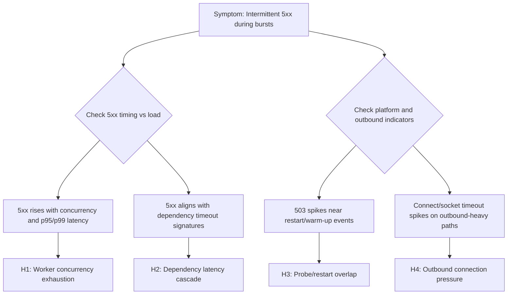

---
hide:
  - toc
title: Intermittent 5xx Under Load
slug: intermittent-5xx-under-load
doc_type: playbook
section: troubleshooting
topics:
  - performance
  - 5xx
  - load
products:
  - azure-app-service
prerequisites:
  - mental-model
  - request-lifecycle
related:
  - memory-pressure-and-worker-degradation
  - slow-response-but-low-cpu
validated_by_lab:
  - lab-intermittent-5xx
investigated_with_kql:
  - 5xx-trend-over-time
  - latency-vs-errors
evidence:
  - kql
  - metrics
summary: Diagnose 5xx errors that appear under load but not at baseline traffic.
status: stable
last_reviewed: 2026-04-08
---
# Intermittent 5xx Under Load (Azure App Service Linux)

## 1. Summary

### Symptom
HTTP 500/502/503 errors appear intermittently during moderate-to-high concurrency or burst traffic, then recover without manual intervention. At low traffic, endpoints may look healthy and error-free.

### Why this scenario is confusing
Intermittent behavior encourages false conclusions: "it fixed itself," "scale is fine," or "not reproducible." In App Service Linux, transient 5xx can come from multiple layers (app worker model, outbound dependencies, platform health/restart behavior), so a single metric like CPU rarely explains the full failure pattern.

### Troubleshooting decision flow


## 2. Common Misreadings

- "The app is healthy now, so the incident is closed" (ignores burst-only failure modes).
- "If 5xx is intermittent, it must be external" (can still be local worker starvation).
- "No sustained CPU saturation means no capacity issue" (I/O wait and queueing can fail requests first).
- "502 always means gateway problem" (often upstream app timeout/reset under dependency stalls).

### Common Misdiagnoses

- "`499` means Azure platform dropped requests." (it usually means client disconnected while waiting)
- "200 on `/diag/env` proves no load issue." (other endpoints can still queue and time out)
- "No explicit `WORKER TIMEOUT` line means workers are fine." (HTTP latency/abort signatures can prove saturation)
- "Increase retries in clients to fix it." (can amplify worker exhaustion under burst)
- "Scale-out alone is enough." (without worker/path tuning, bursts can still saturate each instance)

## 3. Competing Hypotheses

- **H1: Worker concurrency exhaustion under burst traffic** (Gunicorn workers/threads saturated, queueing and timeout spillover).
- **H2: Dependency latency cascade** (DB/API/Redis/Key Vault timeout chain leading to app exceptions and 502/500 outcomes).
- **H3: Platform health probe and restart overlap** (temporary unhealthy state, startup/warmup gaps, resulting in intermittent 503).
- **H4: Outbound connection pressure (including SNAT-like behavior)** (high outbound churn, connect/read timeouts, and transient upstream failures).

## 4. What to Check First

### Metrics
- Request count vs 5xx rate by 1-minute bins during the exact incident window.
- App Service Plan CPU and memory trends (same period) to separate compute pressure from queueing/I/O issues.
- Instance count and scale activity timing relative to first 5xx spike.

### Logs
- `AppServiceHTTPLogs`: status distribution (500/502/503), paths, user agents, and `TimeTaken` tail behavior.
- `AppServiceConsoleLogs`: worker timeout, connection timeout, dependency exceptions, process restart messages.
- Timestamp alignment between 5xx bursts and latency spikes.

### Platform Signals
- `AppServicePlatformLogs`: container restarts, health check events, recycle/start operations, instance transitions.
- Diagnose and Solve Problems detectors for restart frequency and outbound connectivity indicators.
- Recent deployment and config changes that overlap with first occurrence.

## 5. Evidence to Collect

### Required Evidence
- KQL timeline from `AppServiceHTTPLogs` showing per-status counts and latency percentiles.
- KQL evidence from `AppServiceConsoleLogs` for timeout/reset/worker failures.
- KQL timeline from `AppServicePlatformLogs` to correlate restart/probe transitions.
- Azure CLI outputs for web app config and app settings affecting workers/timeouts/health checks.

### Useful Context
- Runtime stack and startup command (Gunicorn flags, workers, threads, timeout).
- Dependency call profile (which endpoints call external services and expected response budgets).
- App Service Plan sharing model (single app vs multiple noisy neighbors).

### Sample Log Patterns

### AppServiceHTTPLogs (intermittent-5xx lab)

```text
[AppServiceHTTPLogs]
2026-04-04T11:23:25Z  GET  /diag/env    200  7
2026-04-04T11:23:25Z  GET  /diag/stats  200  21735
2026-04-04T11:21:55Z  GET  /slow        499  4918
2026-04-04T11:21:55Z  GET  /slow        499  4913
2026-04-04T11:21:55Z  GET  /slow        499  4908
2026-04-04T11:21:55Z  GET  /slow        499  4890
2026-04-04T11:21:55Z  GET  /slow        499  4886
2026-04-04T11:21:55Z  GET  /slow        499  4877
```

### AppServiceConsoleLogs (intermittent-5xx lab)

```text
[AppServiceConsoleLogs]
2026-04-04T11:14:18Z  Error  [2026-04-04 11:14:18 +0000] [1891] [INFO] Starting gunicorn 24.1.1
2026-04-04T11:14:18Z  Error  [2026-04-04 11:14:18 +0000] [1891] [INFO] Listening at: http://0.0.0.0:8000 (1891)
2026-04-04T11:14:18Z  Error  [2026-04-04 11:14:18 +0000] [1891] [INFO] Using worker: sync
2026-04-04T11:14:18Z  Error  [2026-04-04 11:14:18 +0000] [1892] [INFO] Booting worker with pid: 1892
2026-04-04T11:14:18Z  Error  [2026-04-04 11:14:18 +0000] [1893] [INFO] Booting worker with pid: 1893
```

!!! tip "How to Read This"
    `499` responses near ~4.9 seconds on `/slow` indicate clients gave up waiting before the app completed work. Combined with sync workers and only three worker processes, this is strong evidence of H1 (worker concurrency exhaustion) under burst traffic.

### KQL Queries with Example Output

### Query 1: Identify timeout-like client disconnect pattern on hot endpoint

```kusto
AppServiceHTTPLogs
| where TimeGenerated between (datetime(2026-04-04 11:21:50) .. datetime(2026-04-04 11:22:05))
| where CsUriStem == "/slow"
| project TimeGenerated, CsMethod, CsUriStem, ScStatus, TimeTaken
| order by TimeGenerated desc
```

**Example Output:**

| TimeGenerated | CsMethod | CsUriStem | ScStatus | TimeTaken |
|---|---|---|---|---|
| 2026-04-04 11:21:55 | GET | /slow | 499 | 4918 |
| 2026-04-04 11:21:55 | GET | /slow | 499 | 4913 |
| 2026-04-04 11:21:55 | GET | /slow | 499 | 4908 |
| 2026-04-04 11:21:55 | GET | /slow | 499 | 4890 |
| 2026-04-04 11:21:55 | GET | /slow | 499 | 4886 |
| 2026-04-04 11:21:55 | GET | /slow | 499 | 4877 |

!!! tip "How to Read This"
    This is a queueing/latency signature, not random platform noise. Repeated same-second `499` near a consistent timeout boundary means requests are waiting too long and clients abort.

### Query 2: Compare fast diagnostic route vs blocked diagnostic route

```kusto
AppServiceHTTPLogs
| where TimeGenerated between (datetime(2026-04-04 11:23:20) .. datetime(2026-04-04 11:23:30))
| where CsUriStem in ("/diag/env", "/diag/stats")
| project TimeGenerated, CsMethod, CsUriStem, ScStatus, TimeTaken
| order by TimeGenerated desc
```

**Example Output:**

| TimeGenerated | CsMethod | CsUriStem | ScStatus | TimeTaken |
|---|---|---|---|---|
| 2026-04-04 11:23:25 | GET | /diag/env | 200 | 7 |
| 2026-04-04 11:23:25 | GET | /diag/stats | 200 | 21735 |

!!! tip "How to Read This"
    Same timestamp, same app, radically different latency. This supports endpoint-specific blocking behavior (and worker occupancy), not complete platform unavailability.

### Query 3: Confirm worker model and worker count from console logs

```kusto
AppServiceConsoleLogs
| where TimeGenerated between (datetime(2026-04-04 11:14:15) .. datetime(2026-04-04 11:14:25))
| where ResultDescription has_any ("Using worker", "Booting worker", "Starting gunicorn", "Listening at")
| project TimeGenerated, Level, ResultDescription
| order by TimeGenerated asc
```

**Example Output:**

| TimeGenerated | Level | ResultDescription |
|---|---|---|
| 2026-04-04 11:14:18 | Error | [2026-04-04 11:14:18 +0000] [1891] [INFO] Starting gunicorn 24.1.1 |
| 2026-04-04 11:14:18 | Error | [2026-04-04 11:14:18 +0000] [1891] [INFO] Listening at: http://0.0.0.0:8000 (1891) |
| 2026-04-04 11:14:18 | Error | [2026-04-04 11:14:18 +0000] [1891] [INFO] Using worker: sync |
| 2026-04-04 11:14:18 | Error | [2026-04-04 11:14:18 +0000] [1892] [INFO] Booting worker with pid: 1892 |
| 2026-04-04 11:14:18 | Error | [2026-04-04 11:14:18 +0000] [1893] [INFO] Booting worker with pid: 1893 |

!!! tip "How to Read This"
    Only three sync workers means at most three requests can execute concurrently per instance without queue delay. Bursty `/slow` traffic will quickly saturate this model and surface timeout-driven failures.

### CLI Investigation Commands

```bash
# Validate runtime stack and startup command (worker model evidence)
az webapp config show --resource-group <resource-group> --name <app-name> --query "{linuxFxVersion:linuxFxVersion,appCommandLine:appCommandLine,alwaysOn:alwaysOn}" --output table

# Check worker and timeout-related app settings
az webapp config appsettings list --resource-group <resource-group> --name <app-name> --query "[?name=='PYTHON_GUNICORN_CUSTOM_THREAD_NUM' || name=='GUNICORN_CMD_ARGS' || name=='WEBSITES_PORT' || name=='WEBSITES_CONTAINER_START_TIME_LIMIT'].{name:name,value:value}" --output table

# Inspect scale and plan context for burst periods
az webapp show --resource-group <resource-group> --name <app-name> --query "{state:state,serverFarmId:serverFarmId,hostNames:hostNames}" --output table
```

**Example Output:**

```text
LinuxFxVersion    AppCommandLine                               AlwaysOn
----------------  -------------------------------------------  --------
PYTHON|3.11       gunicorn --bind 0.0.0.0:8000 src.app:app    True

Name                              Value
--------------------------------  ----------------------------
GUNICORN_CMD_ARGS                 --workers 3 --worker-class sync --timeout 30
WEBSITES_PORT                     8000
WEBSITES_CONTAINER_START_TIME_LIMIT 230

State    ServerFarmId                                                     HostNames
-------  ---------------------------------------------------------------  -------------------------------------------
Running  /subscriptions/<subscription-id>/resourceGroups/<resource-group>/providers/Microsoft.Web/serverfarms/<plan-name>  <app-name>.azurewebsites.net
```

!!! tip "How to Read This"
    If command/settings confirm low sync-worker concurrency and logs show timeout-like request behavior, prioritize H1 mitigations first (worker model tuning, request-path optimization, and burst handling).

### Normal vs Abnormal Comparison

| Signal | Normal Under Burst | Intermittent 5xx Under Load (This Pattern) |
|---|---|---|
| `/slow` status mix | Mostly 200/206 with bounded latency | Frequent `499` near ~4.9 seconds |
| Endpoint latency spread | Heavy endpoints slower but controlled | Extreme divergence (`/diag/env` 7 ms vs `/diag/stats` 21735 ms) |
| Gunicorn worker model impact | Sufficient concurrency headroom | Sync workers exhausted under spikes |
| Failure shape | Gradual degradation, recoverable with autoscale | Sudden timeout/abort bursts during concurrency spikes |
| Root-cause direction | Dependency or traffic growth investigation | Concurrency exhaustion (H1) is primary lead |

## 6. Validation and Disproof by Hypothesis

### H1: Worker concurrency exhaustion under burst traffic
- **Signals that support**
    - 5xx rises when request volume/concurrency rises, especially with increased p95/p99 `TimeTaken`.
    - Console logs show worker timeout/restart/backlog-style messages.
    - CPU is moderate while latency and timeout exceptions climb.
    - Failures concentrate on endpoints with longer synchronous request paths.
- **Signals that weaken**
    - 5xx appears even at low request volume with no queueing pattern.
    - No worker timeout or backlog indicators in console logs.
    - Failures are uniform across all endpoints including very fast/static ones.
- **What to verify**
    - KQL (status and latency under load):
    ```kusto
    AppServiceHTTPLogs
    | where TimeGenerated > ago(6h)
    | summarize total=count(), err5xx=countif(ScStatus >= 500 and ScStatus < 600), p95=percentile(TimeTaken,95), p99=percentile(TimeTaken,99) by bin(TimeGenerated, 1m)
    | extend errPct = todouble(err5xx) * 100.0 / iif(total == 0, 1, total)
    | order by TimeGenerated asc
    ```
    - KQL (worker timeout signals):
    ```kusto
    AppServiceConsoleLogs
    | where TimeGenerated > ago(6h)
    | where ResultDescription has_any ("WORKER TIMEOUT", "timeout", "backlog", "failed", "killed")
    | project TimeGenerated, ResultDescription
    | order by TimeGenerated desc
    ```
    - CLI (effective runtime/config):
    ```bash
    az webapp config show --resource-group <resource-group> --name <app-name>
    az webapp config appsettings list --resource-group <resource-group> --name <app-name>
    ```

### H2: Dependency latency cascade
- **Signals that support**
    - 502/500 bursts align with timeout/refused/reset messages in console logs.
    - Problem endpoints are dependency-heavy (DB/API/cache) rather than uniformly distributed.
    - `TimeTaken` grows before 5xx spikes, indicating upstream stall then timeout.
    - Retry storms appear (multiple timeout logs per request window).
- **Signals that weaken**
    - Dependency-independent endpoints fail with identical timing and volume.
    - No dependency timeout/error signatures in console logs.
    - Platform restart/probe events alone explain the full timeline better.
- **What to verify**
    - KQL (endpoint and status concentration):
    ```kusto
    AppServiceHTTPLogs
    | where TimeGenerated > ago(6h)
    | where ScStatus in (500, 502, 503)
    | summarize failures=count(), p95=percentile(TimeTaken,95) by CsUriStem, ScStatus
    | order by failures desc
    ```
    - KQL (dependency timeout patterns from console):
    ```kusto
    AppServiceConsoleLogs
    | where TimeGenerated > ago(6h)
    | where ResultDescription has_any ("timed out", "connection reset", "connection refused", "ReadTimeout", "ConnectTimeout", "upstream")
    | summarize hits=count() by bin(TimeGenerated, 5m)
    | order by TimeGenerated asc
    ```
    - CLI (capture app settings related to dependency timeouts/retries):
    ```bash
    az webapp config appsettings list --resource-group <resource-group> --name <app-name>
    az webapp show --resource-group <resource-group> --name <app-name>
    ```

### H3: Platform health probe and restart overlap
- **Signals that support**
    - 503 spikes align with platform restart/recycle or health check transitions.
    - Incident begins shortly after deployment, scale event, or container start.
    - Console logs show startup/warmup delays near failure window.
    - Recovery occurs after instance stabilization without code rollback.
- **Signals that weaken**
    - No restart/recycle/probe events around the incident window.
    - 500/502 dominate without any platform event correlation.
    - Errors persist long after stable runtime with no further platform transitions.
- **What to verify**
    - KQL (platform event timeline):
    ```kusto
    AppServicePlatformLogs
    | where TimeGenerated > ago(24h)
    | where ResultDescription has_any ("restart", "recycle", "health", "container", "probe", "start")
    | project TimeGenerated, OperationName, ResultDescription
    | order by TimeGenerated desc
    ```
    - KQL (503 trend around events):
    ```kusto
    AppServiceHTTPLogs
    | where TimeGenerated > ago(24h)
    | summarize s503=countif(ScStatus == 503), total=count() by bin(TimeGenerated, 5m)
    | extend s503Pct = todouble(s503) * 100.0 / iif(total == 0, 1, total)
    | order by TimeGenerated asc
    ```
    - CLI (restart and config baseline):
    ```bash
    az webapp show --resource-group <resource-group> --name <app-name>
    az webapp config show --resource-group <resource-group> --name <app-name>
    ```

### H4: Outbound connection pressure (including SNAT-like behavior)
- **Signals that support**
    - Bursts of 502/500 correlate with outbound-heavy endpoints.
    - Console logs show connect timeout/socket errors under peak parallelism.
    - Failures improve after reducing outbound fan-out or enabling connection reuse.
    - Detector evidence indicates outbound port stress during incident.
- **Signals that weaken**
    - Endpoints with minimal outbound calls fail at same rate.
    - No outbound timeout/reset signatures in console logs.
    - Traffic shape is flat (no bursts), yet failures persist continuously.
- **What to verify**
    - KQL (outbound/error signature sampling):
    ```kusto
    AppServiceConsoleLogs
    | where TimeGenerated > ago(6h)
    | where ResultDescription has_any ("connect", "socket", "ENETUNREACH", "EHOSTUNREACH", "ReadTimeout", "ConnectTimeout")
    | project TimeGenerated, ResultDescription
    | order by TimeGenerated desc
    ```
    - KQL (5xx by endpoint and time):
    ```kusto
    AppServiceHTTPLogs
    | where TimeGenerated > ago(6h)
    | where ScStatus >= 500 and ScStatus < 600
    | summarize failures=count() by bin(TimeGenerated, 5m), CsUriStem, ScStatus
    | order by TimeGenerated asc
    ```
    - CLI (outbound-related app config and restart action if needed):
    ```bash
    az webapp config appsettings list --resource-group <resource-group> --name <app-name>
    az webapp restart --resource-group <resource-group> --name <app-name>
    ```

## 7. Likely Root Cause Patterns

- **Pattern A: Sync worker model + blocking calls = intermittent saturation**
    - Under bursts, a small set of long-running requests occupies all workers; queued requests time out and surface as mixed 500/502.
- **Pattern B: Dependency timeout cascade with retries**
    - One slow dependency increases in-flight request duration, retries amplify load, and transient 5xx appears until backlog drains.
- **Pattern C: Health-probe instability during restart/warmup windows**
    - Containers transition through unhealthy states during startup/recycle, causing temporary 503 that self-heals.
- **Pattern D: Outbound connection pressure under high fan-out**
    - Large numbers of short-lived outbound connections increase connect failures and timeout-driven 5xx.

### Investigation Notes

- Intermittent 5xx under load is usually a queueing and timeout story, not a pure CPU story.
- Use one aligned timeline (HTTP + console + platform logs) before concluding root cause.
- 500/502/503 mix matters: 500 often app exception, 502 often upstream timeout/reset, 503 often temporary unavailability/health transition.
- Recovery without intervention does not mean correctness; it often means backlog drained or instance recovered.

### Quick Conclusion

For intermittent 5xx under load on App Service Linux, avoid single-cause assumptions. Validate H1-H4 against aligned evidence from `AppServiceHTTPLogs`, `AppServiceConsoleLogs`, and `AppServicePlatformLogs`, then apply low-risk stabilizers first (timeouts, retries, connection reuse, burst headroom). Durable resolution usually requires concurrency model tuning, dependency resilience, and startup/health-check hardening.

## 8. Immediate Mitigations

- Increase worker capacity conservatively (workers/threads) and retest burst path (**temporary**, **risk-bearing**: may raise memory pressure).
- Tighten dependency timeout budgets and cap retries with jittered backoff (**production-safe**).
- Add short-term scale-out during peak windows to reduce queue depth (**temporary**, **production-safe** if cost accepted).
- Restart app after confirming degraded worker state to restore service quickly (**temporary**, **risk-bearing** due to warmup window).
- Reduce outbound fan-out and enable connection reuse/keep-alive in clients (**production-safe**).

## 9. Prevention

- Convert hot request paths to non-blocking I/O patterns where feasible (async workers or offloaded background processing).
- Define explicit per-dependency timeout budgets and circuit-breaker behavior.
- Build burst-aware load tests (steady + spike) and tune worker model from observed concurrency.
- Improve startup/readiness path so health checks only pass after critical dependencies are ready.

### Limitations

- This playbook targets **Azure App Service Linux** and OSS runtime patterns.
- It does not provide framework-specific deep tuning for every Python web stack.
- It assumes logging is enabled and retained for the incident window.

## See Also

### Related Queries

- [`../../kql/http/5xx-trend-over-time.md`](../../kql/http/5xx-trend-over-time.md)
- [`../../kql/http/latency-trend-by-status-code.md`](../../kql/http/latency-trend-by-status-code.md)
- [`../../kql/correlation/latency-vs-errors.md`](../../kql/correlation/latency-vs-errors.md)
- [`../../kql/restarts/restart-timing-correlation.md`](../../kql/restarts/restart-timing-correlation.md)

### Related Checklists

- [`../../first-10-minutes/performance.md`](../../first-10-minutes/performance.md)

### Related Labs

- [Lab: Intermittent 5xx Under Load](../../lab-guides/intermittent-5xx.md)

## Sources

- [Troubleshoot HTTP errors of "502 bad gateway" and "503 service unavailable" in Azure App Service](https://learn.microsoft.com/en-us/azure/app-service/troubleshoot-http-502-http-503)
- [Get started with autoscale in Azure](https://learn.microsoft.com/en-us/azure/azure-monitor/autoscale/autoscale-get-started)
- [Azure App Service diagnostics overview](https://learn.microsoft.com/en-us/azure/app-service/overview-diagnostics)
- [Monitor Azure App Service](https://learn.microsoft.com/en-us/azure/app-service/monitor-app-service)
