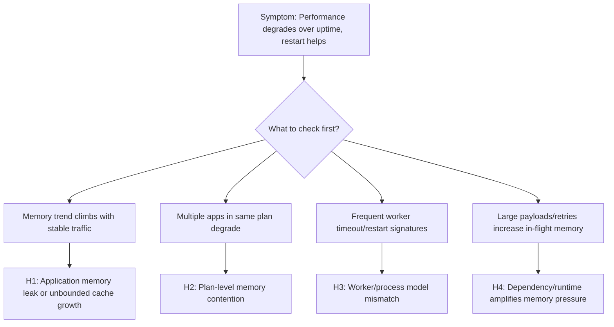

# Memory Pressure and Worker Degradation (Azure App Service Linux)

## 1. Summary

### Symptom
Latency and error rates gradually worsen over uptime even when CPU is not saturated. Requests that were stable after deployment become slower after several hours, then often recover after restart or recycle. In severe windows, the app shows 502/503 bursts, worker restarts, or OOM-like behavior.

### Why this scenario is confusing
Teams commonly expect memory incidents to present as immediate crashes. In App Service Linux, memory pressure can first appear as worker degradation: slower GC cycles, queue buildup, intermittent timeouts, and delayed responses. Because CPU can stay moderate, responders may incorrectly scale on CPU alone and miss plan-level memory contention shared across apps.

### Troubleshooting decision flow
<!-- diagram-id: memory-pressure-worker-degradation-flow -->


## 2. Common Misreadings

- "CPU is healthy, so platform capacity is healthy."
- "Only one app is affected, therefore the App Service Plan is not relevant."
- "Restart fixed it, so the issue is gone" (without proving root cause).
- "No persistent 5xx means no user-impacting performance issue."
- "Memory leak always means obvious out-of-memory crash" (ignoring slow degradation patterns).

## 3. Competing Hypotheses

- **H1: Application memory leak or unbounded cache growth** in Python/Node worker processes causes progressive memory retention and GC overhead.
- **H2: Plan-level memory contention (noisy neighbor pattern)** where multiple apps in the same plan consume shared memory headroom, degrading one another.
- **H3: Worker/process model mismatch** (too many workers/threads for available memory) causing thrash, frequent restarts, and queueing.
- **H4: Dependency and runtime behavior amplifies memory pressure** (large payload buffering, retry storms, long-lived objects), creating degraded workers before hard OOM.

## 4. What to Check First

### Metrics
- App Service Plan **Memory Percentage** and **CpuPercentage** over the same timeline as latency degradation.
- HTTP latency distribution using `AppServiceHTTPLogs.TimeTaken` (P50/P95/P99).
- Restart/recycle frequency and instance count trend during the incident window.

### Logs
- `AppServiceConsoleLogs` for OOM, worker timeout, restart loop, GC pressure, heap warnings.
- `AppServiceAppLogs` for framework/runtime warnings (allocation spikes, request body size warnings, retry storms).
- `AppServiceHTTPLogs` for path-specific slowdown and status code drift (200 -> 499/5xx patterns).

### Platform Signals
- `AppServicePlatformLogs` for container restart/recycle events and health check consequences.
- Correlation with deployment, scale changes, and app setting updates.
- Shared-plan context: whether sibling apps show simultaneous stress.

## 5. Evidence to Collect

### Required Evidence
- KQL: latency trend and endpoint distribution from `AppServiceHTTPLogs`.
- KQL: memory-pressure keywords and worker lifecycle events from `AppServiceConsoleLogs` and `AppServicePlatformLogs`.
- KQL: application-level warning/error bursts from `AppServiceAppLogs`.
- Azure Monitor metric exports for App Service Plan memory/CPU and affected app instance counts.

### Useful Context
- Runtime details: Python/Node version, Gunicorn/PM2/startup command, worker/thread count.
- Recent code changes affecting object lifetime, caching, streaming, payload size, retries.
- Plan topology: number of apps in the same App Service Plan and recent utilization trends.
- Incident timing: when degradation starts after startup and how quickly restart restores baseline.

### Sample Log Patterns

### AppServiceHTTPLogs (memory-pressure lab)

```text
2026-04-04T11:23:04Z  GET  /diag/env    200  4
2026-04-04T11:23:03Z  GET  /diag/stats  200  18
2026-04-04T11:21:50Z  GET  /heavy       200  1384
2026-04-04T11:21:49Z  GET  /heavy       200  1153
2026-04-04T11:21:49Z  GET  /heavy       200  1019
2026-04-04T11:21:49Z  GET  /heavy       200  950
2026-04-04T11:21:49Z  GET  /heavy       200  920
2026-04-04T11:21:48Z  GET  /leak        200  4808
```

### AppServiceConsoleLogs (worker model clues)

```text
2026-04-04T11:14:07Z  [2026-04-04 11:14:07 +0000] [1891] [INFO] Starting gunicorn 24.1.1
2026-04-04T11:14:07Z  [2026-04-04 11:14:07 +0000] [1891] [INFO] Listening at: http://0.0.0.0:8000 (1891)
2026-04-04T11:14:07Z  [2026-04-04 11:14:07 +0000] [1891] [INFO] Using worker: sync
2026-04-04T11:14:07Z  [2026-04-04 11:14:07 +0000] [1892] [INFO] Booting worker with pid: 1892
2026-04-04T11:14:07Z  [2026-04-04 11:14:07 +0000] [1893] [INFO] Booting worker with pid: 1893
2026-04-04T11:14:07Z  [2026-04-04 11:14:07 +0000] [1894] [INFO] Booting worker with pid: 1894
2026-04-04T11:14:07Z  [2026-04-04 11:14:07 +0000] [1895] [INFO] Booting worker with pid: 1895
```

### AppServicePlatformLogs (recycle sequence)

```text
2026-04-04T11:14:30Z  Informational  Container is terminating. Grace period: 5 seconds.
2026-04-04T11:14:30Z  Informational  Stopping container: f19d98813a89_<app-name>.
2026-04-04T11:14:36Z  Informational  Container is terminated. Total time elapsed: 5545 ms.
2026-04-04T11:14:36Z  Informational  Site: <app-name> stopped.
```

!!! tip "How to Read This"
    `/heavy` requests are consistently ~920-1384 ms while `/leak` is 4808 ms, even with HTTP 200 responses. That is a degradation signature, not an availability-only incident. Combined with `sync` workers and only four workers, a few long-running calls can saturate worker slots and amplify queue delay.

### KQL Queries with Example Output

### Query 1: Endpoint latency fingerprint during incident window

```kusto
AppServiceHTTPLogs
| where TimeGenerated between (datetime(2026-04-04 11:21:45) .. datetime(2026-04-04 11:23:05))
| project TimeGenerated, CsMethod, CsUriStem, ScStatus, TimeTaken
| order by TimeGenerated desc
```

**Example Output**

| TimeGenerated | CsMethod | CsUriStem | ScStatus | TimeTaken |
|---|---|---|---|---|
| 2026-04-04 11:23:04 | GET | /diag/env | 200 | 4 |
| 2026-04-04 11:23:03 | GET | /diag/stats | 200 | 18 |
| 2026-04-04 11:21:50 | GET | /heavy | 200 | 1384 |
| 2026-04-04 11:21:49 | GET | /heavy | 200 | 1153 |
| 2026-04-04 11:21:49 | GET | /heavy | 200 | 1019 |
| 2026-04-04 11:21:49 | GET | /heavy | 200 | 950 |
| 2026-04-04 11:21:49 | GET | /heavy | 200 | 920 |
| 2026-04-04 11:21:48 | GET | /leak | 200 | 4808 |

!!! tip "How to Read This"
    Health endpoints (`/diag/env`, `/diag/stats`) remain fast while workload endpoints degrade. This weakens global network outage hypotheses and strengthens endpoint-specific pressure hypotheses (memory growth, heavy compute, queueing).

### Query 2: Worker model and boot evidence from console logs

```kusto
AppServiceConsoleLogs
| where TimeGenerated between (datetime(2026-04-04 11:14:00) .. datetime(2026-04-04 11:14:10))
| project TimeGenerated, Level, ResultDescription
| order by TimeGenerated desc
```

**Example Output**

| TimeGenerated | Level | ResultDescription |
|---|---|---|
| 2026-04-04 11:14:07 | Error | [2026-04-04 11:14:07 +0000] [1895] [INFO] Booting worker with pid: 1895 |
| 2026-04-04 11:14:07 | Error | [2026-04-04 11:14:07 +0000] [1894] [INFO] Booting worker with pid: 1894 |
| 2026-04-04 11:14:07 | Error | [2026-04-04 11:14:07 +0000] [1893] [INFO] Booting worker with pid: 1893 |
| 2026-04-04 11:14:07 | Error | [2026-04-04 11:14:07 +0000] [1892] [INFO] Booting worker with pid: 1892 |
| 2026-04-04 11:14:07 | Error | [2026-04-04 11:14:07 +0000] [1891] [INFO] Using worker: sync |
| 2026-04-04 11:14:07 | Error | [2026-04-04 11:14:07 +0000] [1891] [INFO] Listening at: http://0.0.0.0:8000 (1891) |
| 2026-04-04 11:14:07 | Error | [2026-04-04 11:14:07 +0000] [1891] [INFO] Starting gunicorn 24.1.1 |

!!! tip "How to Read This"
    `sync` plus a small worker count means each worker handles one blocking request at a time. Long `/heavy` and `/leak` calls can consume all workers quickly even when CPU is not pegged.

### Query 3: Platform recycle timeline around pressure event

```kusto
AppServicePlatformLogs
| where TimeGenerated between (datetime(2026-04-04 11:14:25) .. datetime(2026-04-04 11:14:40))
| project TimeGenerated, Level, Message
| order by TimeGenerated desc
```

**Example Output**

| TimeGenerated | Level | Message |
|---|---|---|
| 2026-04-04 11:14:36 | Informational | Site: <app-name> stopped. |
| 2026-04-04 11:14:36 | Informational | Container is terminated. Total time elapsed: 5545 ms. |
| 2026-04-04 11:14:30 | Informational | Stopping container: f19d98813a89_<app-name>. |
| 2026-04-04 11:14:30 | Informational | Container is terminating. Grace period: 5 seconds. |

!!! tip "How to Read This"
    These rows confirm lifecycle churn. If latency improves immediately after this stop/start cycle and then degrades again with uptime, treat memory/worker degradation as primary until disproven.

### CLI Investigation Commands

```bash
az webapp config show --resource-group <resource-group> --name <app-name>
az webapp config appsettings list --resource-group <resource-group> --name <app-name>
az webapp log tail --resource-group <resource-group> --name <app-name>
az monitor metrics list --resource <app-service-plan-resource-id> --metric "CpuPercentage,MemoryPercentage" --interval PT1M --aggregation Average
```

**Example Output (sanitized)**

```text
$ az webapp config show --resource-group <resource-group> --name <app-name>
{
  "linuxFxVersion": "PYTHON|3.12",
  "alwaysOn": true,
  "http20Enabled": true
}

$ az webapp config appsettings list --resource-group <resource-group> --name <app-name>
[
  {"name": "WEBSITES_PORT", "value": "8000"},
  {"name": "SCM_DO_BUILD_DURING_DEPLOYMENT", "value": "false"}
]

$ az monitor metrics list --resource <app-service-plan-resource-id> --metric "CpuPercentage,MemoryPercentage" --interval PT1M --aggregation Average
timestamp                  CpuPercentage_Average   MemoryPercentage_Average
-------------------------  ----------------------  ------------------------
2026-04-04T11:21:00Z       36.2                    83.7
2026-04-04T11:22:00Z       39.8                    86.4
```

!!! tip "How to Read This"
    If memory remains high while CPU is moderate and HTTP latency climbs, scaling by CPU signal alone will miss the failure mode. Revisit worker count, memory profile, and endpoint behavior.

### Normal vs Abnormal Comparison

| Signal | Normal (Healthy) | Abnormal (Memory/Worker Degradation) |
|---|---|---|
| `/heavy` latency | Mostly sub-second, stable tail | Repeated 920-1384 ms spikes under moderate load |
| `/leak` latency | Rare and bounded | Multi-second outlier (for example 4808 ms) |
| Health endpoint latency | Low and stable | Still low (can remain deceptively healthy) |
| Gunicorn worker mode | Matches workload profile and capacity | `sync` workers saturated by long-running calls |
| Platform lifecycle | Infrequent stop/start events | Recurrent container termination/restart correlation |
| CPU vs memory trend | CPU and memory proportional to load | CPU moderate, memory elevated and climbing |

## 6. Validation and Disproof by Hypothesis

### H1: Application memory leak or unbounded cache growth
- **Signals that support**
    - Memory trend rises with uptime while traffic volume is relatively stable.
    - Latency gradually worsens before any restart event.
    - Restart temporarily restores latency and error rates.
    - Console/app logs mention OOM, memory allocation failures, or aggressive GC cycles.
- **Signals that weaken**
    - Memory remains flat across uptime windows.
    - Latency degrades immediately after deployment regardless of uptime length.
    - Restart does not produce temporary improvement.
- **What to verify**
    - KQL (latency and status trend):
    ```kusto
    AppServiceHTTPLogs
    | where TimeGenerated > ago(24h)
    | summarize req=count(), p95=percentile(TimeTaken,95), p99=percentile(TimeTaken,99), errors=countif(ScStatus >= 500) by bin(TimeGenerated, 5m)
    | order by TimeGenerated asc
    ```
    - KQL (memory symptom keywords from console):
    ```kusto
    AppServiceConsoleLogs
    | where TimeGenerated > ago(24h)
    | where ResultDescription has_any ("OutOfMemory", "OOM", "Killed", "worker timeout", "memory", "GC")
    | project TimeGenerated, ResultDescription
    | order by TimeGenerated desc
    ```
    - CLI (plan memory and cpu):
    ```bash
    az monitor metrics list --resource <app-service-plan-resource-id> --metric "MemoryPercentage,CpuPercentage" --interval PT1M --aggregation Average
    az webapp log tail --resource-group <resource-group> --name <app-name>
    ```

### H2: Plan-level memory contention across multiple apps
- **Signals that support**
    - Multiple apps on the same App Service Plan degrade in overlapping windows.
    - Plan memory remains high even when the affected app has moderate traffic.
    - Incidents align with a sibling app deployment or load surge.
    - Recycling one app helps briefly, but pressure returns until total plan demand drops.
- **Signals that weaken**
    - Other plan apps remain stable with no latency or restart signal.
    - Plan memory headroom remains comfortably below pressure levels.
    - Isolated dedicated plan shows no recurrence.
- **What to verify**
    - KQL (platform restart/recycle timeline):
    ```kusto
    AppServicePlatformLogs
    | where TimeGenerated > ago(24h)
    | where ResultDescription has_any ("restart", "recycle", "container", "health check")
    | project TimeGenerated, ContainerId, OperationName, ResultDescription
    | order by TimeGenerated desc
    ```
    - CLI (apps sharing plan and plan metadata):
    ```bash
    az appservice plan show --resource-group <resource-group> --name <plan-name>
    az webapp list --resource-group <resource-group> --query "[?serverFarmId!=null].{name:name,serverFarmId:serverFarmId,state:state}" --output table
    az monitor metrics list --resource <app-service-plan-resource-id> --metric "MemoryPercentage" --interval PT5M --aggregation Maximum
    ```
    - Verify whether affected and sibling apps share incident timestamps and memory pressure windows.

### H3: Worker/process model is overcommitted for memory budget
- **Signals that support**
    - Startup command configures high worker/thread count relative to SKU memory.
    - Frequent worker exits/timeouts with moderate CPU.
    - Tail latency worsens with concurrency bursts and short recovery after recycle.
    - Logs show repeated worker boot/restart patterns.
- **Signals that weaken**
    - Conservative worker settings with sustained stability under equivalent load tests.
    - No worker timeout/restart signatures in logs.
    - Latency follows dependency slowness independent of concurrency level.
- **What to verify**
    - KQL (worker lifecycle and timeout signatures):
    ```kusto
    AppServiceConsoleLogs
    | where TimeGenerated > ago(12h)
    | where ResultDescription has_any ("WORKER TIMEOUT", "Booting worker", "Worker exiting", "signal 9", "Killed")
    | summarize events=count() by bin(TimeGenerated, 5m)
    | order by TimeGenerated asc
    ```
    - CLI (runtime and startup config):
    ```bash
    az webapp config show --resource-group <resource-group> --name <app-name>
    az webapp config appsettings list --resource-group <resource-group> --name <app-name>
    ```
    - Validate effective process settings (`workers`, `threads`, `timeout`) against measured memory per worker and plan limits.

### H4: Dependency/runtime behavior amplifies memory pressure
- **Signals that support**
    - Slow periods align with high-volume endpoints returning large payloads or buffering request bodies.
    - App logs show retry storms, large object serialization, or unbounded in-memory aggregation.
    - HTTP latency and 499/5xx increase before restart, not only during startup.
    - Memory pressure worsens when dependency latency increases (larger in-flight object lifetime).
- **Signals that weaken**
    - Large-payload endpoints are quiet during incidents.
    - Dependency latency is stable while memory pressure still rises linearly.
    - Reduced retry limits do not change memory profile.
- **What to verify**
    - KQL (path and payload-related latency shape):
    ```kusto
    AppServiceHTTPLogs
    | where TimeGenerated > ago(12h)
    | summarize req=count(), p95=percentile(TimeTaken,95), p99=percentile(TimeTaken,99) by CsUriStem, ScStatus
    | top 20 by p99 desc
    ```
    - KQL (application warnings and memory-affecting behavior):
    ```kusto
    AppServiceAppLogs
    | where TimeGenerated > ago(12h)
    | where ResultDescription has_any ("retry", "payload", "buffer", "allocation", "memory", "gc", "timeout")
    | project TimeGenerated, CustomLevel, ResultDescription, Logger
    | order by TimeGenerated desc
    ```
    - CLI (restart for controlled validation window):
    ```bash
    az webapp restart --resource-group <resource-group> --name <app-name>
    az monitor metrics list --resource <app-service-plan-resource-id> --metric "MemoryPercentage" --interval PT1M --aggregation Average
    ```

## 7. Likely Root Cause Patterns

- **Pattern A: Gradual heap retention in application code**
    - Common in Python/Node when caches are unbounded, large objects remain referenced, or per-request data leaks into process scope.
- **Pattern B: Shared-plan headroom collapse**
    - One or more sibling apps consume memory spikes, reducing effective capacity and degrading unrelated apps in the same plan.
- **Pattern C: Over-aggressive worker count for SKU size**
    - Higher worker concurrency increases baseline resident memory and pushes plan into frequent pressure cycles.
- **Pattern D: Slow dependency causes in-flight memory expansion**
    - More concurrent in-flight requests hold larger object graphs longer, compounding GC cost and tail latency.

### Investigation Notes

- App Service Linux performance incidents can be memory-first even when CPU appears healthy.
- Always align evidence by time window; individual signals in isolation can be misleading.
- A restart that helps is a useful signal, not a root cause.
- Plan-level memory is shared capacity; app-level tuning without plan context is often incomplete.
- Validate both application behavior and process model choices before concluding platform fault.

### Quick Conclusion

When App Service Linux response times degrade over uptime and improve after restart, treat memory pressure and worker degradation as primary hypotheses early. Correlate `AppServiceHTTPLogs`, `AppServiceConsoleLogs`, `AppServicePlatformLogs`, `AppServiceAppLogs`, and plan metrics in one timeline to separate leak patterns, plan contention, worker overcommit, and dependency-amplified pressure. Stabilize with low-risk mitigations, then implement durable memory budgeting, isolation, and workload design changes to prevent recurrence.

## 8. Immediate Mitigations

- Reduce worker/process count to stabilize memory footprint (**temporary**, **production-safe** if traffic is moderate).
- Scale up App Service Plan SKU to add memory headroom quickly (**temporary**, **production-safe**, cost impact).
- Move high-memory sibling app to a separate plan to remove contention (**production-safe**, operational change risk).
- Apply bounded cache limits and shorter object retention windows (**production-safe**).
- Restart affected app during incident to recover service while investigation continues (**temporary**, **risk-bearing**: brief disruption and cold-start effect).
- Reduce retry fan-out and cap request payload sizes in hot paths (**production-safe** with behavior validation).

## 9. Prevention

- Establish memory budgets per worker and choose concurrency settings from load-test data, not defaults.
- Add leak detection and periodic heap profiling in pre-production and canary slots.
- Implement bounded caches with explicit eviction policy and size controls.
- Isolate critical workloads into dedicated App Service Plans to eliminate cross-app memory contention.
- Track SLOs using P95/P99 latency plus memory trend and restart frequency correlation alerts.
- Refactor large buffering code paths to streaming patterns where possible.

### Limitations

- This playbook focuses on Azure App Service Linux and OSS runtime patterns only.
- It does not replace framework-specific memory profiling guidance for each language ecosystem.
- Kernel-level host diagnostics are abstracted by the platform and may not be directly visible.

## See Also

### Related Queries

- [`../../kql/http/latency-trend-by-status-code.md`](../../kql/http/latency-trend-by-status-code.md)
- [`../../kql/http/slowest-requests-by-path.md`](../../kql/http/slowest-requests-by-path.md)
- [`../../kql/correlation/latency-vs-errors.md`](../../kql/correlation/latency-vs-errors.md)
- [`../../kql/restarts/restart-timing-correlation.md`](../../kql/restarts/restart-timing-correlation.md)

### Related Checklists

- [`../../first-10-minutes/performance.md`](../../first-10-minutes/performance.md)

### Related Labs

- [Lab: Memory Pressure and Worker Degradation](../../lab-guides/memory-pressure.md)

### Related Labs (Evidence Drills)

- [Lab: Memory Pressure and Worker Degradation](../../lab-guides/memory-pressure.md)

- [Performance (First 10 Minutes)](../../first-10-minutes/performance.md)
- [Memory Pressure Lab](../../lab-guides/memory-pressure.md)

## Sources

- [Monitor Azure App Service](https://learn.microsoft.com/en-us/azure/app-service/monitor-app-service)
- [Azure App Service plan overview](https://learn.microsoft.com/en-us/azure/app-service/overview-hosting-plans)
- [Scale up an app in Azure App Service](https://learn.microsoft.com/en-us/azure/app-service/manage-scale-up)
- [Azure App Service diagnostics overview](https://learn.microsoft.com/en-us/azure/app-service/overview-diagnostics)
