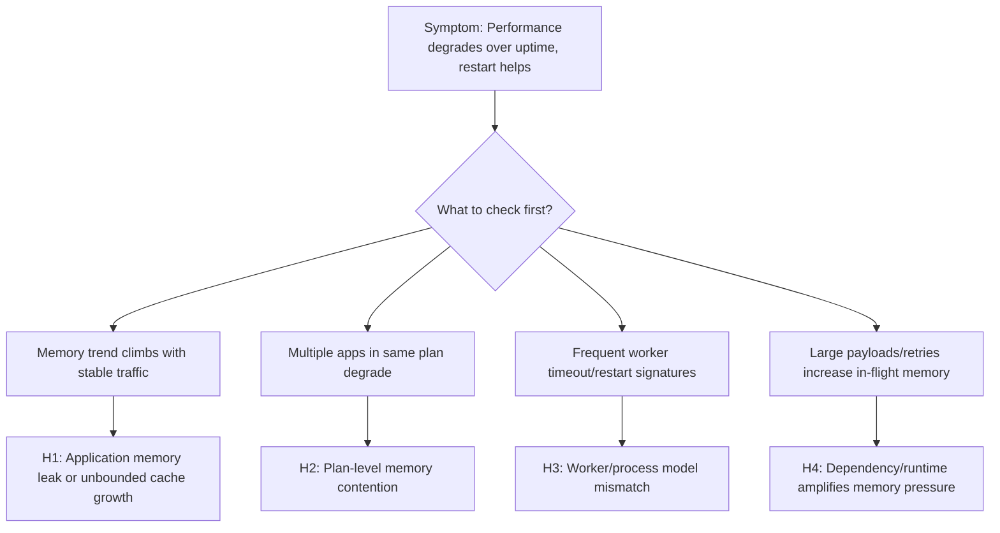

# Memory Pressure and Worker Degradation (Azure App Service Linux)

## 1. Summary
### Symptom
Latency and error rates gradually worsen over uptime even when CPU is not saturated. Requests that were stable after deployment become slower after several hours, then often recover after restart or recycle. In severe windows, the app shows 502/503 bursts, worker restarts, or OOM-like behavior.

### Why this scenario is confusing
Teams commonly expect memory incidents to present as immediate crashes. In App Service Linux, memory pressure can first appear as worker degradation: slower GC cycles, queue buildup, intermittent timeouts, and delayed responses. Because CPU can stay moderate, responders may incorrectly scale on CPU alone and miss plan-level memory contention shared across apps.

### Troubleshooting decision flow


## 2. Common Misreadings
- "CPU is healthy, so platform capacity is healthy."
- "Only one app is affected, therefore the App Service Plan is not relevant."
- "Restart fixed it, so the issue is gone" (without proving root cause).
- "No persistent 5xx means no user-impacting performance issue."
- "Memory leak always means obvious out-of-memory crash" (ignoring slow degradation patterns).

## 3. Competing Hypotheses
- **H1: Application memory leak or unbounded cache growth** in Python/Node worker processes causes progressive memory retention and GC overhead.
- **H2: Plan-level memory contention (noisy neighbor pattern)** where multiple apps in the same plan consume shared memory headroom, degrading one another.
- **H3: Worker/process model mismatch** (too many workers/threads for available memory) causing thrash, frequent restarts, and queueing.
- **H4: Dependency and runtime behavior amplifies memory pressure** (large payload buffering, retry storms, long-lived objects), creating degraded workers before hard OOM.

## 4. What to Check First
### Metrics
- App Service Plan **Memory Percentage** and **CpuPercentage** over the same timeline as latency degradation.
- HTTP latency distribution using `AppServiceHTTPLogs.TimeTaken` (P50/P95/P99).
- Restart/recycle frequency and instance count trend during the incident window.

### Logs
- `AppServiceConsoleLogs` for OOM, worker timeout, restart loop, GC pressure, heap warnings.
- `AppServiceAppLogs` for framework/runtime warnings (allocation spikes, request body size warnings, retry storms).
- `AppServiceHTTPLogs` for path-specific slowdown and status code drift (200 -> 499/5xx patterns).

### Platform Signals
- `AppServicePlatformLogs` for container restart/recycle events and health check consequences.
- Correlation with deployment, scale changes, and app setting updates.
- Shared-plan context: whether sibling apps show simultaneous stress.

## 5. Evidence to Collect
### Required Evidence
- KQL: latency trend and endpoint distribution from `AppServiceHTTPLogs`.
- KQL: memory-pressure keywords and worker lifecycle events from `AppServiceConsoleLogs` and `AppServicePlatformLogs`.
- KQL: application-level warning/error bursts from `AppServiceAppLogs`.
- Azure Monitor metric exports for App Service Plan memory/CPU and affected app instance counts.

### Useful Context
- Runtime details: Python/Node version, Gunicorn/PM2/startup command, worker/thread count.
- Recent code changes affecting object lifetime, caching, streaming, payload size, retries.
- Plan topology: number of apps in the same App Service Plan and recent utilization trends.
- Incident timing: when degradation starts after startup and how quickly restart restores baseline.

## 6. Validation and Disproof by Hypothesis
### H1: Application memory leak or unbounded cache growth
- **Signals that support**
  - Memory trend rises with uptime while traffic volume is relatively stable.
  - Latency gradually worsens before any restart event.
  - Restart temporarily restores latency and error rates.
  - Console/app logs mention OOM, memory allocation failures, or aggressive GC cycles.
- **Signals that weaken**
  - Memory remains flat across uptime windows.
  - Latency degrades immediately after deployment regardless of uptime length.
  - Restart does not produce temporary improvement.
- **What to verify**
  - KQL (latency and status trend):
    ```kusto
    AppServiceHTTPLogs
    | where TimeGenerated > ago(24h)
    | summarize req=count(), p95=percentile(TimeTaken,95), p99=percentile(TimeTaken,99), errors=countif(ScStatus >= 500) by bin(TimeGenerated, 5m)
    | order by TimeGenerated asc
    ```
  - KQL (memory symptom keywords from console):
    ```kusto
    AppServiceConsoleLogs
    | where TimeGenerated > ago(24h)
    | where ResultDescription has_any ("OutOfMemory", "OOM", "Killed", "worker timeout", "memory", "GC")
    | project TimeGenerated, ResultDescription
    | order by TimeGenerated desc
    ```
  - CLI (plan memory and cpu):
    ```bash
    az monitor metrics list --resource <app-service-plan-resource-id> --metric "MemoryPercentage,CpuPercentage" --interval PT1M --aggregation Average
    az webapp log tail --resource-group <resource-group> --name <app-name>
    ```

### H2: Plan-level memory contention across multiple apps
- **Signals that support**
  - Multiple apps on the same App Service Plan degrade in overlapping windows.
  - Plan memory remains high even when the affected app has moderate traffic.
  - Incidents align with a sibling app deployment or load surge.
  - Recycling one app helps briefly, but pressure returns until total plan demand drops.
- **Signals that weaken**
  - Other plan apps remain stable with no latency or restart signal.
  - Plan memory headroom remains comfortably below pressure levels.
  - Isolated dedicated plan shows no recurrence.
- **What to verify**
  - KQL (platform restart/recycle timeline):
    ```kusto
    AppServicePlatformLogs
    | where TimeGenerated > ago(24h)
    | where ResultDescription has_any ("restart", "recycle", "container", "health check")
    | project TimeGenerated, ContainerId, OperationName, ResultDescription
    | order by TimeGenerated desc
    ```
  - CLI (apps sharing plan and plan metadata):
    ```bash
    az appservice plan show --resource-group <resource-group> --name <plan-name>
    az webapp list --resource-group <resource-group> --query "[?serverFarmId!=null].{name:name,serverFarmId:serverFarmId,state:state}" --output table
    az monitor metrics list --resource <app-service-plan-resource-id> --metric "MemoryPercentage" --interval PT5M --aggregation Maximum
    ```
  - Verify whether affected and sibling apps share incident timestamps and memory pressure windows.

### H3: Worker/process model is overcommitted for memory budget
- **Signals that support**
  - Startup command configures high worker/thread count relative to SKU memory.
  - Frequent worker exits/timeouts with moderate CPU.
  - Tail latency worsens with concurrency bursts and short recovery after recycle.
  - Logs show repeated worker boot/restart patterns.
- **Signals that weaken**
  - Conservative worker settings with sustained stability under equivalent load tests.
  - No worker timeout/restart signatures in logs.
  - Latency follows dependency slowness independent of concurrency level.
- **What to verify**
  - KQL (worker lifecycle and timeout signatures):
    ```kusto
    AppServiceConsoleLogs
    | where TimeGenerated > ago(12h)
    | where ResultDescription has_any ("WORKER TIMEOUT", "Booting worker", "Worker exiting", "signal 9", "Killed")
    | summarize events=count() by bin(TimeGenerated, 5m)
    | order by TimeGenerated asc
    ```
  - CLI (runtime and startup config):
    ```bash
    az webapp config show --resource-group <resource-group> --name <app-name>
    az webapp config appsettings list --resource-group <resource-group> --name <app-name>
    ```
  - Validate effective process settings (`workers`, `threads`, `timeout`) against measured memory per worker and plan limits.

### H4: Dependency/runtime behavior amplifies memory pressure
- **Signals that support**
  - Slow periods align with high-volume endpoints returning large payloads or buffering request bodies.
  - App logs show retry storms, large object serialization, or unbounded in-memory aggregation.
  - HTTP latency and 499/5xx increase before restart, not only during startup.
  - Memory pressure worsens when dependency latency increases (larger in-flight object lifetime).
- **Signals that weaken**
  - Large-payload endpoints are quiet during incidents.
  - Dependency latency is stable while memory pressure still rises linearly.
  - Reduced retry limits do not change memory profile.
- **What to verify**
  - KQL (path and payload-related latency shape):
    ```kusto
    AppServiceHTTPLogs
    | where TimeGenerated > ago(12h)
    | summarize req=count(), p95=percentile(TimeTaken,95), p99=percentile(TimeTaken,99) by CsUriStem, ScStatus
    | top 20 by p99 desc
    ```
  - KQL (application warnings and memory-affecting behavior):
    ```kusto
    AppServiceAppLogs
    | where TimeGenerated > ago(12h)
    | where ResultDescription has_any ("retry", "payload", "buffer", "allocation", "memory", "gc", "timeout")
    | project TimeGenerated, CustomLevel, ResultDescription, Logger
    | order by TimeGenerated desc
    ```
  - CLI (restart for controlled validation window):
    ```bash
    az webapp restart --resource-group <resource-group> --name <app-name>
    az monitor metrics list --resource <app-service-plan-resource-id> --metric "MemoryPercentage" --interval PT1M --aggregation Average
    ```

## 7. Likely Root Cause Patterns
- **Pattern A: Gradual heap retention in application code**
  - Common in Python/Node when caches are unbounded, large objects remain referenced, or per-request data leaks into process scope.
- **Pattern B: Shared-plan headroom collapse**
  - One or more sibling apps consume memory spikes, reducing effective capacity and degrading unrelated apps in the same plan.
- **Pattern C: Over-aggressive worker count for SKU size**
  - Higher worker concurrency increases baseline resident memory and pushes plan into frequent pressure cycles.
- **Pattern D: Slow dependency causes in-flight memory expansion**
  - More concurrent in-flight requests hold larger object graphs longer, compounding GC cost and tail latency.

## 8. Immediate Mitigations
- Reduce worker/process count to stabilize memory footprint (**temporary**, **production-safe** if traffic is moderate).
- Scale up App Service Plan SKU to add memory headroom quickly (**temporary**, **production-safe**, cost impact).
- Move high-memory sibling app to a separate plan to remove contention (**production-safe**, operational change risk).
- Apply bounded cache limits and shorter object retention windows (**production-safe**).
- Restart affected app during incident to recover service while investigation continues (**temporary**, **risk-bearing**: brief disruption and cold-start effect).
- Reduce retry fan-out and cap request payload sizes in hot paths (**production-safe** with behavior validation).

## 9. Long-term Fixes
- Establish memory budgets per worker and choose concurrency settings from load-test data, not defaults.
- Add leak detection and periodic heap profiling in pre-production and canary slots.
- Implement bounded caches with explicit eviction policy and size controls.
- Isolate critical workloads into dedicated App Service Plans to eliminate cross-app memory contention.
- Track SLOs using P95/P99 latency plus memory trend and restart frequency correlation alerts.
- Refactor large buffering code paths to streaming patterns where possible.

## 10. Investigation Notes
- App Service Linux performance incidents can be memory-first even when CPU appears healthy.
- Always align evidence by time window; individual signals in isolation can be misleading.
- A restart that helps is a useful signal, not a root cause.
- Plan-level memory is shared capacity; app-level tuning without plan context is often incomplete.
- Validate both application behavior and process model choices before concluding platform fault.

## 11. Related Queries
- [`../../kql/http/latency-trend-by-status-code.md`](../../kql/http/latency-trend-by-status-code.md)
- [`../../kql/http/slowest-requests-by-path.md`](../../kql/http/slowest-requests-by-path.md)
- [`../../kql/correlation/latency-vs-errors.md`](../../kql/correlation/latency-vs-errors.md)
- [`../../kql/restarts/restart-timing-correlation.md`](../../kql/restarts/restart-timing-correlation.md)

## 12. Related Checklists
- [`../../first-10-minutes/performance.md`](../../first-10-minutes/performance.md)

## 13. Related Labs
- [Lab: Memory Pressure and Worker Degradation](../../lab-guides/memory-pressure.md)

## 14. Limitations
- This playbook focuses on Azure App Service Linux and OSS runtime patterns only.
- It does not replace framework-specific memory profiling guidance for each language ecosystem.
- Kernel-level host diagnostics are abstracted by the platform and may not be directly visible.

## 15. Quick Conclusion
When App Service Linux response times degrade over uptime and improve after restart, treat memory pressure and worker degradation as primary hypotheses early. Correlate `AppServiceHTTPLogs`, `AppServiceConsoleLogs`, `AppServicePlatformLogs`, `AppServiceAppLogs`, and plan metrics in one timeline to separate leak patterns, plan contention, worker overcommit, and dependency-amplified pressure. Stabilize with low-risk mitigations, then implement durable memory budgeting, isolation, and workload design changes to prevent recurrence.

## References
- [Monitor Azure App Service](https://learn.microsoft.com/en-us/azure/app-service/monitor-app-service)
- [Azure App Service plan overview](https://learn.microsoft.com/en-us/azure/app-service/overview-hosting-plans)
- [Scale up an app in Azure App Service](https://learn.microsoft.com/en-us/azure/app-service/manage-scale-up)
- [Azure App Service diagnostics overview](https://learn.microsoft.com/en-us/azure/app-service/overview-diagnostics)
