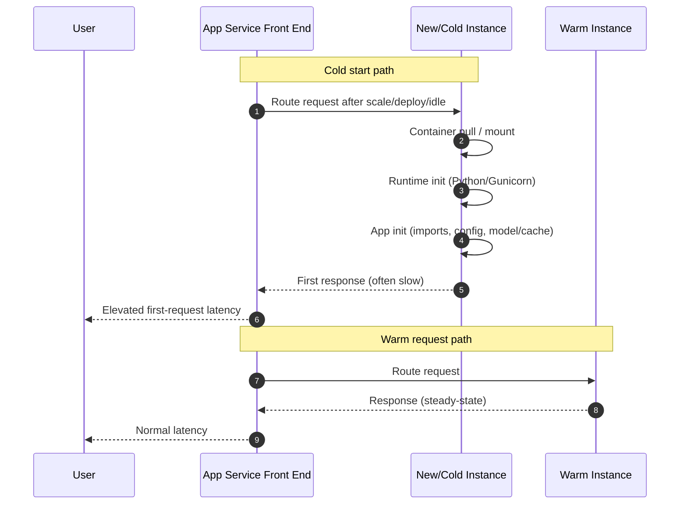

---
hide:
  - toc
content_sources:
  diagrams:
    - id: slow-start-cold-start-sequence
      type: sequence
      source: self-generated
      justification: "Synthesized cold-start versus warm-path behavior from Microsoft Learn guidance on App Service warm-up settings, health checks, Linux startup behavior, and 502/503 troubleshooting."
      based_on:
        - https://learn.microsoft.com/en-us/azure/app-service/reference-app-settings
        - https://learn.microsoft.com/en-us/azure/app-service/monitor-instances-health-check
        - https://learn.microsoft.com/en-us/troubleshoot/azure/app-service/faqs-app-service-linux-new
        - https://learn.microsoft.com/en-us/azure/app-service/troubleshoot-http-502-http-503
content_validation:
  status: verified
  last_reviewed: "2026-04-12"
  reviewer: ai-agent
  core_claims:
    - claim: "`WEBSITES_CONTAINER_START_TIME_LIMIT` only changes startup timeout tolerance."
      source: "https://learn.microsoft.com/azure/app-service/reference-app-settings"
      verified: true
    - claim: "`AlwaysOn=false` on smaller SKUs increases cold-start exposure."
      source: "https://learn.microsoft.com/azure/app-service/reference-app-settings"
      verified: true
---

# Slow Start / Cold Start vs Real Regression (Azure App Service Linux)

## 1. Summary

### Symptom
Users report the app is "slow" right after deployment, scale-out, or inactivity, with first requests taking 30-60+ seconds on one or more instances, while later requests are much faster.

### Why this scenario is confusing
Cold start latency is bursty and event-driven, while true performance regression is sustained. If teams only look at incident screenshots or average latency, they may treat startup behavior as a code regression and over-correct.

## 2. Common Misreadings

- "Latency is high after deployment, so the release introduced a performance bug."
- "One slow request proves the app is degraded."
- "Health Check or warm-up probes are equivalent to real user warm traffic."
- "Increasing `WEBSITES_CONTAINER_START_TIME_LIMIT` fixes slow requests" (it only changes startup timeout tolerance).
- "P95 spike means always scale up immediately" (without separating first-hit startup from steady-state latency).

## 3. Competing Hypotheses

- **H1: Expected cold start window** after scale-out, restart, deployment, slot swap, or idle recycle.
- **H2: Startup path is too heavy** (Python import cost, model loading, initialization work, startup scripts, dependency installation patterns).
- **H3: Misconfiguration of warm-up/startup controls** (`AlwaysOn`, `WEBSITE_WARMUP_PATH`, Health Check, startup timeout settings).
- **H4: Real regression in warm path** (code, dependency, DB, or network change causing sustained latency beyond startup window).

## 4. What to Check First

### Metrics
- Request percentile trend (P50/P95/P99) over time, not just a single point.
- Compare first-request latency spikes vs sustained latency over 30-60 minutes.
- Instance count and scale/restart timestamps aligned to latency spikes.

### Logs
- `AppServicePlatformLogs`: container start, recycle, scale, worker lifecycle events.
- `AppServiceConsoleLogs`: startup sequence, import/load messages, Gunicorn worker boot timing, timeout/warning lines in `ResultDescription`.
- `AppServiceHTTPLogs`: `TimeTaken`, `ScStatus`, `CsUriStem` around event windows.

### Platform Signals
- Deployment timeline (`az webapp deployment list`) vs latency timeline.
- App settings: `AlwaysOn`, `WEBSITE_WARMUP_PATH`, `WEBSITES_CONTAINER_START_TIME_LIMIT`.
- Plan/SKU behavior (for example, idle recycle risk with `AlwaysOn=false` on Basic SKU).

## 5. Evidence to Collect

### Required Evidence
- 24-hour timeline joining HTTP latency, restarts/scale events, and deployment events.
- Startup-related console lines (`ResultDescription`) for affected windows.
- Per-path latency and status code breakdown from `AppServiceHTTPLogs`.
- Effective app settings and startup command for the running app.

### Useful Context
- Whether slow requests are first-hit only (after restart/scale/idle) or persist under warm traffic.
- Python runtime/framework, Gunicorn worker config, module import profile.
- Whether startup script performs network/package tasks (for example `pip install`) before serving traffic.
- Traffic pattern (bursty vs constant), and whether pre-warm traffic exists before user traffic.

### Sample Log Patterns

### AppServiceHTTPLogs (cold-start lab)

```text
2026-04-04T11:23:04Z  GET  /diag/env    200  24
2026-04-04T11:23:03Z  GET  /diag/stats  200  41
2026-04-04T11:22:32Z  GET  /timing      200  11
```

### AppServiceConsoleLogs (startup worker sequence)

```text
2026-04-04T11:14:11Z  [2026-04-04 11:14:11 +0000] [1895] [INFO] Starting gunicorn 22.0.0
2026-04-04T11:14:11Z  [2026-04-04 11:14:11 +0000] [1895] [INFO] Listening at: http://0.0.0.0:8000 (1895)
2026-04-04T11:14:11Z  [2026-04-04 11:14:11 +0000] [1895] [INFO] Using worker: sync
2026-04-04T11:14:11Z  [2026-04-04 11:14:11 +0000] [1897] [INFO] Booting worker with pid: 1897
2026-04-04T11:14:11Z  [2026-04-04 11:14:11 +0000] [1898] [INFO] Booting worker with pid: 1898
```

### AppServicePlatformLogs (timeout/stop sequence)

```text
2026-04-04T11:15:03Z  Informational  State: Stopping, Action: StoppingSiteContainers, LastError: ContainerTimeout, LastErrorTimestamp: 04/04/2026 10:53:07
2026-04-04T11:15:09Z  Informational  Container is terminated. Total time elapsed: 5996 ms.
2026-04-04T11:15:09Z  Informational  Site: <app-name> stopped.
```

!!! tip "How to Read This"
    The key signal in this lab is not endpoint failure but startup duration. `/diag/stats` confirms `startup_duration=31.499s`, which is long for B1 under cold-start conditions and can trigger perceived slowness after restart/scale events.

### KQL Queries with Example Output

### Query 1: Cold-start request window profile

```kusto
AppServiceHTTPLogs
| where TimeGenerated between (datetime(2026-04-04 11:22:30) .. datetime(2026-04-04 11:23:05))
| project TimeGenerated, CsMethod, CsUriStem, ScStatus, TimeTaken
| order by TimeGenerated desc
```

**Example Output**

| TimeGenerated | CsMethod | CsUriStem | ScStatus | TimeTaken |
|---|---|---|---|---|
| 2026-04-04 11:23:04 | GET | /diag/env | 200 | 24 |
| 2026-04-04 11:23:03 | GET | /diag/stats | 200 | 41 |
| 2026-04-04 11:22:32 | GET | /timing | 200 | 11 |

!!! tip "How to Read This"
    This narrow sample alone does not prove regression. Use it with startup metadata (`startup_duration`) and platform lifecycle events to decide whether this is expected cold-start cost.

### Query 2: Startup sequence from console logs

```kusto
AppServiceConsoleLogs
| where TimeGenerated between (datetime(2026-04-04 11:14:10) .. datetime(2026-04-04 11:14:12))
| project TimeGenerated, Level, ResultDescription
| order by TimeGenerated desc
```

**Example Output**

| TimeGenerated | Level | ResultDescription |
|---|---|---|
| 2026-04-04 11:14:11 | Error | [2026-04-04 11:14:11 +0000] [1898] [INFO] Booting worker with pid: 1898 |
| 2026-04-04 11:14:11 | Error | [2026-04-04 11:14:11 +0000] [1897] [INFO] Booting worker with pid: 1897 |
| 2026-04-04 11:14:11 | Error | [2026-04-04 11:14:11 +0000] [1895] [INFO] Using worker: sync |
| 2026-04-04 11:14:11 | Error | [2026-04-04 11:14:11 +0000] [1895] [INFO] Listening at: http://0.0.0.0:8000 (1895) |
| 2026-04-04 11:14:11 | Error | [2026-04-04 11:14:11 +0000] [1895] [INFO] Starting gunicorn 22.0.0 |

!!! tip "How to Read This"
    Only two sync workers are booted in this sample. If startup and first-hit work include heavy initialization, user-facing latency spikes can occur even before CPU appears stressed.

### Query 3: Platform timeout correlation

```kusto
AppServicePlatformLogs
| where TimeGenerated between (datetime(2026-04-04 11:15:00) .. datetime(2026-04-04 11:15:10))
| project TimeGenerated, Level, Message
| order by TimeGenerated desc
```

**Example Output**

| TimeGenerated | Level | Message |
|---|---|---|
| 2026-04-04 11:15:09 | Informational | Site: <app-name> stopped. |
| 2026-04-04 11:15:09 | Informational | Container is terminated. Total time elapsed: 5996 ms. |
| 2026-04-04 11:15:03 | Informational | State: Stopping, Action: StoppingSiteContainers, LastError: ContainerTimeout, LastErrorTimestamp: 04/04/2026 10:53:07 |

!!! tip "How to Read This"
    A `ContainerTimeout` near startup windows means startup readiness did not complete in time. Do not treat this as warm-path regression without verifying sustained warm traffic behavior.

### CLI Investigation Commands

```bash
az webapp show --resource-group <resource-group> --name <app-name> --query "siteConfig.alwaysOn"
az webapp config appsettings list --resource-group <resource-group> --name <app-name>
az webapp deployment list --resource-group <resource-group> --name <app-name>
az webapp log tail --resource-group <resource-group> --name <app-name>
```

**Example Output (sanitized)**

```text
$ az webapp show --resource-group <resource-group> --name <app-name> --query "siteConfig.alwaysOn"
false

$ az webapp config appsettings list --resource-group <resource-group> --name <app-name>
[
  {"name": "WEBSITES_CONTAINER_START_TIME_LIMIT", "value": "230"},
  {"name": "WEBSITE_WARMUP_PATH", "value": "/timing"}
]

$ az webapp deployment list --resource-group <resource-group> --name <app-name>
[
  {
    "id": "<deployment-id>",
    "status": 4,
    "received_time": "2026-04-04T11:13:52Z"
  }
]
```

!!! tip "How to Read This"
    `AlwaysOn=false` plus a small SKU increases cold-start exposure. Deployment timing close to first-user latency spikes is expected; this should not be auto-classified as code regression.

### Normal vs Abnormal Comparison

| Signal | Normal Cold Start | Abnormal Regression |
|---|---|---|
| Latency shape | First-hit spike then normalization | Elevated latency persists after warm-up |
| Startup metrics | `startup_duration` elevated but bounded (for example ~31.499s) | Startup normal, but warm endpoints remain slow |
| Platform logs | Restart/scale/deploy events align with spike | No event correlation with sustained slowdown |
| Console logs | Worker boot sequence visible, no repeated runtime faults | Repeated timeouts/errors under warm traffic |
| Health endpoints | Recover quickly after warm-up | Also degrade over longer windows |

## 6. Validation and Disproof by Hypothesis

### H1: Expected cold start window
- **Signals that support**
    - Spikes align tightly with `AppServicePlatformLogs` events (`container start`, `restart`, `scale out`).
    - First requests on new instances are slow; subsequent requests normalize quickly.
    - Latency spike is narrow (for example 5-15 minutes) and not sustained.
- **Signals that weaken**
    - No restart/scale/deployment/idle event near latency increase.
    - Warm traffic remains slow long after instance initialization.
    - All requests across all instances are consistently slow.
- **What to verify**
    - KQL (event and latency correlation):
    ```kusto
    let latency = AppServiceHTTPLogs
    | where TimeGenerated > ago(24h)
    | summarize p50=percentile(TimeTaken, 50), p95=percentile(TimeTaken, 95), requests=count() by bin(TimeGenerated, 5m);
    let platform = AppServicePlatformLogs
    | where TimeGenerated > ago(24h)
    | where ResultDescription has_any ("restart", "recycle", "container", "scale")
    | summarize platform_events=count(), samples=make_set(ResultDescription, 5) by bin(TimeGenerated, 5m);
    latency
    | join kind=leftouter platform on TimeGenerated
    | order by TimeGenerated asc
    ```
    - KQL (first-hit signature by path/status):
    ```kusto
    AppServiceHTTPLogs
    | where TimeGenerated > ago(6h)
    | summarize p95=percentile(TimeTaken,95), max_latency=max(TimeTaken), requests=count() by bin(TimeGenerated, 5m), ScStatus, CsUriStem
    | order by TimeGenerated asc
    ```

### H2: Startup path is too heavy (Python-specific initialization)
- **Signals that support**
    - `AppServiceConsoleLogs.ResultDescription` shows long gaps during startup before listener is ready.
    - Logs indicate expensive imports (`numpy`, `pandas`, ML model loading) during worker boot.
    - Oryx-related build/install activity appears in startup path (for example `pip install` executed during restart/startup workflow), delaying readiness.
    - Startup scripts perform package/network tasks before app starts (for example runtime `pip install` behavior).
    - Cold start duration increases with app package size/model size while warm-path latency remains stable.
- **Signals that weaken**
    - Startup completes quickly and consistently in logs.
    - Import/model load is deferred and first-request spikes are absent in controlled warm tests.
    - Slowdown persists on already warm workers (indicates H4).
- **What to verify**
    - KQL (startup timing clues from console):
    ```kusto
    AppServiceConsoleLogs
    | where TimeGenerated > ago(24h)
    | where ResultDescription has_any ("Starting", "Started", "Gunicorn", "Worker", "pip", "numpy", "pandas", "model", "ready")
    | project TimeGenerated, ResultDescription
    | order by TimeGenerated asc
    ```
    - CLI (startup config and app settings):
    ```bash
    az webapp config show --resource-group <resource-group> --name <app-name>
    az webapp config appsettings list --resource-group <resource-group> --name <app-name>
    ```
    - Confirm build/run flow: dependencies should be installed at build/deploy stage, not per restart/startup script.

### H3: Warm-up/startup controls are misconfigured
- **Signals that support**
    - `AlwaysOn` is disabled for continuously-used production workloads.
    - `WEBSITE_WARMUP_PATH` is missing or points to heavy endpoint.
    - `WEBSITES_CONTAINER_START_TIME_LIMIT` is too low for known startup duration, causing startup retries/failures.
    - Health Check path is expensive, unstable, or not representative of readiness.
- **Signals that weaken**
    - `AlwaysOn` enabled, warm-up endpoint lightweight, and startup timeout sized with margin.
    - Startup completes consistently without timeout/recycle loops.
    - Cold start occurs only after legitimate scale-out and remains within expected SLO.
- **What to verify**
    - CLI (settings inspection):
    ```bash
    az webapp show --resource-group <resource-group> --name <app-name> --query "siteConfig.alwaysOn"
    az webapp config appsettings list --resource-group <resource-group> --name <app-name> --query "[?name=='WEBSITE_WARMUP_PATH' || name=='WEBSITES_CONTAINER_START_TIME_LIMIT']"
    ```
    - KQL (timeout/recycle hints):
    ```kusto
    AppServicePlatformLogs
    | where TimeGenerated > ago(24h)
    | where ResultDescription has_any ("start", "timeout", "recycle", "health")
    | project TimeGenerated, OperationName, ResultDescription
    | order by TimeGenerated desc
    ```
    - Treat `WEBSITES_CONTAINER_START_TIME_LIMIT` as a startup survivability control, not a latency optimization knob.

### H4: Real regression in warm request path
- **Signals that support**
    - Elevated P95/P99 continues well after startup windows.
    - Slow endpoints are the same under warm traffic and normal instance lifecycle.
    - Dependency timings/error rates increased after code or config change.
    - No meaningful correlation with restart/scale/deployment events.
- **Signals that weaken**
    - Only first request(s) are slow and metrics normalize quickly.
    - Performance degradation disappears once workers are warm.
    - Regression cannot be reproduced with sustained warm load.
- **What to verify**
    - KQL (sustained warm-path latency):
    ```kusto
    AppServiceHTTPLogs
    | where TimeGenerated > ago(24h)
    | summarize p50=percentile(TimeTaken,50), p95=percentile(TimeTaken,95), p99=percentile(TimeTaken,99), requests=count() by bin(TimeGenerated, 15m)
    | order by TimeGenerated asc
    ```
    - KQL (slowest warm endpoints):
    ```kusto
    AppServiceHTTPLogs
    | where TimeGenerated > ago(6h)
    | where ScStatus between (200 .. 499)
    | summarize avg_ms=avg(TimeTaken), p95_ms=percentile(TimeTaken,95), requests=count() by CsUriStem
    | order by p95_ms desc
    ```

## 7. Likely Root Cause Patterns

- **Pattern A: Scale-out cold instance onboarding delay**
    - New instances need image/container/runtime/app initialization before stable serving.
- **Pattern B: Deployment-triggered first-hit slowness**
    - Fresh workers receive user traffic before caches/imports/readiness are warmed.
- **Pattern C: Idle recycle then cold request (AlwaysOn disabled)**
    - Idle period leads to recycle; next request pays startup cost.
- **Pattern D: Misread startup spike as regression**
    - Teams evaluate only immediate post-event latency and miss steady-state normalization.

### Investigation Notes

<!-- diagram-id: slow-start-cold-start-sequence -->


- `WEBSITES_CONTAINER_START_TIME_LIMIT` affects how long platform waits for startup readiness. It does **not** directly improve warm request performance.
- For Basic SKU with `AlwaysOn=false`, idle periods can create predictable "next request is slow" behavior due to recycle/cold start.
- Keep examples and exported logs sanitized: replace subscription/resource IDs with placeholders like `<subscription-id>` and `<resource-group>`.

### Quick Conclusion

If latency spikes occur immediately after scale/deploy/idle events and then normalize, treat them as cold start behavior first and validate with platform-event correlation. Call it a real regression only when elevated latency remains under warm steady-state traffic across time.

## 8. Immediate Mitigations

- Enable `AlwaysOn` for production apps that require low first-hit latency (**risk**: increased baseline resource usage/cost).
- Configure `WEBSITE_WARMUP_PATH` to a lightweight endpoint that initializes critical dependencies (**risk**: if endpoint is heavy, startup becomes slower).
- Keep Health Check endpoint lightweight and readiness-focused; do not use expensive business logic (**risk**: noisy health signals if misused).
- If startup time is legitimately longer than default timeout, increase `WEBSITES_CONTAINER_START_TIME_LIMIT` carefully (**risk**: masks startup inefficiency if used alone).
- During incident response, separate first-request spike alerts from sustained P95 breaches to avoid false regression escalation (**risk**: under-alerting if thresholds are too relaxed).

## 9. Prevention

- Reduce Python startup cost: lazy-import heavy modules, preload only essential components, externalize large model loading, cache warmed artifacts.
- Move dependency installation entirely to build/deployment stage; avoid runtime `pip install` or network-heavy startup scripts.
- Implement deterministic pre-warm before traffic cutover (slot warm-up, controlled synthetic requests to warm endpoints).
- Establish dual SLOs: startup-first-request SLO and warm steady-state latency SLO.
- Add dashboards correlating restart/scale/deploy events with first-request latency and sustained P95/P99.

### Limitations

- This playbook is Linux App Service focused and excludes Windows/IIS behavior.
- This playbook distinguishes cold start from regression; it does not replace deep dependency profiling or code-level performance tuning playbooks.
- Warm-up vs health/availability design details are intentionally out of scope here.

## See Also

### Related Queries

- [`../../kql/http/latency-trend-by-status-code.md`](../../kql/http/latency-trend-by-status-code.md)
- [`../../kql/http/slowest-requests-by-path.md`](../../kql/http/slowest-requests-by-path.md)
- [`../../kql/restarts/restart-timing-correlation.md`](../../kql/restarts/restart-timing-correlation.md)

### Related Checklists

- [`../../first-10-minutes/performance.md`](../../first-10-minutes/performance.md)

### Related Labs

- [Lab: Slow Start / Cold Start](../../lab-guides/slow-start-cold-start.md)

## Sources

- [Configure an App Service app](https://learn.microsoft.com/en-us/azure/app-service/configure-common)
- [Azure App Service plan overview](https://learn.microsoft.com/en-us/azure/app-service/overview-hosting-plans)
- [Monitor instances using Health check](https://learn.microsoft.com/en-us/azure/app-service/monitor-instances-health-check)
- [Set up staging environments in Azure App Service](https://learn.microsoft.com/en-us/azure/app-service/deploy-staging-slots)
