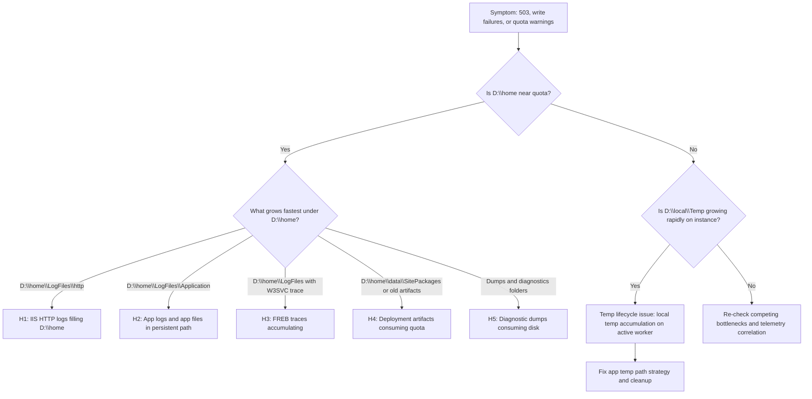

# Windows Filesystem Quotas and IIS Log Behaviors (Azure App Service Windows)

## 1. Summary

### Symptom
Windows App Service apps intermittently fail with quota and write errors after days or weeks of normal operation. Common impact patterns include `503` responses, application write exceptions, slow responses before failure, deployment extraction failures, and logging interruptions. The incident usually starts when `D:\home` approaches the plan quota or when write-heavy workflows overload local temporary storage on one worker instance.

### Why this scenario is confusing
The behavior mixes persistent and ephemeral storage semantics:

- `D:\home` is persistent and Azure Storage-backed for the app, so growth survives worker restarts and scale operations.
- `D:\local` is worker-local ephemeral disk, so files can disappear when the instance is recycled, moved, or replaced.
- `D:\local\Temp` is not automatically cleaned during the lifetime of the same worker instance.
- IIS and app diagnostics can continue writing while traffic is normal, so quota pressure may appear unrelated to recent code changes.

Responders often restart the app, observe temporary recovery, and incorrectly assume root cause is fixed.

### Troubleshooting decision flow (mermaid diagram)
<!-- diagram-id: windows-filesystem-quotas-flow -->


### Limitations

- This playbook targets Azure App Service **Windows** workers and filesystem behavior.
- It focuses on quota, log growth, and temp-file pressure; it is not a deep IIS tuning guide.
- It assumes diagnostic logs are enabled and accessible through App Service diagnostics or Kudu.
- Host-level implementation details are abstracted by the platform and may not be fully visible.

### Quick Conclusion
Treat the incident as a path-specific storage diagnosis, not a generic "disk full" event. Confirm whether pressure is in persistent `D:\home` (most often IIS, app logs, deployment remnants, or dumps) versus ephemeral `D:\local\Temp` (instance-local churn). Validate with Kudu filesystem evidence plus platform logs, then apply bounded retention and cleanup policies.

## 2. Common Misreadings

- "If I restart and errors stop, the root cause is gone." Persistent `D:\home` growth usually remains.
- "Only application files can fill quota." IIS HTTP logs and FREB traces can fill `D:\home` even with stable app code.
- "`D:\local\Temp` is cleaned continuously by the platform." It is not auto-cleaned during the same instance lifetime.
- "503 means CPU or memory only." Quota exhaustion and write failures can surface as `503` and startup degradation.
- "Scaling out always fixes disk pressure." Instance-local pressure may move, but persistent quota pressure follows the app.
- "Deployment succeeded, so no artifact risk." Old zip packages and extracted artifacts can still consume quota.
- "Windows and Linux paths are identical." They are not; Windows uses `D:\home` and `D:\local`, while Linux uses `/home` and `/tmp`.

## 3. Competing Hypotheses

- **H1: IIS HTTP logs filling D:\home (not rotated/cleaned)**
- **H2: Application writing large temp files to D:\home instead of D:\local**
- **H3: FREB traces enabled and accumulating**
- **H4: Deployment artifacts (old zip packages) consuming quota**
- **H5: Diagnostic dumps consuming disk space**

## 4. What to Check First

### Plan quota context
Confirm expected App Service filesystem quota by plan tier and current footprint.

| Plan context | Typical filesystem quota range (shared app storage) | Operational meaning |
|---|---|---|
| Lower tiers | ~250 MB to low-GB range | Quota can be reached quickly by logs and deployment artifacts |
| Standard/Premium families | Tens to hundreds of GB | Incident often appears after long retention windows |
| Larger Premium/Isolated profiles | Up to ~1 TB | Quota still finite; unbounded logs eventually fail |

!!! note "Quota interpretation"
    Use the platform-reported quota for the specific plan and region as the source of truth. The practical range across plans is roughly 250 MB to 1 TB.

### Fast storage split check

- Check whether failures reference `D:\home` (persistent quota pressure) or `D:\local\Temp` (instance-local pressure).
- Correlate first error timestamp with traffic spikes, deployment events, and logging configuration changes.
- Verify whether errors persist after restart. Persistent recurrence points to `D:\home` accumulation.

### Log path triage

- IIS HTTP logs: `D:\home\LogFiles\http`
- Application logs: `D:\home\LogFiles\Application`
- Failed Request Tracing (FREB): under `D:\home\LogFiles` with IIS trace files
- Deployment packages and artifacts: commonly under `D:\home\data\SitePackages` and deployment history locations
- Diagnostic dumps: under app data and diagnostics folders beneath `D:\home`

### Kudu first look commands
Use Kudu API to get immediate size evidence before deleting anything.

```bash
az webapp deployment list-publishing-profiles --resource-group <resource-group> --name <app-name>
az webapp show --resource-group <resource-group> --name <app-name>
```

```bash
curl --request POST \
  --url "https://<app-name>.scm.azurewebsites.net/api/command" \
  --user "<kudu-user>:<kudu-password>" \
  --header "Content-Type: application/json" \
  --data '{"command":"powershell -NoProfile -Command \"Get-PSDrive -Name D | Select-Object Used,Free\"","dir":"site\\wwwroot"}'
```

## 5. Evidence to Collect

### Required Evidence

- Current filesystem usage for `D:\home` and key subdirectories.
- Instance-local temp usage under `D:\local\Temp`.
- Log retention settings and whether detailed error/FREB logging is enabled.
- Time-correlated error evidence (`503`, write exceptions, startup failures).
- Recent deployment history and package retention footprint.
- Presence and size of dump files (`.dmp`) and diagnostic archives.

### Kudu API collection set

### API 1: Summarize top folders under D:\home

```bash
curl --request POST \
  --url "https://<app-name>.scm.azurewebsites.net/api/command" \
  --user "<kudu-user>:<kudu-password>" \
  --header "Content-Type: application/json" \
  --data '{"command":"powershell -NoProfile -Command \"Get-ChildItem D:\\home -Directory | ForEach-Object { $size=(Get-ChildItem $_.FullName -File -Recurse -ErrorAction SilentlyContinue | Measure-Object Length -Sum).Sum; [PSCustomObject]@{Path=$_.FullName;SizeGB=[math]::Round($size/1GB,2)} } | Sort-Object SizeGB -Descending | Select-Object -First 15\"","dir":"site\\wwwroot"}'
```

### API 2: Check IIS HTTP log growth

```bash
curl --request POST \
  --url "https://<app-name>.scm.azurewebsites.net/api/command" \
  --user "<kudu-user>:<kudu-password>" \
  --header "Content-Type: application/json" \
  --data '{"command":"powershell -NoProfile -Command \"$p=\'D:\\\\home\\\\LogFiles\\\\http\'; if (Test-Path $p) { Get-ChildItem $p -File -Recurse | Sort-Object Length -Descending | Select-Object -First 20 FullName,Length,LastWriteTime } else { Write-Output \'Path not found\' }\"","dir":"site\\wwwroot"}'
```

### API 3: Check application log growth

```bash
curl --request POST \
  --url "https://<app-name>.scm.azurewebsites.net/api/command" \
  --user "<kudu-user>:<kudu-password>" \
  --header "Content-Type: application/json" \
  --data '{"command":"powershell -NoProfile -Command \"$p=\'D:\\\\home\\\\LogFiles\\\\Application\'; if (Test-Path $p) { Get-ChildItem $p -File -Recurse | Sort-Object Length -Descending | Select-Object -First 20 FullName,Length,LastWriteTime } else { Write-Output \'Path not found\' }\"","dir":"site\\wwwroot"}'
```

### API 4: Check local temp accumulation

```bash
curl --request POST \
  --url "https://<app-name>.scm.azurewebsites.net/api/command" \
  --user "<kudu-user>:<kudu-password>" \
  --header "Content-Type: application/json" \
  --data '{"command":"powershell -NoProfile -Command \"$p=\'D:\\\\local\\\\Temp\'; if (Test-Path $p) { Get-ChildItem $p -File -Recurse -ErrorAction SilentlyContinue | Measure-Object Length -Sum | Select-Object Count,@{Name=\'SizeGB\';Expression={[math]::Round($_.Sum/1GB,2)}} } else { Write-Output \'Path not found\' }\"","dir":"site\\wwwroot"}'
```

### API 5: Find dump files and large traces

```bash
curl --request POST \
  --url "https://<app-name>.scm.azurewebsites.net/api/command" \
  --user "<kudu-user>:<kudu-password>" \
  --header "Content-Type: application/json" \
  --data '{"command":"powershell -NoProfile -Command \"Get-ChildItem D:\\home -File -Recurse -ErrorAction SilentlyContinue | Where-Object { $_.Extension -in @('.dmp','.zip','.etl','.xml') } | Sort-Object Length -Descending | Select-Object -First 30 FullName,Length,LastWriteTime\"","dir":"site\\wwwroot"}'
```

!!! tip "How to read Kudu size evidence"
    Prioritize growth trend and recency. A single large stale file may be less important than rapidly growing current-day logs.

### Sample event and log signatures

```text
2026-04-08T03:20:31Z  HTTP  GET  /api/orders  503  1421
2026-04-08T03:20:30Z  APP   IOException: There is not enough space on the disk.
2026-04-08T03:20:30Z  APP   Failed to write file D:\home\site\wwwroot\tmp\report-cache.bin
2026-04-08T03:19:59Z  IIS   W3SVC log write warning: quota or file write issue
```

### KQL queries with example outputs

### Query 1: 503 and latency drift around incident window

```kusto
AppServiceHTTPLogs
| where TimeGenerated > ago(6h)
| summarize requests=count(), errors503=countif(ScStatus == 503), p95=percentile(TimeTaken,95) by bin(TimeGenerated, 5m), CsUriStem
| order by TimeGenerated asc
```

**Example Output**

| TimeGenerated | CsUriStem | requests | errors503 | p95 |
|---|---|---:|---:|---:|
| 2026-04-08 03:10:00 | /api/orders | 220 | 0 | 120 |
| 2026-04-08 03:15:00 | /api/orders | 238 | 3 | 680 |
| 2026-04-08 03:20:00 | /api/orders | 245 | 21 | 1421 |

!!! tip "How to Read This"
    Rising `p95` followed by `503` concentration on write-heavy endpoints often indicates storage pressure before hard failure.

### Query 2: Console errors with disk indicators

```kusto
AppServiceConsoleLogs
| where TimeGenerated > ago(24h)
| where ResultDescription has_any ("not enough space", "disk", "quota", "D:\\home", "D:\\local\\Temp")
| project TimeGenerated, ResultDescription
| order by TimeGenerated desc
```

**Example Output**

| TimeGenerated | ResultDescription |
|---|---|
| 2026-04-08 03:20:30 | IOException: There is not enough space on the disk. |
| 2026-04-08 03:20:30 | Failed to write D:\home\LogFiles\Application\app-2026-04-08.log |
| 2026-04-08 03:19:58 | Warning: quota threshold reached for site storage |

### CLI investigation commands

```bash
az webapp config show --resource-group <resource-group> --name <app-name>
az webapp log config --resource-group <resource-group> --name <app-name> --application-logging filesystem --detailed-error-messages true --failed-request-tracing true --web-server-logging filesystem
az webapp log tail --resource-group <resource-group> --name <app-name>
```

```bash
az monitor metrics list --resource <app-resource-id> --metric "Http5xx" --interval PT5M --aggregation Total
az monitor metrics list --resource <app-resource-id> --metric "Requests" --interval PT5M --aggregation Total
```

### Normal vs abnormal comparison

| Signal | Normal | Abnormal |
|---|---|---|
| `D:\home\LogFiles\http` growth | Predictable daily growth with retention | Unbounded accumulation, older files never pruned |
| `D:\home\LogFiles\Application` | Rotated app logs | Large monolithic log files and persistent spikes |
| `D:\local\Temp` | Temporary churn, bounded size | Sustained growth within same instance lifetime |
| HTTP behavior | Stable p95 and low 5xx | Latency ramp then `503` bursts |
| Deployment | New package activated, old artifacts controlled | Old packages accumulate in site package paths |

## 6. Validation and Disproof by Hypothesis

### H1: IIS HTTP logs filling D:\home (not rotated/cleaned)
- **Signals that support**
    - `D:\home\LogFiles\http` is top consumer and keeps growing.
    - Error window aligns with heavy request volume and rising log volume.
    - App recovers briefly after deleting/rotating old HTTP logs.
- **Signals that weaken**
    - HTTP log path remains small while other folders dominate usage.
    - 503 events occur without significant log growth.
- **What to verify**
    - Kudu API 2 output and file recency.
    - Current web server logging configuration and retention behavior.
    - Whether logging is set to filesystem with no practical cleanup policy.

### H2: Application writing large temp files to D:\home instead of D:\local
- **Signals that support**
    - App code paths write caches, exports, or uploads under `D:\home`.
    - Large files appear in app-owned folders in persistent storage.
    - Incidents worsen over time rather than per-instance lifecycle.
- **Signals that weaken**
    - Large temp files are under `D:\local\Temp` only and rotate naturally with instance change.
    - Persistent storage remains relatively flat.
- **What to verify**
    - File paths in application logs and stack traces.
    - Kudu folder breakdown for app directories under `D:\home\site`.
    - App setting values controlling temp and cache locations.

### H3: FREB traces enabled and accumulating
- **Signals that support**
    - Failed Request Tracing is enabled for long periods.
    - Trace XML files under `D:\home\LogFiles` consume significant space.
    - High request-error periods generate large numbers of FREB files.
- **Signals that weaken**
    - FREB is disabled or trace directories are minimal.
    - Storage growth is dominated by non-trace files.
- **What to verify**
    - Logging configuration flags for failed request tracing.
    - Kudu listing for FREB-related XML files and size trend.
    - Correlation between 4xx/5xx bursts and trace file creation.

### H4: Deployment artifacts (old zip packages) consuming quota
- **Signals that support**
    - `D:\home\data\SitePackages` or related deployment paths contain many historical files.
    - Disk usage increases after each deployment and never returns.
    - Startup failures begin after release cadence increases.
- **Signals that weaken**
    - Deployment artifact folders are small and stable.
    - Incidents happen without recent deployments.
- **What to verify**
    - Kudu listing of deployment package directories and timestamps.
    - Deployment history versus quota growth timeline.
    - Whether cleanup process exists for stale packages.

### H5: Diagnostic dumps consuming disk space
- **Signals that support**
    - `.dmp` files or diagnostics archives are large and recent.
    - Incident starts after crash loops or proactive dump capture.
    - Disk pressure persists even when app log volume is moderate.
- **Signals that weaken**
    - Dump files are absent or negligible.
    - Deleting old dumps has no measurable impact.
- **What to verify**
    - Kudu API 5 output sorted by size and date.
    - Crash/restart timeline relative to dump generation.
    - Dump policy and retention controls.

## 7. Likely Root Cause Patterns

- **Pattern A: Logging retention gap on persistent storage**
    - IIS HTTP logs and app logs grow in `D:\home\LogFiles` without strict retention.
- **Pattern B: Persistent path misuse for temporary workloads**
    - Export/cache/upload intermediates are written to `D:\home` instead of bounded local temp.
- **Pattern C: Trace amplification during incident windows**
    - FREB and verbose diagnostics multiply file creation during 4xx/5xx spikes.
- **Pattern D: Release artifact accumulation**
    - Old deployment packages and extraction remnants remain under `D:\home`.
- **Pattern E: Crash diagnostics saturation**
    - Dump collection policies create large files with no timed purge.

### Investigation notes

- Persistent `D:\home` pressure does not disappear reliably after restart.
- `D:\local\Temp` pressure can look transient but still repeats on long-lived instances.
- Quota events can manifest as write exceptions first, then `503` as the app degrades.
- The fastest discriminator is path-level evidence from Kudu plus timestamped growth trends.

## 8. Immediate Mitigations

- Reduce filesystem logging scope and retention; disable unneeded verbose categories.
- Clean up stale IIS HTTP logs, stale application logs, old FREB traces, and obsolete package artifacts.
- Move temporary workload files from persistent `D:\home` to bounded `D:\local\Temp` where appropriate.
- Remove outdated dumps and tune dump policy to avoid unlimited growth.
- Restart the app after cleanup to validate recovery and confirm new growth baseline.

```bash
az webapp log config --resource-group <resource-group> --name <app-name> --application-logging filesystem --web-server-logging filesystem --detailed-error-messages false --failed-request-tracing false
az webapp restart --resource-group <resource-group> --name <app-name>
```

!!! warning "Deletion safety"
    Validate active file handles and retention requirements before deleting diagnostics artifacts in production.

## 9. Prevention

### Storage governance controls

- Define explicit retention windows for IIS HTTP logs and application filesystem logs.
- Keep FREB disabled by default and enable only for bounded troubleshooting windows.
- Add routine cleanup jobs for deployment artifacts and historical diagnostics files.
- Enforce application-level quotas for generated files and cache directories.

### Application design controls

- Use `D:\local\Temp` for true temporary files and clear them at workflow completion.
- Avoid writing large transient files to `D:\home` unless persistence is required.
- Keep upload and report generation pipelines streamed when possible to reduce disk spikes.
- Emit structured logs to external sinks instead of large local rolling files when feasible.

### Monitoring controls

- Alert on rapid growth under `D:\home\LogFiles` and key app data folders.
- Alert on sustained 503 increases with concurrent write-failure signatures.
- Review Kudu folder distribution during weekly operational health checks.

### Windows vs Linux contrast (for triage only)

- Windows App Service uses `D:\home` (persistent) and `D:\local\Temp` (ephemeral local instance storage).
- Linux App Service uses `/home` (persistent network-backed mount) and `/tmp` (local ephemeral storage).
- Use the correct path semantics to avoid false assumptions during incident response.

## See Also
- [No Space Left on Device / Ephemeral Storage Pressure (Linux)](./no-space-left-on-device.md)
- [Performance (First 10 Minutes)](../../first-10-minutes/performance.md)
## Sources
- [Operating system functionality on Azure App Service](https://learn.microsoft.com/en-us/azure/app-service/operating-system-functionality)
- [Enable diagnostic logging for apps in Azure App Service](https://learn.microsoft.com/en-us/azure/app-service/troubleshoot-diagnostic-logs)
- [Azure App Service diagnostics overview](https://learn.microsoft.com/en-us/azure/app-service/overview-diagnostics)
