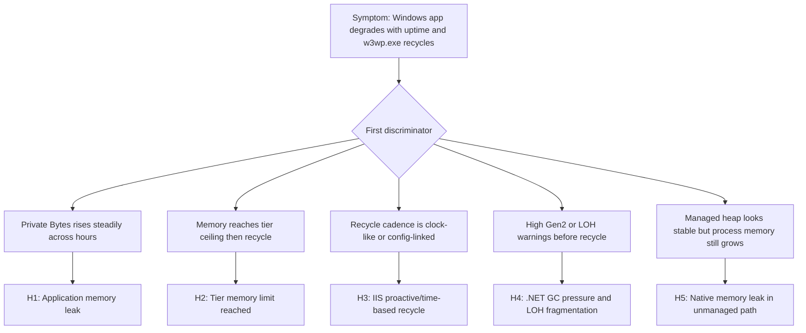

---
hide:
  - toc
title: Windows Memory Pressure and IIS Worker Recycling
slug: windows-memory-pressure-worker-recycling
doc_type: playbook
section: troubleshooting
topics:
  - performance
  - windows
  - memory
  - iis
  - recycling
products:
  - azure-app-service
status: stable
last_reviewed: 2026-04-09
summary: Diagnose memory pressure and unexpected w3wp.exe worker process recycling on Windows App Service.
---
# Windows Memory Pressure and IIS Worker Recycling (Azure App Service Windows)

## 1. Summary

### Symptom
The app is stable after restart, then latency and intermittent 5xx return as uptime increases. Windows workers (`w3wp.exe`) recycle unexpectedly, sessions may reset, and logs show process restarts without a code deployment event.

### Why this scenario is confusing
Memory pressure on App Service Windows often appears as periodic worker recycling rather than one obvious crash. IIS overlap recycle, platform restarts, .NET GC behavior, and native allocations can all look similar from high-level uptime signals. Teams also assume on-premises IIS behavior applies directly, but App Service sandbox and SKU memory ceilings materially change outcomes.

### Troubleshooting decision flow (mermaid diagram)


### Limitations
- This playbook targets **Windows App Service only** and focuses on `w3wp.exe` recycling behavior.
- It does not cover Linux container workers, Oryx startup, or `dotnet` process model on Linux plans.
- App Service host internals are abstracted; some low-level host counters from on-premises IIS are not directly exposed.
- Evidence quality depends on enabled diagnostics and retention period in the connected Log Analytics workspace.

### Quick Conclusion
If `w3wp.exe` private bytes climbs toward the SKU memory envelope and recycle events correlate with that rise, treat memory pressure as primary. Use Kudu Process Explorer and App Service Diagnostics Memory detector first, then disprove competing hypotheses with KQL timeline correlation before changing code or scaling policy.

## 2. Common Misreadings

- "IIS recycled, so App Service platform is unstable" (often memory threshold or configured recycle).
- "CPU is normal, so memory cannot be the bottleneck" (memory-only pressure can degrade latency first).
- "Restart fixed it permanently" (restart can mask leak or fragmentation pattern for a few hours).
- "On-premises IIS private memory tuning should be identical" (App Service imposes tier/sandbox constraints).
- "Managed heap is small, therefore no leak exists" (native allocations and fragmentation can dominate process RSS).
- "Only one app instance shows restarts, so this is random" (instance-local traffic skew can trigger per-instance pressure).

## 3. Competing Hypotheses

- **H1: Application memory leak (steady growth until recycling)**
    - Long-lived references, unbounded caches, retained per-request objects, or event-handler leaks grow `w3wp.exe` private bytes over uptime.
- **H2: Tier memory limit reached (app needs more RAM than plan provides)**
    - Workload memory demand exceeds practical per-worker envelope for the selected SKU, so recycle is capacity-driven.
- **H3: IIS proactive recycling (time-based or overlapping recycle)**
    - Scheduled/time-based recycle or config-triggered overlap recycle creates restart signatures that are not pure leak behavior.
- **H4: GC pressure in .NET (LOH fragmentation, excessive Gen2)**
    - High allocation churn and LOH fragmentation produce pause amplification and memory growth without classic object leak signatures.
- **H5: Native memory leak in unmanaged code**
    - Interop/native library usage leaks memory outside managed heap, so .NET counters look acceptable while process memory rises.

## 4. What to Check First

### Fast triage sequence
1. Open **Diagnose and solve problems** in App Service and run the **Memory** detector.
2. Open **Kudu** (`https://<app-name>.scm.azurewebsites.net`) and inspect **Process Explorer** for `w3wp.exe` private bytes trend.
3. Correlate recycle/restart times with memory rise using KQL across app, platform, and metrics logs.
4. Confirm whether recycle timing is threshold-driven (reactive) or schedule/config-driven (proactive).

### Practical memory envelope reference (Windows workers)

| Plan SKU | Practical `w3wp.exe` private bytes envelope | Operational interpretation |
|---|---|---|
| S1 | ~1 GB | Frequent pressure if app holds large in-memory caches or large object payloads |
| P1v2 | ~3.5 GB | Better headroom, still sensitive to fragmentation and native leaks |
| P1v3 | ~8 GB | Significant headroom; sustained climb here strongly suggests leak or oversized workload |

!!! warning "Interpret SKU values correctly"
    These values are practical troubleshooting envelopes, not hard contractual limits for every runtime combination. Always validate with observed per-instance metrics and current platform behavior.

### App Service Windows vs on-premises IIS mental model
- On-premises IIS lets you directly tune many app pool knobs per server; App Service abstracts host control and enforces multi-tenant safety boundaries.
- App Service applies platform-level safeguards that can recycle workers before traditional on-prem thresholds would be reached.
- Diagnosing memory must combine IIS/app evidence with App Service diagnostics signals; pure server-admin assumptions can mislead.

### Proactive vs reactive recycling discriminator
- **Reactive memory recycle**: private bytes trend approaches envelope, recycle occurs near peak, then memory resets lower.
- **Proactive/time-based recycle**: recycle occurs on regular cadence independent of memory peak.
- **Config-triggered recycle**: recycle aligns with configuration/app setting changes, slot swaps, or web.config touches.
- **Overlap recycle behavior**: temporary dual-worker overlap can increase short-lived memory pressure during transition.

## 5. Evidence to Collect

### Required evidence
- Kudu Process Explorer snapshots for `w3wp.exe` over time.
- App Service Diagnostics output from **Memory** detector.
- KQL timeline: memory counters + recycle/restart events + latency/error effects.
- App configuration timeline (settings change, slot swap, deployment).
- Runtime evidence: GC indicators (Gen2, LOH behavior) and native module usage.

### Kudu Process Explorer sample output

```text
Site: <app-name> (Windows)
Timestamp (UTC): 2026-04-09T07:42:00Z

Process Name   PID    CPU%   Private Bytes   Working Set   Handles   Threads   Uptime
-----------    ----   ----   -------------   -----------   -------   -------   --------
w3wp.exe       10324  28.4   987 MB          1.14 GB       2184      142       06:11:32
w3wp.exe       11488   2.1   126 MB          211 MB         512       33        00:00:41
dotnet.exe      8420   0.6    74 MB          129 MB         268       18        12:05:19
php-cgi.exe     0000   N/A    N/A            N/A            N/A       N/A       N/A

Observation:
- PID 10324 is the active worker near S1 practical envelope.
- PID 11488 indicates overlap recycle warm-up.
```

!!! tip "How to Read This"
    A short-lived second `w3wp.exe` during recycle is expected for overlap startup. The key signal is whether the long-running worker shows monotonic private-bytes growth leading to recycle.

### App Service Diagnostics sample findings (Memory detector)

```text
Detector: Memory Analysis (App Service Diagnostics)
Time range: Last 24 hours

Findings:
1) Worker memory usage reached 94% of available memory on instance RD00155D4E2A3B.
2) Process w3wp.exe exceeded normal baseline for 3h 18m before recycle.
3) 4 recycle events detected; 3 correlated with memory high-water marks.
4) Recommendation: Review in-memory cache size and evaluate scale-up to higher memory SKU.
```

### KQL Queries with Example Output

### Query 1: Private bytes trend for worker process

```kusto
AppMetrics
| where TimeGenerated > ago(24h)
| where Name has "Private Bytes" or Name has "Working Set"
| where Properties has "w3wp"
| extend Process=tostring(Properties.ProcessName)
| summarize avg_value=avg(Val), max_value=max(Val) by bin(TimeGenerated, 5m), Process, Name
| order by TimeGenerated asc
```

**Example Output**

| TimeGenerated | Process | Name | avg_value | max_value |
|---|---|---|---|---|
| 2026-04-09 04:00:00 | w3wp.exe | Process\Private Bytes | 512 | 590 |
| 2026-04-09 05:00:00 | w3wp.exe | Process\Private Bytes | 731 | 804 |
| 2026-04-09 06:00:00 | w3wp.exe | Process\Private Bytes | 892 | 970 |
| 2026-04-09 06:55:00 | w3wp.exe | Process\Private Bytes | 981 | 1008 |
| 2026-04-09 07:00:00 | w3wp.exe | Process\Private Bytes | 212 | 284 |

!!! tip "How to Read This"
    A sharp reset after a peak is recycle-consistent. Repeating stair-step growth strongly supports H1 or H2.

### Query 2: Restart/recycle correlation timeline

```kusto
AppServicePlatformLogs
| where TimeGenerated > ago(24h)
| where Message has_any ("recycle", "restart", "worker process", "w3wp", "site stopped", "site started")
| project TimeGenerated, Level, Message, _ResourceId
| order by TimeGenerated desc
```

**Example Output**

| TimeGenerated | Level | Message |
|---|---|---|
| 2026-04-09 07:00:06 | Informational | Site: <app-name> started. |
| 2026-04-09 06:59:58 | Warning | Worker process recycle initiated due to memory pressure. |
| 2026-04-09 06:59:55 | Informational | Site: <app-name> stopped. |
| 2026-04-09 02:59:57 | Warning | Worker process recycle initiated due to memory pressure. |

!!! tip "How to Read This"
    If each recycle aligns with memory peaks, H1/H2 strengthen. If recycle occurs on fixed intervals regardless of memory, H3 strengthens.

### Query 3: Latency/error impact around recycle windows

```kusto
AppServiceHTTPLogs
| where TimeGenerated > ago(24h)
| summarize requests=count(), p95=percentile(TimeTaken,95), p99=percentile(TimeTaken,99), errors=countif(ScStatus >= 500) by bin(TimeGenerated, 5m)
| order by TimeGenerated asc
```

**Example Output**

| TimeGenerated | requests | p95 | p99 | errors |
|---|---|---|---|---|
| 2026-04-09 06:45:00 | 11240 | 980 | 1840 | 9 |
| 2026-04-09 06:50:00 | 11308 | 1150 | 2220 | 14 |
| 2026-04-09 06:55:00 | 11092 | 1390 | 3110 | 26 |
| 2026-04-09 07:00:00 | 10231 | 420 | 760 | 3 |

### Query 4: .NET GC pressure signature (Gen2 and LOH-related indicators)

```kusto
AppTraces
| where TimeGenerated > ago(24h)
| where Message has_any ("Gen2", "Large Object Heap", "LOH", "GC", "allocation", "OutOfMemoryException")
| project TimeGenerated, SeverityLevel, Message
| order by TimeGenerated desc
```

**Example Output**

| TimeGenerated | SeverityLevel | Message |
|---|---|---|
| 2026-04-09 06:57:13 | Warning | Gen2 collection duration increased to 280ms percentile band. |
| 2026-04-09 06:55:02 | Warning | LOH allocation pressure detected in image transform path. |
| 2026-04-09 06:54:48 | Error | System.OutOfMemoryException in report aggregation pipeline. |

### Query 5: Config/deployment-change correlation

```kusto
AppServiceAuditLogs
| where TimeGenerated > ago(24h)
| where OperationName has_any ("Update site config", "Swap slots", "Restart Web App", "Set app settings")
| project TimeGenerated, OperationName, Caller, ResultDescription
| order by TimeGenerated desc
```

**Example Output**

| TimeGenerated | OperationName | Caller | ResultDescription |
|---|---|---|---|
| 2026-04-09 06:00:02 | Update site config | user@example.com | Succeeded |
| 2026-04-09 04:00:04 | Set app settings | user@example.com | Succeeded |

!!! note "Data source availability"
    Table names can vary by workspace onboarding path. If a table is unavailable, use equivalent App Service log tables already enabled in your environment and preserve the same time-correlation logic.

### CLI investigation commands (long flags only)

```bash
az webapp show --resource-group <resource-group> --name <app-name>
az webapp config show --resource-group <resource-group> --name <app-name>
az webapp config appsettings list --resource-group <resource-group> --name <app-name>
az webapp restart --resource-group <resource-group> --name <app-name>
az monitor metrics list --resource <app-service-plan-resource-id> --metric "MemoryPercentage,CpuPercentage,Http5xx" --interval PT1M --aggregation Average
az monitor app-insights query --app <application-insights-name> --analytics-query "AppServiceHTTPLogs | where TimeGenerated > ago(1h) | summarize requests=count() by bin(TimeGenerated, 5m)"
```

**Example Output (sanitized)**

```text
$ az monitor metrics list --resource <app-service-plan-resource-id> --metric "MemoryPercentage,CpuPercentage,Http5xx" --interval PT1M --aggregation Average
timestamp                  MemoryPercentage_Average   CpuPercentage_Average   Http5xx_Average
-------------------------  ------------------------   ---------------------   ---------------
2026-04-09T06:55:00Z       92.8                       38.1                    1.0
2026-04-09T06:56:00Z       93.4                       39.6                    2.0
2026-04-09T07:01:00Z       47.2                       24.8                    0.0
```

### Normal vs Abnormal Comparison

| Signal | Normal (Healthy) | Abnormal (Memory Pressure and Recycling) |
|---|---|---|
| `w3wp.exe` private bytes | Stable or cyclical within safe band | Stair-step growth toward SKU envelope then reset |
| Recycle timing | Rare, change-driven | Repeated near memory high-water mark or fixed cadence |
| GC behavior | Routine background collections | Frequent Gen2, LOH warnings, longer pause impact |
| HTTP tail latency | Predictable under same traffic | P95/P99 rises before recycle, then drops after restart |
| CPU vs memory | Roughly proportional trends | CPU moderate while memory saturates |
| Managed vs process memory | Similar directional movement | Process memory climbs beyond managed heap trend |

## 6. Validation and Disproof by Hypothesis

### H1: Application memory leak (steady growth until recycling)
- **Signals that support**
    - Private bytes trend increases continuously across steady traffic periods.
    - Recycle/reset temporarily restores latency and memory baseline.
    - Same growth pattern repeats after each recycle.
    - Cache cardinality or retained object counts increase over time.
- **Signals that weaken**
    - Growth disappears under identical load after code rollback.
    - Memory remains flat when instrumentation and cache features are disabled.
    - Recycle occurs at fixed wall-clock intervals without memory rise.
- **What to verify**
    - Confirm monotonic private-bytes trend from Kudu snapshots and Query 1.
    - Compare pre/post-recycle latency from Query 3.
    - Review recent changes for unbounded cache, static collections, and retention bugs.

### H2: Tier memory limit reached (app needs more RAM than plan provides)
- **Signals that support**
    - Peaks consistently align near practical envelope (S1 ~1 GB, P1v2 ~3.5 GB, P1v3 ~8 GB).
    - Recycle frequency drops immediately after scale-up to higher-memory SKU.
    - Workload characteristics include large payload in-memory transformations.
    - Multiple instances show similar high-memory pattern under load.
- **Signals that weaken**
    - Pressure persists after scale-up with proportional headroom increase.
    - Only one code path or tenant triggers growth independent of traffic volume.
    - Process memory remains low but recycles still occur by schedule.
- **What to verify**
    - Compare memory peaks against SKU envelope and detector findings.
    - Run controlled scale-up and observe recycle reduction.
    - Validate whether memory demand is expected workload size or unexpected retention.

### H3: IIS proactive recycling (time-based or overlapping recycle)
- **Signals that support**
    - Recycles occur on predictable cadence (for example every N hours) independent of memory peak.
    - Recycles align with app setting updates, slot swaps, or config writes.
    - Overlap recycle shows short dual-`w3wp.exe` period with smooth handoff.
    - No strong memory stair-step preceding every recycle event.
- **Signals that weaken**
    - Recycle timing varies with load and follows memory highs.
    - Recycles disappear without config changes but with memory optimization.
    - Detector explicitly flags memory-triggered recycle correlation.
- **What to verify**
    - Use Query 2 and Query 5 to align recycle events to schedule/config operations.
    - Check deployment history and automation jobs touching configuration.
    - Distinguish overlap recycle (expected) from recycle storm (problematic).

### H4: GC pressure in .NET (LOH fragmentation, excessive Gen2)
- **Signals that support**
    - App traces show increased Gen2 frequency/duration near incident windows.
    - LOH-heavy paths (large JSON, image/PDF processing, report generation) correlate with latency spikes.
    - Managed heap size oscillates while process memory remains elevated due to fragmentation.
    - Throughput drops despite moderate CPU because GC pause overhead increases.
- **Signals that weaken**
    - GC metrics remain stable while private bytes rises linearly.
    - Non-.NET components dominate process allocations.
    - Load tests with identical payloads do not reproduce GC stress.
- **What to verify**
    - Run Query 4 and correlate timestamps with Query 3 degradation periods.
    - Profile allocation hotspots in affected endpoints.
    - Validate payload size distribution and serialization buffering behavior.

### H5: Native memory leak in unmanaged code
- **Signals that support**
    - Process private bytes grows while managed heap/counters remain comparatively stable.
    - Leak appears in features using interop/native dependencies (image codecs, PDF engines, compression libs).
    - Memory does not return after full GC, only after process recycle.
    - Handle count or native object usage trends upward with uptime.
- **Signals that weaken**
    - Growth disappears after managed-code fix with no native dependency changes.
    - Managed heap rise fully explains total process memory growth.
    - Native-heavy code paths are not active during incidents.
- **What to verify**
    - Correlate feature-level traffic with private-bytes rise.
    - Capture repeated process snapshots via Kudu Process Explorer.
    - Audit native package versions and known leak advisories.

## 7. Likely Root Cause Patterns

- **Pattern A: Unbounded in-memory cache in ASP.NET application layer**
    - Cache keyed by request/user dimensions grows without eviction and drives recurring high-water recycle.
- **Pattern B: SKU mismatch for workload memory profile**
    - S1 or P1v2 selected for workloads requiring larger sustained object graphs.
- **Pattern C: Recycle policy noise mistaken for instability**
    - Time-based/config-triggered overlap recycle interpreted as random platform crash.
- **Pattern D: LOH-heavy payload processing under burst traffic**
    - Large allocations fragment heap, increase Gen2 pause cost, and amplify tail latency.
- **Pattern E: Native library leak in mixed-mode path**
    - Unmanaged allocations accumulate until worker recycle resets process memory.

### Investigation notes
- Treat recycle as a symptom classification problem first: reactive memory vs proactive schedule/config.
- Always inspect **per-instance** memory timelines; averages hide one-hot instance failure.
- Correlate latency, memory, and restart events in a single time axis before selecting mitigations.
- Keep evidence sanitized and avoid embedding tenant or subscription identifiers.

### Quick conclusion
In Windows App Service, repeated `w3wp.exe` recycle with uptime-linked degradation is usually memory-shape driven, not random platform restart. Distinguish leak, capacity ceiling, proactive recycle, GC pressure, and native leak using Kudu + Diagnostics + KQL correlation, then apply the least risky mitigation that matches the validated hypothesis.

## 8. Immediate Mitigations

- Scale up to a higher-memory SKU when evidence supports H2 and user impact is active.
- Reduce in-memory cache limits and enforce bounded eviction to lower private-bytes slope.
- Move memory-intensive endpoints to async/background architecture to reduce in-flight object retention.
- Trigger controlled app restart during incident bridge window while deeper fix is prepared.
- Temporarily lower concurrency for heavy endpoints to reduce allocation bursts and Gen2 pressure.
- Patch or rollback known leaky native/interop library versions in affected code paths.
- Stagger or remove unnecessary config updates that trigger avoidable proactive recycles.

!!! warning "Mitigation ordering"
    Prefer reversible mitigations first (scale, cap cache, controlled restart) while evidence collection continues. Avoid simultaneous large code and infrastructure changes that erase causal clarity.

## 9. Prevention

- Define memory budgets per endpoint and per worker, then validate in load tests before production rollout.
- Add memory SLO guardrails: alert on private-bytes slope, recycle frequency, and P95/P99 co-movement.
- Use bounded caches with explicit size limits and expiration policy across all app modules.
- Include LOH and Gen2 telemetry in release validation for .NET applications handling large objects.
- Audit native dependencies quarterly and track security/performance advisories for leak regressions.
- Isolate high-memory workloads onto dedicated plans to reduce cross-workload contention.
- Use staged rollout with slot testing to detect memory growth patterns before full production traffic.

## See Also

- [Memory Pressure and Worker Degradation (Linux)](memory-pressure-and-worker-degradation.md)
- [Intermittent 5xx Under Load](intermittent-5xx-under-load.md)
- [Slow Response but Low CPU](slow-response-but-low-cpu.md)
- [Performance (First 10 Minutes)](../../first-10-minutes/performance.md)

## Sources

- [Azure App Service diagnostics overview](https://learn.microsoft.com/en-us/azure/app-service/overview-diagnostics)
- [Troubleshoot performance degradation in Azure App Service](https://learn.microsoft.com/en-us/azure/app-service/troubleshoot-performance-degradation)
- [Troubleshoot .NET process crash and memory issues (practice lab reference)](https://learn.microsoft.com/en-us/troubleshoot/developer/webapps/aspnetcore/practice-troubleshoot-linux/lab-2-2-dotnet-process-crash)
