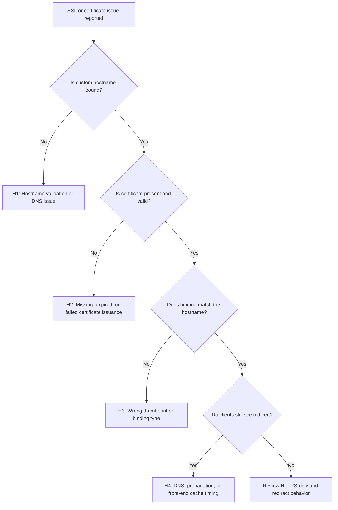

---
content_sources:
  diagrams:
    - id: ssl-certificate-issues-flow
      type: flowchart
      source: self-generated
      justification: "Synthesized hostname, certificate, and binding checks from Microsoft Learn guidance for custom domains and TLS/SSL certificate troubleshooting."
      based_on:
        - https://learn.microsoft.com/en-us/troubleshoot/azure/app-service/connection-issues-with-ssl-or-tls/troubleshoot-domain-and-tls-ssl-certificates
        - https://learn.microsoft.com/en-us/azure/app-service/app-service-web-tutorial-custom-domain
content_validation:
  status: verified
  last_reviewed: "2026-04-12"
  reviewer: ai-agent
  core_claims:
    - claim: "Azure App Service supports free App Service managed certificates, App Service certificates, Key Vault imported certificates, uploaded private certificates, and uploaded public certificates."
      source: "https://learn.microsoft.com/azure/app-service/configure-ssl-certificate"
      verified: true
    - claim: "A private certificate uploaded or imported to App Service must be a password-protected PFX file and include the full certificate chain."
      source: "https://learn.microsoft.com/azure/app-service/configure-ssl-certificate"
      verified: true
    - claim: "To secure a custom domain with a TLS binding, the certificate must include server authentication extended key usage and be signed by a trusted certificate authority."
      source: "https://learn.microsoft.com/azure/app-service/configure-ssl-certificate"
      verified: true
    - claim: "Private certificates uploaded or imported to App Service are stored in a deployment unit and shared with apps in the same resource group, region, and operating system combination."
      source: "https://learn.microsoft.com/azure/app-service/configure-ssl-certificate"
      verified: true
    - claim: "Free App Service managed certificates do not support wildcard certificates and are not exportable."
      source: "https://learn.microsoft.com/azure/app-service/configure-ssl-certificate"
      verified: true
---

# SSL Certificate Issues

## 1. Summary

This playbook applies when a custom domain on Azure App Service cannot be bound, serves an invalid or expired certificate, fails hostname validation, or redirects users to TLS warnings. Use it for App Service Managed Certificates, imported certificates, and custom domain mapping incidents.

### Symptoms

- Browser warns that the certificate is invalid, expired, or does not match the hostname.
- Binding a certificate to a custom domain fails in the portal or CLI.
- The custom hostname works over HTTP but HTTPS returns an error.
- Renewals appear complete, but clients still see the old thumbprint or stale certificate.

### Common error messages

- `Hostname is not verified for this app.`
- `Cannot find certificate with thumbprint ...`.
- `The certificate is expired` or `NET::ERR_CERT_COMMON_NAME_INVALID`.
- `SSL binding could not be added because the hostname is not configured.`
- `Managed certificate creation failed`.

<!-- diagram-id: ssl-certificate-issues-flow -->


## 2. Common Misreadings

| Observation | Often Misread As | Actually Means |
|---|---|---|
| Domain resolves to the app | Hostname is verified | DNS resolution alone does not prove App Service ownership validation completed. |
| Certificate exists in inventory | HTTPS must work | The certificate can exist but still be unbound or bound to the wrong hostname. |
| Browser still shows old cert | Renewal failed | DNS or client-side cache can outlive the management operation. |
| HTTP works | TLS should work automatically | Custom domain mapping and SSL binding are distinct steps. |
| Managed certificate request failed | App Service does not support the domain | The hostname, TXT/CNAME records, or unsupported certificate scenario is often the real issue. |

## 3. Competing Hypotheses

| Hypothesis | Likelihood | Key Discriminator |
|---|---|---|
| H1: Hostname validation or DNS records are wrong | High | App Service rejects hostname binding or shows hostname unverified. |
| H2: Certificate is expired, missing, or issuance failed | High | Certificate list lacks a valid certificate for the hostname or expiration window is exceeded. |
| H3: SSL binding points to the wrong thumbprint or wrong hostname | High | Binding inventory does not match the active custom domain. |
| H4: DNS propagation, cache, or front-end timing masks a completed change | Medium | Azure config looks correct, but clients continue to see old certificate data for a limited window. |
| H5: HTTPS policy or redirect configuration causes user-visible confusion | Medium | TLS technically works, but users are routed through mixed hostnames or broken redirect chains. |

## 4. What to Check First

1. **Inspect custom hostname bindings**

    ```bash
    az webapp config hostname list \
        --resource-group $RG \
        --webapp-name $APP_NAME \
        --output table
    ```

2. **Inspect certificate inventory**

    ```bash
    az webapp config ssl list \
        --resource-group $RG \
        --output table
    ```

3. **Inspect SSL bindings on the app**

    ```bash
    az webapp show \
        --resource-group $RG \
        --name $APP_NAME \
        --query "hostNameSslStates[].{name:name,sslState:sslState,thumbprint:thumbprint}" \
        --output table
    ```

4. **Confirm HTTPS-only and host state**

    ```bash
    az webapp show \
        --resource-group $RG \
        --name $APP_NAME \
        --query "{httpsOnly:httpsOnly,hostNames:hostNames,state:state}" \
        --output json
    ```

## 5. Evidence to Collect

Capture DNS state, hostname binding state, certificate inventory, and user-facing symptom at the same time. Many SSL incidents are simply mismatched layers.

### 5.1 KQL Queries

#### Query 1: HTTPS host and status behavior

```kusto
AppServiceHTTPLogs
| where TimeGenerated > ago(24h)
| where ScStatus >= 400 or CsHost has "."
| summarize Requests=count(), P95=percentile(TimeTaken,95) by CsHost, ScStatus
| order by Requests desc
```

| Column | Example data | Interpretation |
|---|---|---|
| `CsHost` | `www.contoso.example` | Confirms the incident is on the custom domain, not only the default host. |
| `ScStatus` | `301` | Redirects can be normal if they consistently move HTTP to HTTPS. |
| `ScStatus` | `400` or `495`-style proxy failure | Indicates TLS or host mismatch path needs attention. |

!!! tip "How to Read This"
    HTTP logs do not expose the full TLS handshake, but they quickly show whether requests are landing on the intended hostname and whether redirect behavior is coherent.

#### Query 2: Platform lifecycle around custom domain or restart changes

```kusto
AppServicePlatformLogs
| where TimeGenerated > ago(24h)
| where Message has_any ("certificate", "hostname", "restart", "binding")
| project TimeGenerated, Level, Message
| order by TimeGenerated desc
```

| Column | Example data | Interpretation |
|---|---|---|
| `Message` | `Site restarted after configuration update` | A binding change may have just been applied. |
| `Message` | `certificate` | Use with CLI inventory to confirm whether the change propagated. |
| `Level` | `Informational` | Informational rows still matter because SSL issues are often config-state mismatches. |

!!! tip "How to Read This"
    Binding changes often trigger configuration refreshes. Correlate timing before assuming certificate issuance itself failed.

#### Query 3: Application Insights availability or request failures by host (if enabled)

```kusto
requests
| where timestamp > ago(24h)
| summarize Requests=count(), Failures=countif(success == false), P95=percentile(duration,95) by cloud_RoleName, urlHost=tostring(parse_url(url).Host)
| order by Requests desc
```

| Column | Example data | Interpretation |
|---|---|---|
| `urlHost` | `api.contoso.example` | Confirms which host users actually hit. |
| `Failures` | `84` | App-level failures after TLS success point to redirect or host routing side effects instead of raw certificate absence. |
| `P95` | `00:00:01.1000000` | Distinguishes network/TLS confusion from healthy app execution after handshake. |

!!! tip "How to Read This"
    If requests arrive on the custom host and the app processes them, the TLS problem may already be resolved for some clients and only partially propagated elsewhere.

### 5.2 CLI Investigation

```bash
# Show hostname bindings
az webapp config hostname list \
    --resource-group $RG \
    --webapp-name $APP_NAME \
    --output json
```

Sample output:

```json
[
  {
    "name": "www.contoso.example",
    "siteName": "app-contoso"
  }
]
```

Interpretation:

- The hostname must exist here before SSL binding can succeed.
- If absent, focus on DNS/TXT/CNAME validation first.

```bash
# Show certificate inventory and expiration
az webapp config ssl list \
    --resource-group $RG \
    --query "[].{hostNames:hostNames,expirationDate:expirationDate,thumbprint:thumbprint}" \
    --output table
```

Sample output:

```text
HostNames                ExpirationDate          Thumbprint
-----------------------  ----------------------  --------------------------------
["www.contoso.example"] 2026-09-18T23:59:59Z   xxxxxxxx-xxxx-xxxx-xxxx-xxxxxxxxxxxx
```

Interpretation:

- Expiration date immediately answers whether H2 is plausible.
- Thumbprint must match the binding intended for the custom hostname.

## 6. Validation and Disproof by Hypothesis

### H1: Hostname validation or DNS issue

**Proves if** the custom hostname is missing or unverified in App Service.

**Disproves if** hostname binding is present and correct.

Validation steps:

1. Confirm TXT/CNAME or A record requirements for the hostname scenario.
2. Re-run hostname inventory after DNS updates propagate.
3. Only attempt SSL bind after the hostname exists in the app config.

### H2: Certificate missing, expired, or issuance failed

**Proves if** no valid certificate covers the hostname or the expiration window has passed.

**Disproves if** certificate inventory shows a valid certificate and current expiration date.

Validation steps:

1. Inspect certificate list and expiration.
2. Confirm the certificate type supports the scenario.
3. Recreate or re-import the certificate only after hostname verification is stable.

### H3: Wrong thumbprint or binding type

**Proves if** the bound certificate does not map to the active hostname.

**Disproves if** the thumbprint and hostname line up and clients still gradually converge.

Validation steps:

1. Match thumbprint to hostnames in the certificate list.
2. Rebind with the intended thumbprint.
3. Confirm clients access the same hostname that the certificate covers.

### H4: Propagation or cache timing issue

**Proves if** Azure configuration is correct but a subset of clients still sees stale certificate metadata.

**Disproves if** fresh requests from multiple networks all show the same persistent mismatch.

Validation steps:

1. Compare results from browser, curl, and another network.
2. Wait for DNS and front-end propagation before reissuing multiple changes.
3. Avoid simultaneous hostname, DNS, and certificate modifications if one change is still converging.

## 7. Likely Root Cause Patterns

| Pattern | Evidence | Resolution |
|---|---|---|
| Hostname not verified | Hostname missing from app config | Fix DNS ownership records and add hostname again. |
| Certificate expired | Expiration date already passed | Renew or replace the certificate immediately. |
| Wrong certificate bound | Thumbprint does not match hostname | Bind the correct certificate to the hostname. |
| Renewal completed but clients stale | Azure inventory correct, some clients still see old cert | Allow propagation and validate from fresh networks. |
| Redirect confusion | HTTP/HTTPS hostnames mismatch across redirects | Standardize canonical host and HTTPS-only behavior. |

## 8. Immediate Mitigations

1. If the certificate is expired, bind a valid replacement first before deeper cleanup.
2. If the hostname is unverified, pause further SSL changes until DNS ownership records are correct.
3. Rebind the intended thumbprint explicitly after verifying the hostname binding exists.
4. Enable HTTPS-only only after confirming TLS works on the custom host.
5. Validate from multiple clients and networks before declaring the incident closed.

## 9. Prevention

### Prevention checklist

- [ ] Track certificate expiration with alerts well before renewal deadlines.
- [ ] Keep DNS ownership records documented for every custom hostname.
- [ ] Standardize one canonical hostname and redirect pattern.
- [ ] Validate hostname binding before certificate issuance or binding changes.
- [ ] Record current thumbprint and expiration in operational runbooks.

## See Also

- [Playbooks](index.md)
- [Security Operations](../../operations/security.md)
- [Custom Domain and SSL on App Service](../../language-guides/python/tutorial/07-custom-domain-ssl.md)
- [Reference Troubleshooting](../../reference/troubleshooting.md)

## Sources

- [Map an existing custom DNS name to Azure App Service (Microsoft Learn)](https://learn.microsoft.com/en-us/azure/app-service/app-service-web-tutorial-custom-domain)
- [Secure a custom DNS name with a TLS/SSL binding in Azure App Service (Microsoft Learn)](https://learn.microsoft.com/en-us/azure/app-service/configure-ssl-bindings)
- [Add and manage TLS/SSL certificates in Azure App Service (Microsoft Learn)](https://learn.microsoft.com/en-us/azure/app-service/configure-ssl-certificate)
