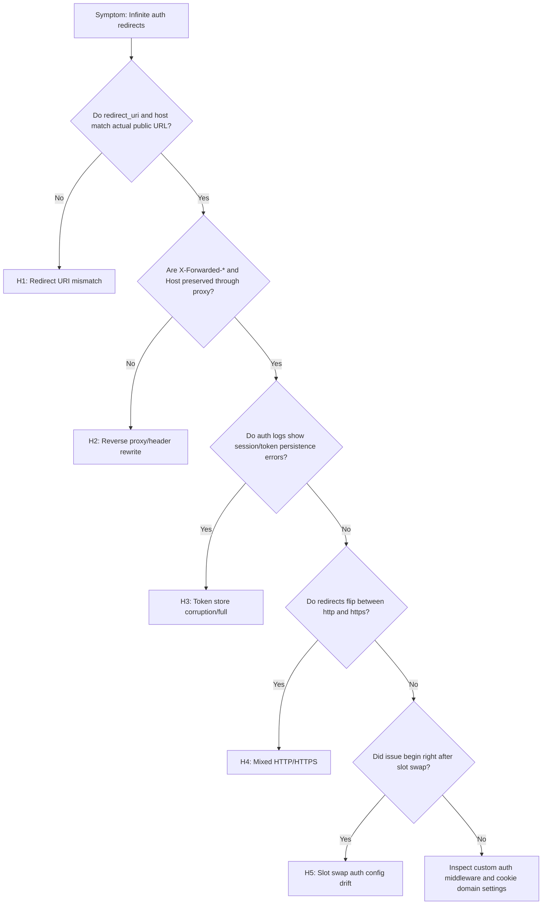
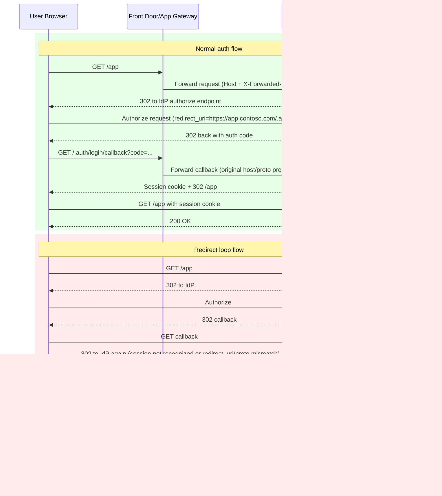

---
content_sources:
  diagrams:
    - id: auth-redirect-loop-flow
      type: flowchart
      source: self-generated
      justification: "Synthesized redirect-loop decision points from Microsoft Learn guidance on App Service authentication, reverse-proxy redirects, and slot-specific auth settings."
      based_on:
        - https://learn.microsoft.com/en-us/azure/app-service/overview-authentication-authorization
        - https://learn.microsoft.com/en-us/azure/app-service/deploy-staging-slots
        - https://learn.microsoft.com/en-us/azure/app-service/app-service-web-tutorial-custom-domain
    - id: auth-redirect-loop-sequence
      type: sequence
      source: self-generated
      justification: "Synthesized normal versus looping auth redirects from Microsoft Learn guidance on App Service authentication and reverse-proxy redirect handling."
      based_on:
        - https://learn.microsoft.com/en-us/azure/app-service/overview-authentication-authorization
content_validation:
  status: verified
  last_reviewed: "2026-04-12"
  reviewer: ai-agent
  core_claims:
    - claim: "Azure App Service provides built-in authentication and authorization support."
      source: "https://learn.microsoft.com/azure/app-service/overview-authentication-authorization"
      verified: true
    - claim: "App Service authentication settings, if enabled, are applied during a slot swap."
      source: "https://learn.microsoft.com/azure/app-service/deploy-staging-slots"
      verified: true
---

# Authentication Redirect Loop (Azure App Service Linux)

## 1. Summary

### Symptom

Users are redirected repeatedly between App Service and the identity provider (Microsoft Entra ID or another OpenID Connect provider). The browser eventually shows a "too many redirects" error, and the application never loads.

### Why this scenario is confusing

Redirect loops can be caused by identity configuration drift, reverse-proxy header handling, token persistence failures, protocol mismatch, or deployment-slot behavior. The browser symptom is the same while the remediation is different for each root cause.

### Troubleshooting decision flow

<!-- diagram-id: auth-redirect-loop-flow -->


### Symptom details

- Browser network trace shows repeated `302` responses between App Service and the identity provider.
- Browser error: `ERR_TOO_MANY_REDIRECTS` (or equivalent).
- App sign-in appears successful at the identity provider but returns to sign-in immediately.
- No steady authenticated session is established.

### Normal flow vs redirect loop flow

<!-- diagram-id: auth-redirect-loop-sequence -->


## 2. Common Misreadings

- "Identity provider is down." (loop usually results from config mismatch, not provider outage)
- "User password or MFA failure." (credentials can be correct while callback/session handling is broken)
- "Clearing browser cookies is the fix." (may temporarily mask symptoms but not configuration root cause)
- "This is always an app code bug." (most loops are auth/proxy/host/protocol configuration issues)
- "If production works, staging config differences do not matter." (slot swap can promote bad auth settings)

## 3. Competing Hypotheses

- **H1: Redirect URI mismatch** — App registration redirect URI does not match the app's actual public URL (for example custom domain vs `azurewebsites.net`).
- **H2: Reverse proxy stripping headers** — Front Door or Application Gateway modifies `Host` or `X-Forwarded-Proto`, so auth redirect generation is incorrect.
- **H3: Token store corruption or full** — Auth module cannot persist or retrieve session tokens, so each request re-triggers authentication.
- **H4: Mixed HTTP/HTTPS** — App is effectively perceived as HTTP internally while external URL is HTTPS, causing protocol mismatch loops.
- **H5: Slot swap broke auth config** — Slot-sticky auth settings (client ID, issuer, redirect URI assumptions) diverged during swap.

## 4. What to Check First

### Metrics

- `302` rate bursts over short windows and concentration on `/` + callback path.
- Number of redirect hops per client/session over time.
- Timing correlation between redirect spikes and recent config/swap events.

### Logs

- `AppServiceHTTPLogs` for repeated `302` chains and callback behavior.
- `AppServiceAuthenticationLogs` for `redirect_uri`, nonce/state, cookie/correlation failures.
- Browser network/HAR chain proving loop sequence and host/scheme used.

### Platform Signals

- Effective App Service auth settings and HTTPS-only posture.
- Proxy/edge host + `X-Forwarded-Proto` forwarding behavior.
- Slot configuration parity and recent swap timeline.

## 5. Evidence to Collect

### Required Evidence

- Redirect chain capture from browser DevTools (network HAR preferred).
- Authentication settings and app settings from Azure CLI.
- `AppServiceHTTPLogs` evidence showing 302 chain patterns.
- `AppServiceAuthenticationLogs` evidence showing callback/auth failures.
- Proxy configuration evidence (Front Door/App Gateway header forwarding behavior).

### Core commands

```bash
az webapp show --resource-group <resource-group> --name <app-name>
az webapp auth show --resource-group <resource-group> --name <app-name>
az webapp config appsettings list --resource-group <resource-group> --name <app-name>
az webapp deployment slot list --resource-group <resource-group> --name <app-name>
```

### KQL: HTTP redirect-chain evidence

```kusto
AppServiceHTTPLogs
| where TimeGenerated > ago(6h)
| where ScStatus == 302
| summarize redirects=count(), paths=dcount(CsUriStem), clients=dcount(CIp) by bin(TimeGenerated, 5m)
| order by TimeGenerated asc
```

```kusto
AppServiceHTTPLogs
| where TimeGenerated > ago(6h)
| where ScStatus == 302
| summarize hops=count() by CIp, CsUserAgent, bin(TimeGenerated, 2m)
| where hops > 10
| order by hops desc
```

### KQL: authentication failure evidence

```kusto
AppServiceAuthenticationLogs
| where TimeGenerated > ago(6h)
| summarize failures=count() by ResultDescription, bin(TimeGenerated, 5m)
| order by TimeGenerated asc
```

```kusto
AppServiceAuthenticationLogs
| where TimeGenerated > ago(6h)
| where ResultDescription has_any ("redirect_uri", "invalid", "nonce", "state", "token", "cookie", "correlation")
| project TimeGenerated, OperationName, ResultDescription
| order by TimeGenerated desc
```

### Sample Log Patterns

> These examples are **illustrative synthetic patterns** (no dedicated live lab dataset currently exists for this scenario).

### CLI Investigation Commands

```bash
# Inspect effective auth settings
az webapp auth show --resource-group <resource-group> --name <app-name> --output json

# Check HTTPS enforcement and host-related configuration
az webapp show --resource-group <resource-group> --name <app-name> --query "{defaultHostName:defaultHostName,httpsOnly:httpsOnly,hostNames:hostNames}" --output json

# Compare production and staging auth-relevant app settings
az webapp config appsettings list --resource-group <resource-group> --name <app-name> --slot production --query "[?name=='WEBSITE_AUTH_ENABLED' || name=='WEBSITE_AUTH_DEFAULT_PROVIDER' || name=='WEBSITE_AUTH_CLIENT_ID' || name=='WEBSITE_AUTH_OPENID_ISSUER'].{name:name,value:value}" --output table
az webapp config appsettings list --resource-group <resource-group> --name <app-name> --slot <staging-slot> --query "[?name=='WEBSITE_AUTH_ENABLED' || name=='WEBSITE_AUTH_DEFAULT_PROVIDER' || name=='WEBSITE_AUTH_CLIENT_ID' || name=='WEBSITE_AUTH_OPENID_ISSUER'].{name:name,value:value}" --output table
```

**Example Output (illustrative):**

```text
{
  "enabled": true,
  "defaultProvider": "azureactivedirectory",
  "unauthenticatedClientAction": "RedirectToLoginPage"
}

{
  "defaultHostName": "<app-name>.azurewebsites.net",
  "httpsOnly": true,
  "hostNames": [
    "<app-name>.azurewebsites.net",
    "app.contoso.com"
  ]
}

Name                           Value
-----------------------------  -----------------------------------------------
WEBSITE_AUTH_ENABLED           True
WEBSITE_AUTH_DEFAULT_PROVIDER  AzureActiveDirectory
WEBSITE_AUTH_CLIENT_ID         <masked>
WEBSITE_AUTH_OPENID_ISSUER     https://login.microsoftonline.com/<tenant-id>/v2.0
```

!!! tip "How to Read This"
    CLI output should prove host/scheme/auth settings are internally consistent across slots. If they are not, fix config parity first; app-code changes rarely resolve redirect loops caused by auth configuration drift.

### AppServiceHTTPLogs (illustrative redirect-loop signature)

```text
[AppServiceHTTPLogs]
2026-04-04T12:01:14Z  GET  /                       302  21
2026-04-04T12:01:14Z  GET  /.auth/login/aad/callback 302  33
2026-04-04T12:01:15Z  GET  /                       302  19
2026-04-04T12:01:15Z  GET  /.auth/login/aad/callback 302  30
2026-04-04T12:01:16Z  GET  /                       302  20
2026-04-04T12:01:16Z  GET  /.auth/login/aad/callback 302  29
```

### AppServiceAuthenticationLogs (illustrative auth-module signal)

```text
[AppServiceAuthenticationLogs]
2026-04-04T12:01:14Z  Warning  Correlation cookie validation failed for callback request.
2026-04-04T12:01:14Z  Warning  redirect_uri mismatch. Expected https://app.contoso.com/.auth/login/aad/callback
2026-04-04T12:01:15Z  Warning  Nonce validation failed. Authentication handshake restarting.
2026-04-04T12:01:16Z  Warning  Token persisted = false. Re-challenging user.
```

### Reverse proxy header mismatch pattern (illustrative)

```text
[Proxy Access Logs]
2026-04-04T12:01:14Z  host=app.contoso.com  x-forwarded-proto=http   upstream_status=302
2026-04-04T12:01:15Z  host=app.contoso.com  x-forwarded-proto=http   upstream_status=302
```

!!! tip "How to Read This"
    Repeating `302` on both `/` and callback path with nonce/state/correlation warnings indicates handshake never reaches stable session establishment. Prioritize H1/H2/H4 before changing application business logic.

### Query 1: Detect redirect-loop bursts

```kusto
AppServiceHTTPLogs
| where TimeGenerated > ago(6h)
| where ScStatus == 302
| summarize redirects=count(), distinctPaths=dcount(CsUriStem), distinctClients=dcount(CIp) by bin(TimeGenerated, 1m)
| where redirects >= 20
| order by TimeGenerated asc
```

**Example Output (illustrative):**

| TimeGenerated | redirects | distinctPaths | distinctClients |
|---|---|---|---|
| 2026-04-04 12:01:00 | 48 | 2 | 3 |
| 2026-04-04 12:02:00 | 57 | 2 | 4 |
| 2026-04-04 12:03:00 | 51 | 2 | 3 |

!!! tip "How to Read This"
    Very high per-minute `302` counts with only 1-2 active paths are classic loop telemetry. Normal sign-in flow produces short redirect bursts, not sustained high-rate repetition.

### Query 2: Isolate callback/auth-validation failure messages

```kusto
AppServiceAuthenticationLogs
| where TimeGenerated > ago(6h)
| where ResultDescription has_any ("redirect_uri", "nonce", "state", "correlation", "token", "cookie")
| summarize failures=count() by ResultDescription, bin(TimeGenerated, 5m)
| order by TimeGenerated asc
```

**Example Output (illustrative):**

| TimeGenerated | ResultDescription | failures |
|---|---|---|
| 2026-04-04 12:00:00 | redirect_uri mismatch. Expected https://app.contoso.com/.auth/login/aad/callback | 26 |
| 2026-04-04 12:00:00 | Correlation cookie validation failed for callback request. | 18 |
| 2026-04-04 12:05:00 | Nonce validation failed. Authentication handshake restarting. | 22 |

!!! tip "How to Read This"
    If failure text is dominated by redirect URI or correlation/nonce errors, root cause is usually configuration/proxy/session handling, not user credential issues.

### Query 3: Confirm callback endpoint keeps returning 302 instead of stabilizing

```kusto
AppServiceHTTPLogs
| where TimeGenerated > ago(6h)
| where CsUriStem in ("/", "/.auth/login/aad/callback")
| summarize requests=count(), redirects=countif(ScStatus == 302), success=countif(ScStatus == 200) by CsUriStem, bin(TimeGenerated, 2m)
| order by TimeGenerated asc
```

**Example Output (illustrative):**

| TimeGenerated | CsUriStem | requests | redirects | success |
|---|---|---|---|---|
| 2026-04-04 12:02:00 | / | 30 | 30 | 0 |
| 2026-04-04 12:02:00 | /.auth/login/aad/callback | 29 | 29 | 0 |

!!! tip "How to Read This"
    Callback requests should eventually transition to a post-auth `200` flow. Persistent callback `302` with zero success is loop confirmation.
## 6. Validation and Disproof by Hypothesis

### H1: Redirect URI mismatch

- **Signals that support**
    - Auth logs show `redirect_uri` or callback mismatch errors.
    - Identity provider app registration includes only `https://<app-name>.azurewebsites.net/...` while users access `https://app.contoso.com`.
    - Redirect location headers oscillate between multiple hostnames.
- **Signals that weaken**
    - Redirect URIs in app registration exactly match active public URL and callback path.
    - Auth logs show successful callback processing with no URI mismatch.
- **What to verify**
    1. Compare browser-visible host, App Service default host, and configured redirect URIs.
    2. Confirm callback path and scheme (`https`) are identical in IdP and App Service auth config.

### H2: Reverse proxy stripping headers

- **Signals that support**
    - Redirects generated with wrong host or protocol after passing through Front Door/App Gateway.
    - Logs show request host different from expected public host.
    - Issue reproduces only through proxy, not on direct `azurewebsites.net` endpoint.
- **Signals that weaken**
    - `Host` and `X-Forwarded-Proto` are consistently preserved.
    - Same redirect loop occurs when bypassing proxy.
- **What to verify**
    1. Review proxy rule set for host-header override and forwarded-header behavior.
    2. Confirm end-to-end `https` with preserved host from client edge to App Service.

### H3: Token store corruption or full

- **Signals that support**
    - Auth logs indicate token/session persistence failures.
    - Every authenticated callback is followed by fresh challenge with no durable session cookie behavior.
    - Problem started after storage pressure, key rotation, or auth token store changes.
- **Signals that weaken**
    - Authentication logs show stable session creation and retrieval.
    - Session cookies persist and are accepted across requests.
- **What to verify**
    1. Inspect `AppServiceAuthenticationLogs` for storage, cookie, nonce, state, and token handling errors.
    2. Validate configured auth token store settings and backing dependency health (if externalized).

### H4: Mixed HTTP/HTTPS

- **Signals that support**
    - Redirect sequence alternates between `http://` and `https://`.
    - App enforces HTTPS while upstream auth components infer HTTP from forwarded headers.
    - Loop disappears when forcing consistent HTTPS at edge and app settings.
- **Signals that weaken**
    - All redirects are consistently HTTPS.
    - No scheme mismatch in logs, headers, or callback URLs.
- **What to verify**
    1. Confirm HTTPS-only setting and TLS termination pattern.
    2. Verify proxy sends `X-Forwarded-Proto: https` and app trusts forwarded headers.

### H5: Slot swap broke auth config

- **Signals that support**
    - Incident starts immediately after slot swap.
    - Slot-specific app settings differ (`clientId`, issuer URL, allowed audiences, auth flags).
    - Staging works, production loops only after swap.
- **Signals that weaken**
    - No recent swap activity and slot configs are identical for auth-relevant settings.
    - Problem persists even after reapplying known-good production auth settings.
- **What to verify**
    1. Diff production/staging slot settings and auth config snapshots.
    2. Confirm slot-sticky settings include all auth-sensitive values.

### Normal vs Abnormal Comparison

| Signal | Normal Authentication Flow | Redirect Loop Scenario |
|---|---|---|
| HTTP redirect count per sign-in | Few redirects then stable `200` | Sustained high-rate `302` bursts |
| Callback endpoint outcome | Callback consumed, session established | Callback repeatedly re-challenges |
| Auth log content | Occasional informational entries | Repeated nonce/state/correlation/redirect_uri warnings |
| Scheme/host consistency | `https` and canonical host preserved | Mixed host/proto or mismatched redirect URI |
| User experience | Sign-in completes and app loads | Browser ends with too-many-redirects error |

## 7. Likely Root Cause Patterns

- **Redirect URI and host mismatch**: IdP callback registration does not match the actual public hostname/scheme used by users.
- **Proxy header/protocol rewrite**: lost or rewritten `Host` / `X-Forwarded-Proto` causes generated redirects to drift from canonical URL.
- **Session persistence failure after callback**: nonce/state/correlation or token-store issues prevent stable auth session establishment.
- **Slot-driven auth drift**: swap promotes non-parity auth settings, producing loop immediately after release operations.

## 8. Immediate Mitigations

- **For H1**: Add exact redirect URIs for every active host (`custom-domain` and App Service domain only if intentionally used), including callback path.
- **For H2**: Configure Front Door/App Gateway to preserve host and forward protocol headers correctly.
- **For H3**: Clear or repair token/session store path, fix storage limits, and validate cookie/session settings.
- **For H4**: Enforce HTTPS everywhere and correct forwarded-proto trust configuration.
- **For H5**: Reapply production auth settings, correct slot-sticky configuration, then perform validated swap runbook.

## 9. Prevention

- Standardize on a single canonical public host per environment and register all required redirect URIs explicitly.
- Add pre-deployment validation that checks auth settings, callback URI, and slot-sticky settings before swap.
- Keep reverse-proxy templates version-controlled, including host/proto forwarding rules.
- Add alerting on `AppServiceAuthenticationLogs` spikes for redirect/correlation/token failures.
- Include a synthetic sign-in test in release validation to catch redirect loops before user impact.

## See Also

### Related Labs

No dedicated lab for this scenario.

- [Slot Swap Config Drift](slot-swap-config-drift.md)
- [Deployment Succeeded, Startup Failed](deployment-succeeded-startup-failed.md)
- [Troubleshooting KQL Queries](../../kql/index.md)

## Sources

- [Authentication and authorization in Azure App Service](https://learn.microsoft.com/en-us/azure/app-service/overview-authentication-authorization)
- [Configure your App Service or Azure Functions app to use Microsoft Entra sign-in](https://learn.microsoft.com/en-us/azure/app-service/configure-authentication-provider-aad)
- [Configure Azure App Service authentication settings by using the Azure CLI](https://learn.microsoft.com/en-us/azure/app-service/configure-authentication-api-version)
- [Azure Front Door origin and routing architecture](https://learn.microsoft.com/en-us/azure/frontdoor/front-door-routing-architecture)
- [Application Gateway request routing rules overview](https://learn.microsoft.com/en-us/azure/application-gateway/configuration-request-routing-rules)
