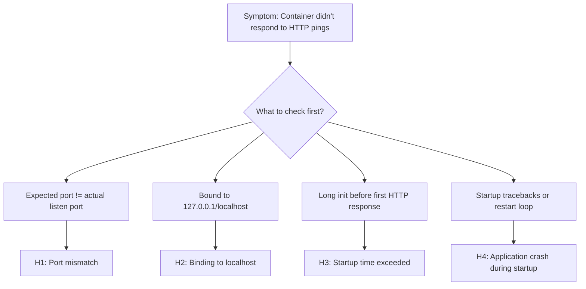

# Container Didn't Respond to HTTP Pings (Azure App Service Linux)

## 1. Summary

### Symptom

The container starts but App Service reports "Container didn't respond to HTTP pings on port: <port>, failing site start." The app never becomes available, or it starts successfully locally but fails on App Service.

### Why this scenario is confusing

Multiple unrelated issues produce the same error message. Port binding, startup time, health endpoint behavior, and base image issues can all manifest as "didn't respond to HTTP pings." The error message itself does not distinguish between these causes.

### Troubleshooting decision flow

## 2. Common Misreadings

- "The container crashed" (it may be running but listening on the wrong port)
- "The app is too slow to start" (it may be fast but binding to 127.0.0.1 instead of 0.0.0.0)
- "Health check is failing" (startup pings and configured health checks are different mechanisms)
- "The Dockerfile is wrong" (it may work locally but fail on App Service due to environment differences)
- "The platform is broken" (almost always an application or configuration issue)

## 3. Competing Hypotheses

- H1: Port mismatch — container listens on a different port than what App Service expects (`WEBSITES_PORT` configured probe target vs actual app listen port exposed through `PORT` inside the container)
- H2: Binding to localhost — container binds to 127.0.0.1 instead of 0.0.0.0, so the platform health probe cannot reach it
- H3: Startup time exceeded — container takes longer than the startup time limit (WEBSITES_CONTAINER_START_TIME_LIMIT, default 230 seconds) to begin responding to HTTP
- H4: Application crash during startup — container process exits or enters an error loop before it can respond to any HTTP request
- H5: Missing or incorrect startup command — CMD/ENTRYPOINT issue where the web server never actually starts

## 4. What to Check First

### Metrics

- Linux - Number of Running Containers detector (is the container actually running?)
- Restart count (is the platform killing and restarting the container repeatedly?)

### Logs

- AppServiceConsoleLogs: stdout/stderr from the container — look for listen port, binding address, startup errors, crash traces
- AppServicePlatformLogs: platform-level events — "Container started", "Container failed to start", "Stopping site because it failed to start"

### Platform Signals

- `WEBSITES_PORT` app setting value (tells the platform which port to probe).
- `PORT` environment variable (injected into the container by the platform, defaults to 8080 or the value of `WEBSITES_PORT`).
- WEBSITES_CONTAINER_START_TIME_LIMIT value
- Startup command configuration in Azure Portal
- Docker log stream (Log stream blade in Portal)

## 5. Evidence to Collect

### Required Evidence

- Container console output during startup (AppServiceConsoleLogs)
- Platform events during startup (AppServicePlatformLogs)
- App settings: `WEBSITES_PORT`, `WEBSITES_CONTAINER_START_TIME_LIMIT` (and confirm app code reads `PORT` for listen target)
- Dockerfile: EXPOSE directive, CMD/ENTRYPOINT
- Whether the app starts successfully locally with `docker run -p 8000:8000 <image>`

### Useful Context

- Recent image changes
- Recent app setting changes
- Custom startup command configuration
- Base image changes
- Multi-stage build configuration

## 6. Validation and Disproof by Hypothesis

### H1: Port mismatch

**Signals that support**

- AppServiceConsoleLogs show a concrete listen line such as `Listening on 8000` while `WEBSITES_PORT=8080`.
- Platform logs repeatedly show startup ping failure on one port while app logs indicate another port.
- App works locally only when mapped to a non-8080 container port (for example `-p 8080:8000`).

**Signals that weaken**

- Console and app settings both consistently show the same port.
- Manual request to the expected in-container port succeeds during SSH investigation.

**What to verify**

1. In App Service configuration, record `WEBSITES_PORT` and `PORT`.
2. In AppServiceConsoleLogs, identify the actual listen port emitted by the server startup line.
3. Compare expected vs actual port; if different, align to a single value and restart.
4. Re-check AppServicePlatformLogs for successful transition after the change.

### H2: Binding to localhost

**Signals that support**

- Console logs show bind target `127.0.0.1:<port>` or `localhost:<port>`.
- Framework defaults are in use (for example Flask dev server) without explicit host override.
- Process is running but startup pings still fail, indicating network reachability problem rather than process absence.

**Signals that weaken**

- Logs explicitly show `0.0.0.0:<port>` binding.
- A known-good production server command (for example Gunicorn bound to `0.0.0.0`) is in effect.

**What to verify**

1. Inspect startup logs for exact bind address.
2. Inspect startup command (Dockerfile CMD/ENTRYPOINT or Portal startup command) for host argument.
3. Ensure production command binds to `0.0.0.0`.
4. Redeploy/restart and confirm startup ping success in platform logs.

### H3: Startup time exceeded

**Signals that support**

- Console logs show long-running initialization (dependency download, migrations, model load) before server starts listening.
- AppServicePlatformLogs show `Container started` followed by timeout/failing site start near or beyond the default 230 seconds.
- Increasing `WEBSITES_CONTAINER_START_TIME_LIMIT` improves startup success rate.

**Signals that weaken**

- App reaches a listen state quickly (<30 seconds) before the failure occurs.
- Failure happens immediately with explicit crash output rather than timeout behavior.

**What to verify**

1. Measure elapsed time between first platform start event and failing site start event.
2. Locate server-ready timestamp in AppServiceConsoleLogs.
3. If startup duration exceeds current limit, temporarily set `WEBSITES_CONTAINER_START_TIME_LIMIT` to 300-600 (up to 1800 max).
4. Confirm whether timeout errors disappear; if yes, optimize startup path and keep a justified limit.

### H4: Application crash during startup

**Signals that support**

- AppServiceConsoleLogs show traceback/exception, segmentation fault, missing module, or fatal config error.
- AppServicePlatformLogs show repeated start/exit cycles.
- Exit code appears in logs or detector output and indicates non-zero termination.

**Signals that weaken**

- No crash signatures appear and process remains alive.
- Failure pattern matches timeout without process termination.

**What to verify**

1. Capture full startup stderr/stdout from AppServiceConsoleLogs.
2. Correlate each platform restart event with preceding exception traces.
3. Validate image dependency completeness and runtime configuration required at startup.
4. Fix startup exception, redeploy, and confirm stable single-start behavior.

### H5: Missing or incorrect startup command

**Signals that support**

- Console logs are empty, minimal, or show a process that is not an HTTP server.
- Startup command in Portal overrides Dockerfile CMD with invalid or no-op command.
- CMD/ENTRYPOINT references missing script path or wrong working directory.

**Signals that weaken**

- Command clearly launches a web server binary with correct arguments.
- Logs show web server startup sequence and port bind attempt.

**What to verify**

1. Inspect Dockerfile `CMD` and `ENTRYPOINT` exactly as built into deployed image.
2. Check Azure Portal startup command override and remove/fix conflicting values.
3. Validate command path inside container (via SSH/Kudu) and confirm executable exists.
4. Restart app and confirm logs show expected web server process listening.

## 7. Likely Root Cause Patterns

- Pattern A: Framework defaults to localhost binding (Flask dev server, Django runserver)
- Pattern B: Missing WEBSITES_PORT setting when app doesn't listen on 8080
- Pattern C: Heavy initialization (ML model loading, database migrations) exceeding startup timeout
- Pattern D: Missing dependency in container image (works locally with cached layers, fails on fresh pull)
- Pattern E: Startup command references a file path that doesn't exist in the container

## 8. Immediate Mitigations

- Set WEBSITES_PORT to match your app's actual listen port (diagnostic, production-safe)
- Change app binding from 127.0.0.1 to 0.0.0.0 (diagnostic, production-safe)
- Increase WEBSITES_CONTAINER_START_TIME_LIMIT to 300-600 (temporary, production-safe)
- SSH into the container via Kudu to verify the process is running and listening (diagnostic)
- Check docker run locally with the EXACT same environment variables (diagnostic)

## 9. Long-term Fixes

- Always bind to 0.0.0.0 in production configurations
- Use the `PORT` environment variable for dynamic port binding, and set `WEBSITES_PORT` to match
- Optimize startup time (lazy-load heavy dependencies, run migrations separately)
- Add a lightweight health endpoint that responds immediately even during warm-up
- Test with `docker run -e PORT=8080 -e WEBSITES_PORT=8080 -p 8080:8080` locally before deploying

## 10. Investigation Notes

- App Service Linux probes the container on the configured port via HTTP. If no response within the startup time limit, the platform stops the site.
- The default expected port is 8080 for built-in images. Custom containers should set `WEBSITES_PORT` explicitly.
- `WEBSITES_PORT` is the app setting you configure; `PORT` is the environment variable the platform injects into the container. They serve different roles: set `WEBSITES_PORT` to tell the platform, and read `PORT` in your code for the listen target.
- WEBSITES_CONTAINER_START_TIME_LIMIT default is 230 seconds. Maximum is 1800 seconds.
- The startup probe is NOT the same as a configured Health Check. The startup probe is a simple HTTP ping on the root port. Health Check uses a configured path and has different retry logic.
- For more advanced warm-up control, `WEBSITE_WARMUP_PATH` lets you specify a custom path for startup probes, and `WEBSITE_WARMUP_STATUSES` lets you define which HTTP status codes count as successful warm-up responses (e.g., `200,202`).
- For Python apps: Gunicorn should use `--bind 0.0.0.0:$PORT`. Flask dev server defaults to 127.0.0.1 which WILL fail.
- For Node.js apps: Express should use `app.listen(process.env.PORT || 8080, '0.0.0.0')`.
- SSH into the running container: Azure Portal → App Service → Development Tools → SSH (or use Kudu at https://<app>.scm.azurewebsites.net)

## 11. Related Queries

- [`../../kql/console/startup-errors.md`](../../kql/console/startup-errors.md)
- [`../../kql/console/container-binding-errors.md`](../../kql/console/container-binding-errors.md)
- [`../../kql/restarts/repeated-startup-attempts.md`](../../kql/restarts/repeated-startup-attempts.md)

## 12. Related Checklists

- [`../../first-10-minutes/startup-availability.md`](../../first-10-minutes/startup-availability.md)

## 13. Related Labs

- [Lab: Container HTTP Pings](../../lab-guides/container-http-pings.md)

## 14. Limitations

- Windows-specific container behavior is out of scope
- This playbook covers custom containers and built-in Linux images; it does not cover App Service on Kubernetes
- Detailed framework-specific startup optimization is referenced but not exhaustively documented

## 15. Quick Conclusion

Treat this error as a startup reachability workflow, not a single failure mode. First align expected port and bind address (`WEBSITES_PORT`/`PORT`, `0.0.0.0`), then correlate platform timeout events with console startup logs to separate timeout from crash conditions. Once the immediate issue is mitigated, harden startup commands and initialization behavior so every deployment responds to HTTP pings within the configured startup window.

## References

- [Configure a custom container for Azure App Service](https://learn.microsoft.com/en-us/azure/app-service/configure-custom-container)
- [Enable diagnostic logging for apps in Azure App Service](https://learn.microsoft.com/en-us/azure/app-service/troubleshoot-diagnostic-logs)
- [Azure App Service diagnostics overview](https://learn.microsoft.com/en-us/azure/app-service/overview-diagnostics)
- [Configure a Linux Python app for Azure App Service](https://learn.microsoft.com/en-us/azure/app-service/configure-language-python)
