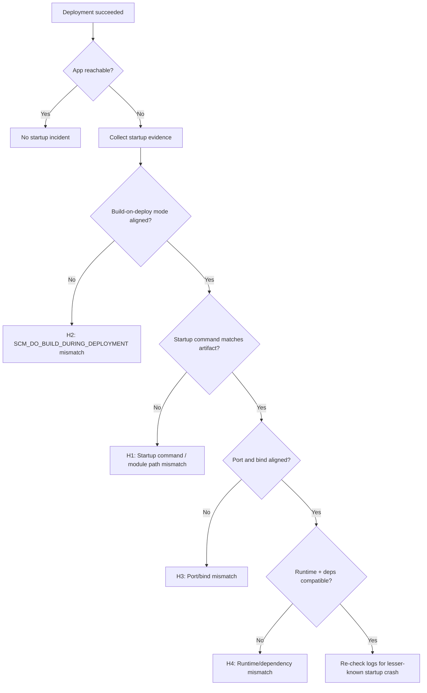

---
hide:
  - toc
title: Deployment Succeeded but Startup Failed
slug: deployment-succeeded-startup-failed
doc_type: playbook
section: troubleshooting
topics:
  - startup
  - deployment
  - availability
products:
  - azure-app-service
prerequisites:
  - mental-model
related:
  - container-didnt-respond-to-http-pings
  - failed-to-forward-request
validated_by_lab:
  - lab-deployment-succeeded-startup-failed
investigated_with_kql:
  - startup-errors
  - repeated-startup-attempts
evidence:
  - kql
  - lab
summary: Diagnose when deployment completes but application fails to start.
status: stable
last_reviewed: 2026-04-08
content_sources:
  diagrams:
    - id: deployment-succeeded-startup-failed-flow
      type: flowchart
      source: self-generated
      justification: "Synthesized post-deployment startup failure branches from Microsoft Learn guidance on deployment diagnostics, Linux startup settings, and 502/503 troubleshooting."
      based_on:
        - https://learn.microsoft.com/en-us/azure/app-service/troubleshoot-diagnostic-logs
        - https://learn.microsoft.com/en-us/azure/app-service/reference-app-settings
        - https://learn.microsoft.com/en-us/troubleshoot/azure/app-service/faqs-app-service-linux-new
        - https://learn.microsoft.com/en-us/azure/app-service/troubleshoot-http-502-http-503
---
# Deployment Succeeded but Startup Failed (Azure App Service Linux)

## 1. Summary

### Symptom

Deployment reports success (for example, ZipDeploy/CI is green and Oryx build exits with code 0), but the app never becomes available and startup fails with messages such as "Container didn't respond to HTTP pings".

### Why confusing

Teams often treat deployment success as runtime success. On App Service Linux, these are separate phases: artifact creation/deployment can succeed while runtime boot fails due to startup command, module path, port binding, runtime version, or dependency/artifact layout mismatches.

<!-- diagram-id: deployment-succeeded-startup-failed-flow -->


### Investigation Notes

- In this scenario, healthy deployment logs are necessary but insufficient evidence.
- The decisive evidence is startup-phase telemetry (`AppServiceConsoleLogs.ResultDescription` + platform startup events).
- For Python apps, common breakpoints are module path naming, missing dependency install, and runtime minor version assumptions.
- Artifact inspection at `/home/site/wwwroot` is often the fastest discriminator between H1/H2 vs H3/H4.
- Always mask identifiers in shared notes: `<subscription-id>`, `<resource-group>`, `<app-name>`, `xxxxxxxx-xxxx-xxxx-xxxx-xxxxxxxxxxxx`.

### 11. Related Queries

- [`../../kql/console/startup-errors.md`](../../kql/console/startup-errors.md)
- [`../../kql/restarts/repeated-startup-attempts.md`](../../kql/restarts/repeated-startup-attempts.md)

### 12. Related Checklists

- [`../../first-10-minutes/startup-availability.md`](../../first-10-minutes/startup-availability.md)

### 13. Related Labs

- [`../../lab-guides/deployment-succeeded-startup-failed.md`](../../lab-guides/deployment-succeeded-startup-failed.md)

### Limitations

- This playbook is for Azure App Service Linux startup failures after successful deployment; it does not cover Windows/IIS.
- It focuses on Oryx/startup/artifact/runtime mismatches, not deep application logic bugs after successful startup.
- It does not replace service-health/outage investigation when there is confirmed regional platform impact.

### Quick Conclusion

When deployment is green but the app is down, treat build success and runtime success as separate checkpoints. Correlate startup command, artifact layout, build mode, port binding, and runtime compatibility to identify why the process never became probe-ready.

## 2. Common Misreadings

- "Pipeline is green, so App Service must be healthy" (deployment success does not prove startup success).
- "Oryx exit 0 means dependencies are definitely installed where runtime expects" (artifact layout can still be wrong for the active startup command).
- "This is a platform outage" (most cases are command/path/port/runtime mismatches).
- "HTTP ping failure always means networking" (it frequently means process never started or crashed immediately).
- "Gunicorn/Uvicorn command worked locally, so module path is correct in App Service" (working directory and artifact shape can differ).

## 3. Competing Hypotheses

- H1: Startup command and deployed artifact mismatch (wrong file/module path, wrong working directory target, `app:app` vs `src.app:app`, missing entrypoint file).
- H2: Build-mode mismatch (`SCM_DO_BUILD_DURING_DEPLOYMENT=true` vs `false`) causes missing virtualenv/dependencies or incorrect artifact structure for ZipDeploy.
- H3: Runtime listens incorrectly (wrong `WEBSITES_PORT`, app binds to different port/address, startup ping cannot reach process).
- H4: Runtime compatibility mismatch (Python version/features mismatch or missing dependencies/requirements install gap) causes immediate startup crash.

## 4. What to Check First

### Metrics

- Restart pattern immediately after deployment timestamp.
- Availability drop immediately after new deployment/restart.

### Logs

- `AppServiceConsoleLogs`: startup command output and Python/Gunicorn/Uvicorn errors in `ResultDescription`.
- `AppServicePlatformLogs`: startup lifecycle and container ping failures.
- `AppServiceHTTPLogs`: whether any HTTP responses are emitted during attempted startup.

### Platform Signals

- App settings: `SCM_DO_BUILD_DURING_DEPLOYMENT`, `WEBSITES_PORT`, `PYTHON_VERSION` (or Linux FX runtime stack), startup command.
- Deployment method (ZipDeploy vs external build artifact) and whether Oryx was expected.
- Effective startup command shown in startup logs.

## 5. Evidence to Collect

### Required

- Deployment log proving success (Oryx/build phase and final status).
- Startup-time `AppServiceConsoleLogs` rows (especially traceback/module-not-found/command-not-found lines).
- Startup-time `AppServicePlatformLogs` rows around ping failure and restart attempts.
- Current app settings snapshot with masked values.
- Deployed artifact layout (`/home/site/wwwroot`) and presence of expected files (`requirements.txt`, entry modules, startup scripts).

### Useful Context

- Last known good deployment ID/commit.
- Any recent changes to startup command, Python version, or repo layout (`src/` migration, monorepo subfolder changes).
- Whether dependencies were prebuilt in CI or expected from Oryx at deploy time.

### Sample Log Patterns

### AppServicePlatformLogs (startup timeout signature)

```text
[AppServicePlatformLogs]
2026-04-04T11:22:47Z  Informational  Site startup probe failed after 43.8646689 seconds.
2026-04-04T11:22:47Z  Error          State: Stopping, Action: StoppingSiteContainers, LastError: ContainerTimeout
2026-04-04T11:22:47Z  Error          Failed to start site. Revert by stopping site.
2026-04-04T11:22:47Z  Error          State: Stopping, Action: CancellingStartup, LastError: ContainerTimeout
2026-04-04T11:22:47Z  Error          Site container: <app-name> terminated during site startup.
2026-04-04T11:22:47Z  Informational  Site: <app-name> stopped.
```

### AppServiceHTTPLogs (platform serves only 503 during startup failure)

```text
[AppServiceHTTPLogs]
2026-04-04T11:22:48Z  GET  /  503  49751
2026-04-04T11:22:48Z  GET  /  503  49751
2026-04-04T11:22:48Z  GET  /  503  49762
2026-04-04T11:22:48Z  GET  /  503  49753
2026-04-04T11:22:48Z  GET  /  503  49765
```

### AppServiceConsoleLogs (no rows)

```text
[AppServiceConsoleLogs]
0 rows returned for incident window.
```

!!! tip "How to Read This"
    The combination of repeated `503` responses near ~50 seconds and `ContainerTimeout` in platform logs means the platform waited for startup readiness and never got it. Zero console rows is a strong signal that the container process never reached a usable boot/logging state.

### KQL Queries with Example Output

### Query 1: Startup timeout and cancellation sequence

```kusto
// Startup timeout sequence in platform logs
AppServicePlatformLogs
| where TimeGenerated between (datetime(2026-04-04 11:22:40) .. datetime(2026-04-04 11:22:50))
| where Message has_any ("ContainerTimeout", "startup probe failed", "Failed to start site", "terminated during site startup")
| project TimeGenerated, Level, Message
| order by TimeGenerated asc
```

**Example Output:**

| TimeGenerated | Level | Message |
|---|---|---|
| 2026-04-04 11:22:47 | Informational | Site startup probe failed after 43.8646689 seconds. |
| 2026-04-04 11:22:47 | Error | State: Stopping, Action: StoppingSiteContainers, LastError: ContainerTimeout |
| 2026-04-04 11:22:47 | Error | Failed to start site. Revert by stopping site. |
| 2026-04-04 11:22:47 | Error | State: Stopping, Action: CancellingStartup, LastError: ContainerTimeout |
| 2026-04-04 11:22:47 | Error | Site container: <app-name> terminated during site startup. |

!!! tip "How to Read This"
    These rows prove a startup lifecycle failure, not a post-start runtime issue. The platform explicitly cancels startup because probe readiness was not achieved in time.

### Query 2: HTTP behavior during failed startup window

```kusto
// HTTP status and latency during startup-failed incident
AppServiceHTTPLogs
| where TimeGenerated between (datetime(2026-04-04 11:22:45) .. datetime(2026-04-04 11:22:50))
| project TimeGenerated, CsMethod, CsUriStem, ScStatus, TimeTaken
| order by TimeGenerated asc
```

**Example Output:**

| TimeGenerated | CsMethod | CsUriStem | ScStatus | TimeTaken |
|---|---|---|---|---|
| 2026-04-04 11:22:48 | GET | / | 503 | 49751 |
| 2026-04-04 11:22:48 | GET | / | 503 | 49751 |
| 2026-04-04 11:22:48 | GET | / | 503 | 49762 |
| 2026-04-04 11:22:48 | GET | / | 503 | 49753 |
| 2026-04-04 11:22:48 | GET | / | 503 | 49765 |

!!! tip "How to Read This"
    `503` across all requests plus nearly identical ~50,000 ms `TimeTaken` indicates platform timeout behavior, not normal app-generated failures.

### Query 3: Console log absence check

```kusto
// Verify whether app emitted startup stdout/stderr
AppServiceConsoleLogs
| where TimeGenerated between (datetime(2026-04-04 11:22:40) .. datetime(2026-04-04 11:22:50))
| project TimeGenerated, Level, ResultDescription
| order by TimeGenerated asc
```

**Example Output:**

| TimeGenerated | Level | ResultDescription |
|---|---|---|
| _No rows_ |  |  |

!!! tip "How to Read This"
    No console output during incident strengthens hypotheses H1/H2/H4 where process startup never reaches logging/serve loop.

### CLI Investigation Commands

```bash
# Confirm app runtime state and enablement
az webapp show --resource-group <resource-group> --name <app-name> --query "{state:state,enabled:enabled,hostNames:hostNames}" --output table

# Inspect startup command and Linux runtime stack
az webapp config show --resource-group <resource-group> --name <app-name> --query "{linuxFxVersion:linuxFxVersion,appCommandLine:appCommandLine,alwaysOn:alwaysOn}" --output table

# Inspect startup-critical settings
az webapp config appsettings list --resource-group <resource-group> --name <app-name> --query "[?name=='SCM_DO_BUILD_DURING_DEPLOYMENT' || name=='WEBSITES_PORT' || name=='WEBSITES_CONTAINER_START_TIME_LIMIT' || name=='PYTHON_VERSION'].{name:name,value:value}" --output table

# Pull deployment history to prove build/deploy success
az webapp log deployment show --resource-group <resource-group> --name <app-name> --output table
```

**Example Output:**

```text
State    Enabled    HostNames
-------  ---------  -------------------------------------------
Running  True       <app-name>.azurewebsites.net

LinuxFxVersion    AppCommandLine                               AlwaysOn
----------------  -------------------------------------------  --------
PYTHON|3.11       gunicorn --bind 0.0.0.0:8000 src.app:app    True

Name                                   Value
-------------------------------------  ------
SCM_DO_BUILD_DURING_DEPLOYMENT         true
WEBSITES_PORT                          8000
WEBSITES_CONTAINER_START_TIME_LIMIT    230
PYTHON_VERSION                         3.11
```

!!! tip "How to Read This"
    If control-plane settings look healthy but logs show startup timeout, focus on runtime artifact/startup-command mismatch and dependency/runtime compatibility, not deployment transport.

## 6. Validation and Disproof by Hypothesis

### H1: Startup command and artifact/module path mismatch

**Signals that support**

- Console log contains errors like `ModuleNotFoundError`, `No such file or directory`, `Error: class uri`, or cannot import app module.
- Startup command references `app:app` while code now lives at `src/app.py` (`src.app:app` needed), or vice versa.
- Deployment artifact lacks file/module referenced by startup command.

**Signals that weaken**

- Startup command resolves successfully and server reaches listening state.
- File/module exists in deployed artifact and import check succeeds.

**KQL validation**

```kusto
AppServiceConsoleLogs
| where TimeGenerated > ago(2h)
| where ResultDescription has_any ("ModuleNotFoundError", "No such file or directory", "Error: class uri", "cannot import", "gunicorn", "uvicorn")
| project TimeGenerated, ResultDescription
| order by TimeGenerated desc
```

```kusto
AppServicePlatformLogs
| where TimeGenerated > ago(2h)
| extend Raw = tostring(pack_all())
| where Raw has_any ("failed to start", "didn't respond to HTTP pings", "restart")
| project TimeGenerated, Raw
| order by TimeGenerated desc
```

**CLI validation (long flags only)**

```bash
az webapp config show --resource-group <resource-group> --name <app-name>
az webapp config appsettings list --resource-group <resource-group> --name <app-name>
az webapp log tail --resource-group <resource-group> --name <app-name>
```

What to verify:

1. Compare configured startup command to actual deployed paths/modules.
2. Confirm expected entry module exists under `/home/site/wwwroot`.
3. Fix command (`gunicorn --bind 0.0.0.0:$PORT src.app:app` or equivalent), restart, re-check platform logs.

### H2: `SCM_DO_BUILD_DURING_DEPLOYMENT` mismatch with ZipDeploy/build flow

**Signals that support**

- Deployment succeeded but startup fails with missing package/import errors.
- App expects Oryx-built environment, but `SCM_DO_BUILD_DURING_DEPLOYMENT=false` and artifact lacks built dependencies.
- App expects prebuilt artifact, but setting is `true` and runtime layout differs from startup command assumptions.

**Signals that weaken**

- Dependencies are present and importable in deployed artifact.
- Build strategy and artifact type are intentionally aligned and unchanged.

**KQL validation**

```kusto
AppServiceConsoleLogs
| where TimeGenerated > ago(2h)
| where ResultDescription has_any ("ModuleNotFoundError", "ImportError", "requirements.txt", "pip", "oryx")
| project TimeGenerated, ResultDescription
| order by TimeGenerated desc
```

```kusto
AppServiceHTTPLogs
| where TimeGenerated > ago(2h)
| extend Raw = tostring(pack_all())
| project TimeGenerated, Raw
| order by TimeGenerated desc
```

**CLI validation (long flags only)**

```bash
az webapp config appsettings list --resource-group <resource-group> --name <app-name>
az webapp deployment source config-zip --resource-group <resource-group> --name <app-name> --src <path-to-package.zip>
az webapp log deployment show --resource-group <resource-group> --name <app-name>
```

What to verify:

1. Confirm intended build strategy (build during deploy vs prebuilt artifact).
2. Ensure `SCM_DO_BUILD_DURING_DEPLOYMENT` matches that strategy.
3. Ensure `requirements.txt` is in expected root for Oryx when build-on-deploy is enabled.
4. Redeploy with aligned mode and validate startup behavior.

### H3: Port/bind mismatch (`WEBSITES_PORT` and actual listen target)

**Signals that support**

- Startup log shows app listening on port X, platform expects port Y.
- App binds to localhost instead of externally reachable interface.
- Platform logs repeatedly show HTTP ping startup failure after process launch.

**Signals that weaken**

- App listens on expected port and reachable bind address.
- Manual curl inside container succeeds on expected startup port/path.

**KQL validation**

```kusto
AppServiceConsoleLogs
| where TimeGenerated > ago(2h)
| where ResultDescription has_any ("Listening on", "Running on", "0.0.0.0", "127.0.0.1", "PORT", "WEBSITES_PORT")
| project TimeGenerated, ResultDescription
| order by TimeGenerated desc
```

```kusto
AppServicePlatformLogs
| where TimeGenerated > ago(2h)
| extend Raw = tostring(pack_all())
| where Raw has_any ("didn't respond to HTTP pings", "port", "start")
| project TimeGenerated, Raw
| order by TimeGenerated desc
```

**CLI validation (long flags only)**

```bash
az webapp config appsettings list --resource-group <resource-group> --name <app-name>
az webapp config appsettings set --resource-group <resource-group> --name <app-name> --settings WEBSITES_PORT=<port>
az webapp restart --resource-group <resource-group> --name <app-name>
```

What to verify:

1. Set a single source of truth for port (`WEBSITES_PORT`) and ensure app binds to that value.
2. Use production server command with explicit bind (`--bind 0.0.0.0:$PORT`).
3. Re-check platform startup signals after restart.

### H4: Python runtime/dependency compatibility mismatch

**Signals that support**

- Tracebacks show syntax/features not supported by selected runtime (for example 3.12-only syntax on `PYTHON|3.11`).
- Startup fails on missing dependency due to absent/incorrect `requirements.txt` processing.
- Deployment succeeded, but runtime import or syntax errors occur before listener starts.

**Signals that weaken**

- Runtime version matches application requirements and local reproduction with same version succeeds.
- Dependency lock/requirements are present and validated in deployed environment.

**KQL validation**

```kusto
AppServiceConsoleLogs
| where TimeGenerated > ago(2h)
| where ResultDescription has_any ("SyntaxError", "requires Python", "ModuleNotFoundError", "ImportError", "Traceback")
| project TimeGenerated, ResultDescription
| order by TimeGenerated desc
```

```kusto
AppServiceHTTPLogs
| where TimeGenerated > ago(2h)
| extend Raw = tostring(pack_all())
| project TimeGenerated, Raw
| order by TimeGenerated desc
```

**CLI validation (long flags only)**

```bash
az webapp config show --resource-group <resource-group> --name <app-name>
az webapp config set --resource-group <resource-group> --name <app-name> --linux-fx-version "PYTHON|3.12"
az webapp restart --resource-group <resource-group> --name <app-name>
```

What to verify:

1. Match runtime stack version to application feature requirements.
2. Confirm dependency manifest is included and install path is valid for selected build mode.
3. Restart and verify process reaches listening state without import/syntax errors.

### Normal vs Abnormal Comparison

| Signal | Normal Startup | Deployment Succeeded, Startup Failed |
|---|---|---|
| Platform lifecycle log | `Site started` after warm-up | `Failed to start site`, `CancellingStartup`, `ContainerTimeout` |
| HTTP status during startup window | First requests become 200/302 quickly | Repeated 503 responses only |
| HTTP TimeTaken | Mixed low latency after readiness | Repeated near-timeout values (~49-50 seconds) |
| Console logs | Boot line + listener line visible | No rows or early fatal output only |
| Availability after deployment | Stable | Immediate outage after deployment success |
| Interpretation | Runtime became probe-ready | Build/deploy completed, runtime never became probe-ready |

## 7. Likely Root Cause Patterns

- Pattern A: Oryx succeeded technically, but produced an artifact shape that no longer matches startup command assumptions.
- Pattern B: Deployment mode drift (`SCM_DO_BUILD_DURING_DEPLOYMENT`) after pipeline changes, leaving dependencies absent at runtime.
- Pattern C: Startup command drift during refactors (`app:app` to `src.app:app`) without corresponding config updates.
- Pattern D: Port contract drift (`WEBSITES_PORT` changed, app still hardcoded to another port/address).
- Pattern E: Runtime stack pinned to older Python while code/dependencies assume newer language/runtime behavior.

## 8. Immediate Mitigations

- Roll back to last known-good deployment artifact and startup command pair (fastest restoration, may revert recent fixes).
- Set/align `SCM_DO_BUILD_DURING_DEPLOYMENT` to intended mode and redeploy immediately (low risk when strategy is clear).
- Correct startup command module path and explicit bind to `0.0.0.0:$PORT` (production-safe, high impact).
- Align `WEBSITES_PORT` with actual listener and restart app (production-safe).
- Temporarily pin runtime to known-compatible Python version while preparing dependency/code updates (short-term stability, technical debt risk).

## 9. Prevention

- Enforce a single deployment contract per app: either Oryx build-on-deploy or fully prebuilt artifact, never ambiguous.
- Add CI smoke tests that run the exact startup command against packaged artifact before deployment.
- Version-control startup command and runtime stack as code; avoid portal-only drift.
- Add startup validation in pipeline: verify entry module exists, dependencies import, and app listens on expected port.
- Maintain explicit Python version compatibility policy and lock dependencies accordingly.

## See Also

### Related Labs

- [Lab: Deployment Succeeded but Startup Failed](../../lab-guides/deployment-succeeded-startup-failed.md)

- [Startup Availability (First 10 Minutes)](../../first-10-minutes/startup-availability.md)
- [Deployment Succeeded, Startup Failed Lab](../../lab-guides/deployment-succeeded-startup-failed.md)

## Sources

- [Configure a Linux Python app for Azure App Service](https://learn.microsoft.com/en-us/azure/app-service/configure-language-python)
- [Deploy to App Service using GitHub Actions](https://learn.microsoft.com/en-us/azure/app-service/deploy-github-actions)
- [Enable diagnostic logging for apps in Azure App Service](https://learn.microsoft.com/en-us/azure/app-service/troubleshoot-diagnostic-logs)
- [Configure a custom container for Azure App Service](https://learn.microsoft.com/en-us/azure/app-service/configure-custom-container)
