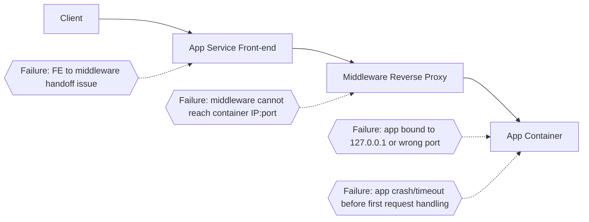

# Failed to Forward Request (Azure App Service Linux)

## 1. Summary

### Symptom

Requests intermittently or consistently fail at runtime with platform messages like **"Failed to forward request"** in `AppServicePlatformLogs`, even though the container may appear started. This means the App Service Linux front-end/middleware path could not successfully proxy the request to the app process in the container.

### Why confusing

This error is often misread as a generic networking outage, but it can come from multiple layers: incorrect bind address (`127.0.0.1`), wrong port alignment (`WEBSITES_PORT` vs actual listen port), protocol mismatch (HTTP/2/WebSocket expectations vs HTTP/1.1 proxy behavior), double-proxy conflicts in custom images (nginx/caddy + platform proxy), slow first-response behavior, or post-bind crashes. The app may look healthy at a glance while still failing in the forwarding path.



## 2. Common Misreadings

- "The app is down" (it may be running but unreachable on the expected bind address/port)
- "This is the same as startup ping failure" (runtime forwarding failures are not identical to startup probe failures)
- "WebSockets/HTTP2 are broken on App Service" (often an upstream/downstream protocol handling mismatch in the app or custom middleware)
- "Platform bug" (most cases are app/middleware binding, protocol, timeout, or crash behavior)
- "WEBSITES_PORT is set, so routing must be correct" (the process can still bind somewhere else)

## 3. Competing Hypotheses

- H1: **Bind/address mismatch** — app binds to `127.0.0.1` instead of `0.0.0.0`, so platform proxy cannot reach it.
- H2: **Port mismatch** — `WEBSITES_PORT` points to one port, but the app actually listens on another.
- H3: **Protocol/path mismatch** — app or user-managed middleware expects HTTP/2/WebSocket semantics that conflict with proxy expectations at that hop.
- H4: **Double-proxy conflict** — custom container includes nginx/caddy reverse-proxy rules that break routing behind App Service middleware.
- H5: **Slow first response / timeout** — startup or warm path delays response enough that proxy forwarding fails.
- H6: **Crash after bind** — process starts, may log a bind message, then crashes before serving requests.

## 4. What to Check First

### Metrics

- HTTP status trend and latency spikes using `AppServiceHTTPLogs` (`ScStatus`, `TimeTaken`)
- Restart/recycle signals around failure windows
- Whether failures are steady-state or bursty during deployment/restart windows

### Logs

- `AppServicePlatformLogs`: look for `OperationName`, `ContainerId`, `ResultDescription` entries containing forward/proxy failures
- `AppServiceConsoleLogs`: look for bind lines (`0.0.0.0` vs `127.0.0.1`), startup exceptions, protocol errors, middleware config errors
- `AppServiceHTTPLogs`: correlate status code and latency around same timestamps

### Platform Signals

- Confirm App Settings: `WEBSITES_PORT`, startup command, and any middleware-related env vars
- Confirm app server bind target uses `0.0.0.0` and reads `PORT` correctly
- Confirm whether custom image has nginx/caddy/traefik layer that proxies again before the app
- Compare with known startup-only signature in the "Container didn't respond to HTTP pings" playbook

## 5. Evidence to Collect

### Required Evidence

- `AppServicePlatformLogs` rows around incident time with `OperationName`, `ContainerId`, `ResultDescription`
- `AppServiceConsoleLogs` rows around incident time with startup/bind/proxy/crash traces (`ResultDescription`)
- `AppServiceHTTPLogs` rows showing request outcomes and latency (`ScStatus`, `TimeTaken`)
- Current App Settings values: `WEBSITES_PORT`, startup command
- Container image metadata (tag/digest) and recent deployment timestamp

### Useful Context

- Whether failures began after adding/changing nginx/caddy config in custom image
- Whether framework/runtime changed (Gunicorn/Uvicorn/Node reverse proxy config)
- Whether incident aligns with high cold-start or initialization work
- Any dependency/config import failures shortly after process startup

## 6. Validation and Disproof by Hypothesis

### H1: Bind/address mismatch (`127.0.0.1` vs `0.0.0.0`)

**Signals that support**

- Console logs show listen host as `127.0.0.1:<port>` or `localhost:<port>`
- Runtime forward failures occur while process appears running
- Typical framework defaults are in use (Flask/Django dev server)

**Signals that weaken**

- Logs clearly show bind to `0.0.0.0:<port>`
- Requests succeed after container start and no forwarding errors recur

**What to verify**

1. Inspect startup command and framework bind options.
2. Ensure bind host is `0.0.0.0`.
3. Restart and verify platform logs no longer show forwarding failures.

### H2: Port mismatch (`WEBSITES_PORT` vs actual listen port)

**Signals that support**

- `WEBSITES_PORT` is set (for example `8080`) but app logs show different listen port (for example `8000`)
- Platform forwards to expected port while container listens elsewhere

**Signals that weaken**

- Logs and settings consistently show same port
- Requests on that port succeed with normal latency

**What to verify**

1. Read current `WEBSITES_PORT` from app settings.
2. Identify actual app listen port from console logs.
3. Align config and code to one port target.

### H3: Protocol/path mismatch (HTTP/2/WebSocket expectations)

**Signals that support**

- Errors appear only on upgraded connections or specific routes
- Console logs show protocol handshake or upgrade failures
- Middleware/app explicitly requires HTTP/2 behavior on internal hop

**Signals that weaken**

- Failures occur on plain HTTP endpoints as well
- No protocol or upgrade errors in logs

**What to verify**

1. Test plain HTTP/1.1 endpoint behavior first.
2. Validate framework reverse-proxy settings and upgrade handling.
3. Confirm no forced protocol mode that breaks internal proxy path.

### H4: Double-proxy conflict (custom nginx/caddy + platform proxy)

**Signals that support**

- Custom container has nginx/caddy in front of app process
- Proxy config rewrites or upstream targets point to wrong host/port
- Failures began after middleware config change

**Signals that weaken**

- Single-process server deployment without extra middleware layer
- No custom proxy config changes around incident

**What to verify**

1. Review middleware config for upstream host/port and rewrite rules.
2. Ensure internal upstream points to correct app listener (`0.0.0.0:<port>` or expected local upstream).
3. Temporarily bypass user middleware (if possible) to isolate issue.

### H5: Slow first response / timeout before forward succeeds

**Signals that support**

- High `TimeTaken` in `AppServiceHTTPLogs` before failures
- Console logs show long warm-up, dependency load, or blocking init
- Failures cluster after restart/deploy and reduce once warm

**Signals that weaken**

- Fast responses on healthy periods with no warm-up correlation
- Failure occurs immediately with crash trace

**What to verify**

1. Compare restart/deploy timestamps with failure start.
2. Check latency trend and timeouts in HTTP logs.
3. Optimize startup path or adjust architecture to avoid blocking first response.

### H6: Crash after bind, before handling first request

**Signals that support**

- Console shows bind/listen message followed by traceback/import/config error
- Platform logs show same `ContainerId` lifecycle ending quickly
- Repeated container restarts with intermittent forward failures

**Signals that weaken**

- No crash traces and container uptime remains stable
- Errors persist without restart patterns

**What to verify**

1. Correlate `ContainerId` in platform logs with console exceptions.
2. Fix import/runtime/config failures occurring after bind.
3. Redeploy and verify stable request handling.

## 7. Likely Root Cause Patterns

- Pattern A: App binds to localhost (`127.0.0.1`) due to framework default
- Pattern B: `WEBSITES_PORT` configured, but app binds to a different port
- Pattern C: Custom nginx/caddy introduces misrouted upstream in double-proxy topology
- Pattern D: Runtime protocol assumptions (HTTP/2/WebSocket) mismatch effective internal proxy behavior
- Pattern E: App process crashes shortly after startup due to missing config/imports
- Pattern F: Slow initialization causes runtime forward timeouts around cold/restart windows

## 8. Immediate Mitigations

- Force app bind host to `0.0.0.0` and restart (production-safe)
- Align app listen port and `WEBSITES_PORT` immediately (production-safe)
- Temporarily simplify path by removing or bypassing custom middleware layer for isolation (diagnostic; may alter behavior)
- Shift heavy initialization out of first request path (diagnostic/mitigation hybrid)
- Roll back to last known-good image tag if failures started after release (production-safe with rollback risk)

## 9. Long-term Fixes

- Standardize startup contract: app reads `PORT`, binds `0.0.0.0`, and logs explicit listener target
- Keep one clear proxy boundary; avoid unnecessary in-container reverse proxies unless required
- Add startup/runtime smoke tests in CI that validate first successful HTTP response in containerized runtime
- Harden protocol handling for WebSocket/upgrade paths through reverse proxies
- Add release guardrails: fail deployment if bind address/port or required config is invalid

## 10. Investigation Notes

- Key distinction:
  - **Container didn't respond to HTTP pings** = startup availability failure before the app is considered ready.
  - **Failed to forward request** = request-path runtime forwarding failure after traffic is being proxied.
- On App Service Linux, there is a platform reverse-proxy/middleware hop between internet front-end and your container.
- A successful process start does not guarantee successful request forwarding.
- When custom middleware exists in-container (nginx/caddy), you effectively create an additional proxy hop that must be validated.
- Use `ContainerId` in platform logs for lifecycle correlation with console traces.

### Example KQL (adjust table names/filters to your workspace schema)

```kusto
// Platform forwarding failures by container
AppServicePlatformLogs
| where TimeGenerated > ago(24h)
| where ResultDescription has "Failed to forward request"
| project TimeGenerated, OperationName, ContainerId, ResultDescription
| order by TimeGenerated desc
```

```kusto
// Console errors near forwarding failure windows
AppServiceConsoleLogs
| where TimeGenerated > ago(24h)
| where ResultDescription has_any ("error", "exception", "traceback", "bind", "listen")
| project TimeGenerated, ResultDescription
| order by TimeGenerated desc
```

```kusto
// HTTP status and latency correlation
AppServiceHTTPLogs
| where TimeGenerated > ago(24h)
| summarize Requests=count(), AvgTimeTaken=avg(TimeTaken) by bin(TimeGenerated, 5m), ScStatus
| order by TimeGenerated asc
```

### Example CLI checks (long flags only)

```bash
# Show app settings related to forwarding path
az webapp config appsettings list --resource-group <resource-group> --name <app-name>

# Show container startup command and Linux config
az webapp config show --resource-group <resource-group> --name <app-name>

# Restart app after config correction
az webapp restart --resource-group <resource-group> --name <app-name>
```

## 11. Related Queries

- [`../../kql/console/startup-errors.md`](../../kql/console/startup-errors.md)
- [`../../kql/http/latency-trend-by-status-code.md`](../../kql/http/latency-trend-by-status-code.md)

## 12. Related Checklists

- [`../../first-10-minutes/startup-availability.md`](../../first-10-minutes/startup-availability.md)

## 13. Related Labs

- `../lab-guides/failed-to-forward-request.md`

## 14. Limitations

- This playbook covers Linux App Service request-forwarding path issues only (no Windows/IIS scenarios).
- It does not provide exhaustive framework-specific proxy configuration matrices.
- It assumes required logs are enabled and available in the workspace.

## 15. Quick Conclusion

Treat **"Failed to forward request"** as a runtime proxy-path symptom, not a single root cause. Correlate platform forwarding errors (`OperationName`, `ContainerId`, `ResultDescription`) with console startup/runtime traces and HTTP latency/status patterns to isolate bind, port, protocol, middleware, timeout, or crash faults quickly and accurately.

## References

- [Configure a custom container for Azure App Service](https://learn.microsoft.com/en-us/azure/app-service/configure-custom-container)
- [Configure a Linux Python app for Azure App Service](https://learn.microsoft.com/en-us/azure/app-service/configure-language-python)
- [Troubleshoot HTTP errors of "502 bad gateway" and "503 service unavailable"](https://learn.microsoft.com/en-us/azure/app-service/troubleshoot-http-502-http-503)
- [Enable diagnostic logging for apps in Azure App Service](https://learn.microsoft.com/en-us/azure/app-service/troubleshoot-diagnostic-logs)
