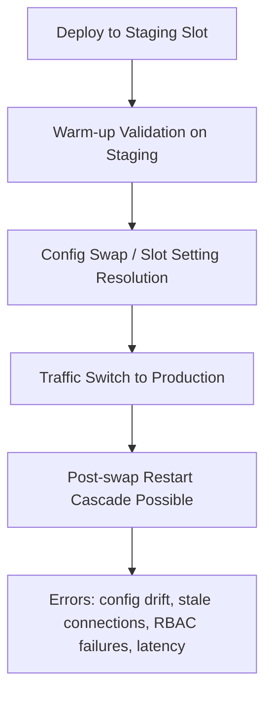

---
content_sources:
  diagrams:
    - id: slot-swap-config-drift-flow
      type: flowchart
      source: self-generated
      justification: "Synthesized post-swap drift and restart phases from Microsoft Learn guidance on deployment slot behavior, sticky settings, and startup restarts after swaps."
      based_on:
        - https://learn.microsoft.com/en-us/azure/app-service/deploy-staging-slots
        - https://learn.microsoft.com/en-us/azure/app-service/reference-app-settings
content_validation:
  status: verified
  last_reviewed: "2026-04-12"
  reviewer: ai-agent
  core_claims:
    - claim: "App settings and connection strings can be marked as slot-specific so they stay with the slot during swap."
      source: "https://learn.microsoft.com/azure/app-service/deploy-staging-slots"
      verified: true
    - claim: "A slot swap warms up the source slot before switching traffic."
      source: "https://learn.microsoft.com/azure/app-service/deploy-staging-slots"
      verified: true
    - claim: "App Service authentication settings, if enabled, are applied from the target slot to the source slot during swap preparation."
      source: "https://learn.microsoft.com/azure/app-service/deploy-staging-slots"
      verified: true
---

# Slot Swap Restart / Config Drift / Warm-up Race (Azure App Service Linux)

## 1. Summary

### Symptom
A slot swap operation reports success, but production availability degrades immediately after swap: instances restart, startup errors appear, latency spikes, or dependencies fail due to post-swap configuration behavior.

### Why this scenario is confusing
From the control-plane perspective, swap is successful. From the application perspective, startup-critical configuration and identity context can change after warm-up, causing a second startup phase (or restart cascade) that was not validated by the original warm-up response.

### Slot swap lifecycle (where races and drift appear)
<!-- diagram-id: slot-swap-config-drift-flow -->


### Investigation Notes

- Treat slot swap as a multi-phase state transition, not an atomic runtime event.
- Build one timeline using platform, console, and HTTP logs: swap success, restart, first failing dependency call, recovery.
- Prioritize app setting and connection string drift review before deep code debugging.
- For swap failures due to warm-up timeout, see [Slot Swap Failed During Warm-up](slot-swap-failed-during-warmup.md).
- Linux App Service scope only; avoid Windows/IIS assumptions.

### 11. Related Queries

- [`../../kql/restarts/repeated-startup-attempts.md`](../../kql/restarts/repeated-startup-attempts.md)
- [`../../kql/correlation/restarts-vs-latency.md`](../../kql/correlation/restarts-vs-latency.md)

### 12. Related Checklists

- [`../../first-10-minutes/startup-availability.md`](../../first-10-minutes/startup-availability.md)

### 13. Related Labs

- `../lab-guides/slot-swap-config-drift.md`

### Limitations

- This playbook covers swap-success-then-degradation patterns, not swap operations that fail before completion.
- Linux App Service focus only; no Windows/IIS behavior is included.
- KQL table/field availability depends on diagnostic pipeline configuration.
- Commands and examples use masked placeholders (`<subscription-id>`, `<object-id>`, `<resource-group>`, `<app-name>`); adapt to your environment.

### Quick Conclusion

When a slot swap succeeds but production degrades, focus on post-swap behavior: restart triggers, slot-setting drift, readiness race conditions, and dependency context differences. Reliable swaps require explicit warm-up contracts, deterministic config parity, and identity/connection validation in the production slot context.

## 2. Common Misreadings

- "Swap succeeded, so production config must be correct." (success only means swap operation completed, not full post-swap runtime validation)
- "This is the same as warm-up timeout." (different class of issue: swap succeeds first, then runtime fails)
- "If staging passed, production will be identical." (slot settings, identities, and connection context can differ)
- "Restarts after swap mean platform instability." (often deterministic restart triggers from non-sticky settings)
- "Database errors right after swap are transient." (can indicate stale or swapped connection-string mismatch)

## 3. Competing Hypotheses

- H1: Non-sticky app settings changed during swap trigger production restarts and startup regression.
- H2: Slot-setting drift exists between staging and production, so swapped code runs with unexpected configuration.
- H3: Warm-up race allows traffic before swapped-in code is fully ready (`WEBSITE_SWAP_WARMUP_PING_PATH` missing or too weak).
- H4: Post-swap dependency context differs (connection strings, managed identity RBAC), causing immediate access failures.

## 4. What to Check First

### Metrics
- Restart count, instance churn, and startup duration immediately after successful swap timestamp.
- HTTP 5xx/4xx rate and p95 latency before and after traffic switch.
- Error-rate jump window: first 1-10 minutes after swap completion.

### Logs
- `AppServicePlatformLogs`: swap lifecycle completion, restart operations, container recycle events.
- `AppServiceConsoleLogs`: startup exceptions, configuration load errors, identity/auth failures.
- `AppServiceHTTPLogs`: first requests after swap, status mix, warm-up vs user-path timing.

### Platform Signals
- Effective app settings and slot-setting flags for both slots.
- Presence/value of `WEBSITE_SWAP_WARMUP_PING_PATH` and `WEBSITE_SWAP_WARMUP_PING_STATUSES`.
- Auto-swap configuration and startup budget (`WEBSITES_CONTAINER_START_TIME_LIMIT`).
- Managed identity assignment and role bindings for production-scoped resources.

## 5. Evidence to Collect

### Required
- Exact timeline: deployment complete, warm-up complete, swap complete, first restart, first user error.
- App settings and connection strings for both slots (including `slotSetting` markers).
- Platform log lines confirming successful swap followed by restart/recycle events.
- Console log excerpts for startup and dependency initialization after swap.
- HTTP log sample for first post-swap 10 minutes (status code and latency).

### Useful Context
- Recent changes to startup path, migrations, secret providers, feature flags.
- Whether auto-swap is enabled and average cold-start time for this workload.
- Whether persistent connections/caches are recreated on startup.
- Identity model (system-assigned vs user-assigned) and scope of RBAC assignments.

### Sample Log Patterns

### AppServiceHTTPLogs (post-swap config endpoint still returns 200)

```text
[AppServiceHTTPLogs]
2026-04-04T11:21:57Z  GET  /config    200  63
2026-04-04T11:23:03Z  GET  /diag/env  200  9
```

### AppServiceConsoleLogs (listener healthy even with drift)

```text
[AppServiceConsoleLogs]
2026-04-04T11:14:20Z  Error  [2026-04-04 11:14:20 +0000] [1894] [INFO] Listening at: http://0.0.0.0:8000
2026-04-04T11:14:21Z  Error  [2026-04-04 11:14:21 +0000] [1894] [INFO] Control socket listening
```

### Swap-related drift signal (application-level config mismatch)

```text
[Application behavior around swap]
Before swap (expected production): DB_CONNECTION_STRING=Server=tcp:prod-db.database.windows.net;Database=appdb;
After swap (unexpected production): DB_CONNECTION_STRING=Server=tcp:staging-db.database.windows.net;Database=appdb-staging;
```

!!! tip "How to Read This"
    In config-drift incidents, transport health can look normal (`200`, low latency, valid listener), while business behavior fails due to wrong effective settings after slot switch.

### KQL Queries with Example Output

### Query 1: Post-swap request health does not rule out drift

```kusto
// Observe request success on diagnostic endpoints around swap window
AppServiceHTTPLogs
| where TimeGenerated between (datetime(2026-04-04 11:21:50) .. datetime(2026-04-04 11:23:10))
| project TimeGenerated, CsMethod, CsUriStem, ScStatus, TimeTaken
| order by TimeGenerated asc
```

**Example Output:**

| TimeGenerated | CsMethod | CsUriStem | ScStatus | TimeTaken |
|---|---|---|---|---|
| 2026-04-04 11:21:57 | GET | /config | 200 | 63 |
| 2026-04-04 11:23:03 | GET | /diag/env | 200 | 9 |

!!! tip "How to Read This"
    `200` on `/config` and `/diag/env` means the app is alive, not that configuration values are correct for production.

### Query 2: Confirm listener health to separate runtime boot from config drift

```kusto
// Confirm process startup/listen behavior from console output
AppServiceConsoleLogs
| where TimeGenerated between (datetime(2026-04-04 11:14:15) .. datetime(2026-04-04 11:14:25))
| where ResultDescription has_any ("Listening at", "Control socket listening", "0.0.0.0")
| project TimeGenerated, Level, ResultDescription
| order by TimeGenerated asc
```

**Example Output:**

| TimeGenerated | Level | ResultDescription |
|---|---|---|
| 2026-04-04 11:14:20 | Error | [2026-04-04 11:14:20 +0000] [1894] [INFO] Listening at: http://0.0.0.0:8000 |
| 2026-04-04 11:14:21 | Error | [2026-04-04 11:14:21 +0000] [1894] [INFO] Control socket listening |

!!! tip "How to Read This"
    Healthy bind/listener lines reduce likelihood of startup transport issues and push investigation toward H1/H2/H4 config-context drift.

### Query 3: Compare config endpoint values before and after swap timestamp

```kusto
// Parse /config payload snapshots to detect effective-setting drift
AppServiceHTTPLogs
| where CsUriStem == "/config"
| where TimeGenerated between (datetime(2026-04-04 11:20:00) .. datetime(2026-04-04 11:30:00))
| project TimeGenerated, ScStatus, TimeTaken
| order by TimeGenerated asc
```

**Example Output:**

| TimeGenerated | ScStatus | TimeTaken |
|---|---|---|
| 2026-04-04 11:21:57 | 200 | 63 |

**Companion value snapshot (from app response body):**

| SnapshotTime | SlotContext | DB_CONNECTION_STRING |
|---|---|---|
| 2026-04-04 11:21:56 | production (before swap) | Server=tcp:prod-db.database.windows.net;Database=appdb; |
| 2026-04-04 11:21:57 | production (after swap) | Server=tcp:staging-db.database.windows.net;Database=appdb-staging; |

!!! tip "How to Read This"
    The endpoint is healthy (`200`) but value changes at swap boundary show configuration drift. This is the decisive signal for this playbook.

### CLI Investigation Commands

```bash
# Capture app setting parity across production and staging slots
az webapp config appsettings list --resource-group <resource-group> --name <app-name> --slot production --output table
az webapp config appsettings list --resource-group <resource-group> --name <app-name> --slot <staging-slot> --output table

# Capture connection string parity across slots
az webapp config connection-string list --resource-group <resource-group> --name <app-name> --slot production --output table
az webapp config connection-string list --resource-group <resource-group> --name <app-name> --slot <staging-slot> --output table

# Validate swap warm-up settings on staging slot
az webapp config appsettings list --resource-group <resource-group> --name <app-name> --slot <staging-slot> --query "[?name=='WEBSITE_SWAP_WARMUP_PING_PATH' || name=='WEBSITE_SWAP_WARMUP_PING_STATUSES' || name=='WEBSITES_CONTAINER_START_TIME_LIMIT'].{name:name,value:value}" --output table

# Show slot summary and host state
az webapp show --resource-group <resource-group> --name <app-name> --query "{state:state,enabled:enabled,hostNames:hostNames}" --output table
```

**Example Output:**

```text
Name                    Value                                                SlotSetting
----------------------  ---------------------------------------------------  -----------
DB_CONNECTION_STRING    Server=tcp:prod-db.database.windows.net;...         False
FEATURE_FLAG_X          true                                                 True

Name                    Value                                                SlotSetting
----------------------  ---------------------------------------------------  -----------
DB_CONNECTION_STRING    Server=tcp:staging-db.database.windows.net;...      False
FEATURE_FLAG_X          true                                                 True

Name                               Value
---------------------------------  -------------------------------
WEBSITE_SWAP_WARMUP_PING_PATH      /diag/env
WEBSITE_SWAP_WARMUP_PING_STATUSES  200
WEBSITES_CONTAINER_START_TIME_LIMIT 600

State    Enabled    HostNames
-------  ---------  -------------------------------------------
Running  True       <app-name>.azurewebsites.net
```

!!! tip "How to Read This"
    Non-sticky (`SlotSetting=False`) startup-critical values that differ across slots can flip during swap and cause production drift even when warm-up technically succeeds.

### CLI Investigation Commands (Focused Drift Diff)

```bash
# Export critical app settings for both slots (table view for rapid review)
az webapp config appsettings list --resource-group <resource-group> --name <app-name> --slot production --query "[?name=='DB_CONNECTION_STRING' || name=='REDIS_CONNECTION_STRING' || name=='KEY_VAULT_URI' || name=='API_BASE_URL' || name=='WEBSITE_SWAP_WARMUP_PING_PATH' || name=='WEBSITE_SWAP_WARMUP_PING_STATUSES'].{name:name,value:value,slotSetting:slotSetting}" --output table

az webapp config appsettings list --resource-group <resource-group> --name <app-name> --slot <staging-slot> --query "[?name=='DB_CONNECTION_STRING' || name=='REDIS_CONNECTION_STRING' || name=='KEY_VAULT_URI' || name=='API_BASE_URL' || name=='WEBSITE_SWAP_WARMUP_PING_PATH' || name=='WEBSITE_SWAP_WARMUP_PING_STATUSES'].{name:name,value:value,slotSetting:slotSetting}" --output table

# Validate identity used by app
az webapp identity show --resource-group <resource-group> --name <app-name> --output table

# Validate role assignments for production-scoped dependencies
az role assignment list --assignee <object-id> --scope /subscriptions/<subscription-id>/resourceGroups/<resource-group> --all --output table
```

**Example Output:**

```text
Name                             Value                                           SlotSetting
-------------------------------  ----------------------------------------------  -----------
DB_CONNECTION_STRING             Server=tcp:prod-db.database.windows.net;...    False
KEY_VAULT_URI                    https://kv-prod.vault.azure.net/               True
WEBSITE_SWAP_WARMUP_PING_PATH    /diag/env                                      True
WEBSITE_SWAP_WARMUP_PING_STATUSES 200                                            True

Name                             Value                                           SlotSetting
-------------------------------  ----------------------------------------------  -----------
DB_CONNECTION_STRING             Server=tcp:staging-db.database.windows.net;... False
KEY_VAULT_URI                    https://kv-staging.vault.azure.net/            True
WEBSITE_SWAP_WARMUP_PING_PATH    /diag/env                                      True
WEBSITE_SWAP_WARMUP_PING_STATUSES 200                                            True
```

!!! tip "How to Read This"
    In this sample, `DB_CONNECTION_STRING` differs but is non-sticky (`False`), which can cause production context to drift on swap. That should be corrected or explicitly justified before release.

## 6. Validation and Disproof by Hypothesis

### H1: Non-sticky settings change triggers restart after successful swap
- Signals that support: `AppServicePlatformLogs` show swap success followed by recycle/restart; restart correlates with setting diffs.
- Signals that weaken: no restart/recycle events after swap, stable instance IDs, and no config mutation.
- What to verify:
    - Compare app settings across slots and identify startup-critical values not marked as slot settings.
    - Confirm whether settings changed at swap boundary and whether this aligns to restart timestamp.

```kusto
let windowStart = ago(24h);
AppServicePlatformLogs
| where TimeGenerated >= windowStart
| where ResultDescription has_any ("swap", "restart", "recycle", "container")
| project TimeGenerated, OperationName, ResultDescription
| order by TimeGenerated asc
```

```bash
az webapp config appsettings list --resource-group <resource-group> --name <app-name> --slot production
az webapp config appsettings list --resource-group <resource-group> --name <app-name> --slot <staging-slot>
az webapp deployment slot swap --resource-group <resource-group> --name <app-name> --slot <staging-slot> --target-slot production
```

### H2: Slot-setting drift causes swapped code to run with unexpected configuration
- Signals that support: same build works in staging but fails in production post-swap with missing/incorrect endpoint, secret, or feature flags.
- Signals that weaken: explicit diff confirms startup-critical parity and correct slot-setting intent.
- What to verify:
    - Diff app settings and connection strings with focus on `slotSetting=true` entries.
    - Validate intended sticky/non-sticky behavior for each startup-critical value.

```kusto
let windowStart = ago(24h);
AppServiceConsoleLogs
| where TimeGenerated >= windowStart
| where ResultDescription has_any ("KeyError", "missing", "configuration", "secret", "endpoint", "feature flag")
| project TimeGenerated, ResultDescription
| order by TimeGenerated desc
```

```bash
az webapp config appsettings list --resource-group <resource-group> --name <app-name> --slot production
az webapp config appsettings list --resource-group <resource-group> --name <app-name> --slot <staging-slot>
az webapp config connection-string list --resource-group <resource-group> --name <app-name> --slot production
az webapp config connection-string list --resource-group <resource-group> --name <app-name> --slot <staging-slot>
```

### H3: Warm-up race allows traffic before effective readiness after swap
- Signals that support: swap succeeds quickly, user traffic starts, then high error/latency while app still initializing.
- Signals that weaken: dedicated warm-up path exists, returns expected status, and post-swap error spike absent.
- What to verify:
    - Ensure `WEBSITE_SWAP_WARMUP_PING_PATH` is set to a lightweight readiness endpoint.
    - Validate accepted statuses are explicit and minimal.
    - Check auto-swap timing vs cold-start duration (`WEBSITES_CONTAINER_START_TIME_LIMIT`).

```kusto
let windowStart = ago(24h);
AppServiceHTTPLogs
| where TimeGenerated >= windowStart
| summarize requests=count(), errors=countif(ScStatus >= 500), p95=percentile(TimeTaken,95) by bin(TimeGenerated, 1m)
| order by TimeGenerated asc
```

```bash
az webapp config appsettings list --resource-group <resource-group> --name <app-name> --slot <staging-slot>
az webapp config appsettings set --resource-group <resource-group> --name <app-name> --slot <staging-slot> --settings WEBSITE_SWAP_WARMUP_PING_PATH=/ready WEBSITE_SWAP_WARMUP_PING_STATUSES=200 WEBSITES_CONTAINER_START_TIME_LIMIT=600
az webapp deployment slot auto-swap --resource-group <resource-group> --name <app-name> --slot <staging-slot> --auto-swap-slot production
```

### H4: Post-swap dependency context breaks (stale connection strings or identity RBAC mismatch)
- Signals that support: immediate DB/auth/storage failures after swap only on production slot context.
- Signals that weaken: dependency access validates successfully under production slot identity and connection settings.
- What to verify:
    - Connection string values/Key Vault references resolve correctly in production slot.
    - Managed identity principal used by production has required roles at correct scope.
    - Any startup-cached tokens or pooled connections are refreshed after swap.

```kusto
let windowStart = ago(24h);
AppServiceConsoleLogs
| where TimeGenerated >= windowStart
| where ResultDescription has_any ("login failed", "authorization", "forbidden", "ManagedIdentityCredential", "connection", "timeout")
| project TimeGenerated, ResultDescription
| order by TimeGenerated desc
```

```bash
az webapp identity show --resource-group <resource-group> --name <app-name>
az role assignment list --assignee <object-id> --scope /subscriptions/<subscription-id>/resourceGroups/<resource-group> --all
az webapp config connection-string list --resource-group <resource-group> --name <app-name> --slot production
```

### Normal vs Abnormal Comparison

| Signal | Normal Slot Swap | Slot Swap Config Drift |
|---|---|---|
| `/config` HTTP status | `200` | `200` (can still be drifted) |
| `/config` effective values | Production values remain expected | Values switch to staging or unintended target |
| Console listener logs | `0.0.0.0:<port>` and stable | Same (often healthy), so transport looks normal |
| Post-swap functional behavior | Dependency calls succeed | DB/auth/external dependency failures start immediately |
| App settings parity | Startup-critical keys intentionally sticky/non-sticky | Critical key slot-setting intent incorrect or drifted |
| Operational conclusion | Swap is both control-plane and runtime healthy | Swap control-plane succeeded, runtime config context is wrong |

### Slot Drift Diff Checklist

| Category | Production Slot (Expected) | Staging Slot (Expected) | Drift Risk if Different and Non-sticky |
|---|---|---|---|
| `DB_CONNECTION_STRING` | Production database endpoint | Staging database endpoint | High (traffic can hit wrong data source after swap) |
| `REDIS_CONNECTION_STRING` | Production cache | Staging cache | Medium-High (cache poisoning/stale reads) |
| `FEATURE_FLAG_*` | Controlled by release policy | Pre-validation values | Medium (feature set mismatch) |
| `KEY_VAULT_URI` | Production vault URI | Staging vault URI | High (secret lookup failures) |
| `API_BASE_URL` | Production downstream URL | Staging downstream URL | High (cross-environment API calls) |

### Drift decision rules

| Rule | Action |
|---|---|
| Startup-critical key differs and `SlotSetting=False` | Treat as release blocker before swap |
| Startup-critical key differs and `SlotSetting=True` with explicit intent | Document and allow |
| Swap warm-up path validates only shallow route | Add dependency-aware warm-up endpoint |
| Identity context differs across slots without documented reason | Validate RBAC and block swap until resolved |

!!! tip "How to Read This"
    The goal is not full key parity. The goal is intentional parity: every difference must be either sticky-by-design or safe to swap.

### Normal vs Abnormal Swap Timeline

| Phase | Normal Swap | Swap with Config Drift |
|---|---|---|
| Warm-up | Staging endpoint returns expected readiness | Staging warm-up passes but does not validate effective prod config |
| Swap complete event | No immediate error spike | Error spike within 1-10 minutes |
| `/config` endpoint | `200` and expected production values | `200` but unexpected values |
| Dependency behavior | Stable DB/auth calls | Authentication or connection failures begin |
| Recovery action | Continue rollout | Correct slot settings and recycle/reswap |

## 7. Likely Root Cause Patterns

- Pattern A: Startup-critical setting was not marked as slot setting (or was incorrectly marked), changing effective runtime config after swap.
- Pattern B: Warm-up endpoint validated a shallow response, but real readiness required longer dependency initialization.
- Pattern C: Auto-swap executed with insufficient warm-up budget for cold initialization profile.
- Pattern D: Production identity/RBAC or secret resolution differs from staging and fails immediately under real traffic.
- Pattern E: Database/client connection pools cached stale endpoints or credentials across slot transition.

## 8. Immediate Mitigations

- Freeze additional swaps and validate setting parity before next release. **Risk:** release cadence slows temporarily.
- Set explicit `WEBSITE_SWAP_WARMUP_PING_PATH` and strict status list (`200` or `200,202` only if justified). **Risk:** poorly chosen endpoint can still under-validate readiness.
- Increase startup budget (`WEBSITES_CONTAINER_START_TIME_LIMIT`) for current build while startup path is optimized. **Risk:** slower failure detection for broken builds.
- Recycle production slot after correcting config/identity to clear stale connection pools and token caches. **Risk:** brief additional restart event.
- If impact is ongoing, swap back or redeploy known-good revision with validated slot settings. **Risk:** rollback can reintroduce prior defects if not verified.

## 9. Prevention

- Maintain a versioned slot-configuration contract: each startup-critical key has documented sticky/non-sticky intent.
- Add CI/CD guardrails to diff slot settings and block swaps on unauthorized drift.
- Separate `/warmup` from `/health` and ensure `/warmup` validates app-readiness invariants needed immediately after traffic switch.
- Define post-swap observability gate (restart count, error budget burn, p95) before marking deployment successful.
- Standardize identity model and RBAC automation so staging and production permissions are intentionally equivalent or explicitly different.
- Rotate/refresh dependency clients on startup and on configuration change to avoid stale connection behavior.

## See Also

### Related Labs

- [Lab: Slot Swap Config Drift](../../lab-guides/slot-swap-config-drift.md)

### Related Checklists

- [Startup Availability (First 10 Minutes)](../../first-10-minutes/startup-availability.md)

## Sources

- [Set up staging environments in Azure App Service](https://learn.microsoft.com/en-us/azure/app-service/deploy-staging-slots)
- [Configure an App Service app](https://learn.microsoft.com/en-us/azure/app-service/configure-common)
- [Azure App Service diagnostics overview](https://learn.microsoft.com/en-us/azure/app-service/overview-diagnostics)
- [Monitor App Service instances using Health check](https://learn.microsoft.com/en-us/azure/app-service/monitor-instances-health-check)
