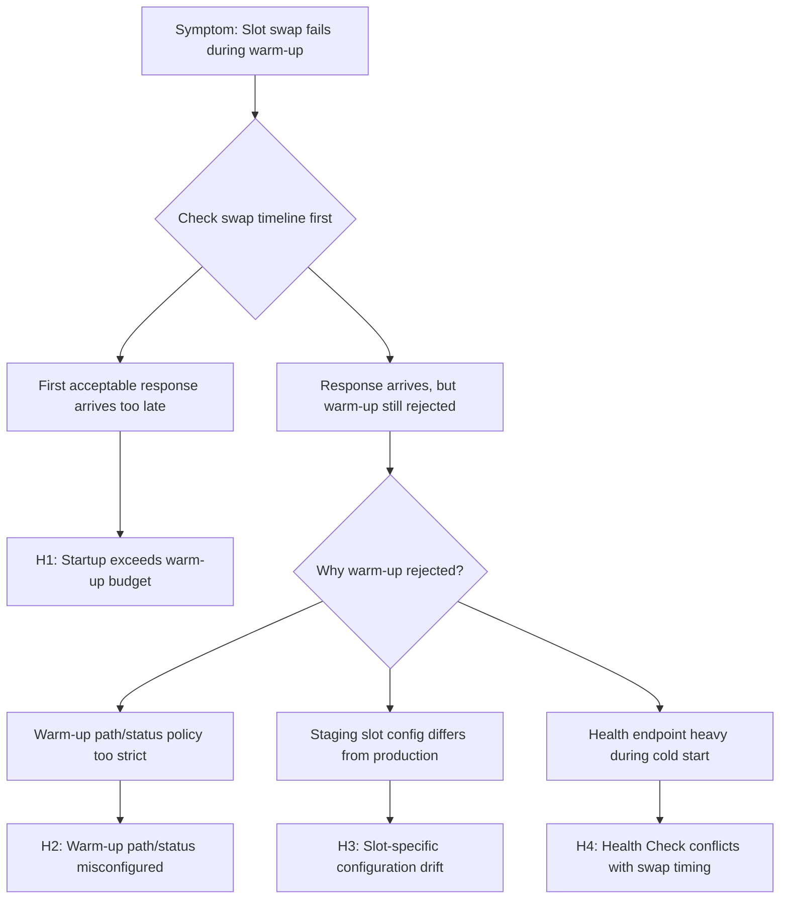

# Slot Swap Failed During Warm-up (Azure App Service Linux)

## 1. Summary

### Symptom
An Azure App Service Linux slot swap fails, rolls back, or takes much longer than expected because warm-up validation does not complete for the source (staging) slot. Common user-facing outcomes include swap timeout messages, repeated swap retries, and intermittent availability during deployment windows.

### Why this scenario is confusing
Swap warm-up is not the same mechanism as regular runtime traffic checks. An app can respond when you browse the staging URL manually and still fail platform-controlled warm-up due to timing, path rules, status filtering, or slot-specific configuration drift.

### Troubleshooting decision flow


## 2. Common Misreadings

- "Staging works in browser, so warm-up must be healthy." (manual checks often differ from platform probe behavior)
- "This is just a health check issue." (swap warm-up and Health Check are related but independently configurable)
- "Swap failure means production code is bad." (frequently caused by slot-specific settings or startup timing)
- "Increasing instance count will fix it." (can worsen startup pressure if initialization is heavy)
- "If no crash appears, platform issue is random." (many failures are deterministic once timing and probe path are correlated)

## 3. Competing Hypotheses

- H1: Staging slot container startup exceeds warm-up window before first acceptable HTTP response.
- H2: Warm-up path/status policy is too strict (`WEBSITE_SWAP_WARMUP_PING_PATH`, `WEBSITE_SWAP_WARMUP_PING_STATUSES`) for current startup behavior.
- H3: Slot-specific app settings or connection settings drifted, so staging initialization differs from production expectations.
- H4: Health Check endpoint behavior on staging conflicts with swap timing (heavy dependency checks, transient 5xx, auth/middleware mismatch).

## 4. What to Check First

### Metrics
- Restart count and instance churn during swap attempts.
- HTTP 5xx and latency spikes aligned to swap start timestamp.
- CPU and memory pressure during staging startup (cold start amplification).
- Duration from swap trigger to rollback/failure event.

### Logs
- `AppServicePlatformLogs` for swap lifecycle and warm-up messages.
- `AppServiceConsoleLogs` for startup timeline, binding logs, and dependency failures.
- `AppServiceHTTPLogs` for warm-up path response code and latency distribution.

### Platform Signals
- Effective values of `WEBSITE_SWAP_WARMUP_PING_PATH` and `WEBSITE_SWAP_WARMUP_PING_STATUSES`.
- Startup budget (`WEBSITES_CONTAINER_START_TIME_LIMIT`) and port settings (`WEBSITES_PORT`, `PORT`).
- Health Check path configuration and authentication requirements.
- Slot setting flags for sensitive config (database, cache, feature toggles, secrets).

## 5. Evidence to Collect

### Required Evidence
- Exact swap attempt window (start time, failure time, retry count).
- Platform log excerpt showing warm-up acceptance or failure reason.
- Console logs from staging slot from container start until swap timeout/rollback.
- Current app settings and connection strings from both slots, including slot-setting markers.
- HTTP log sample for warm-up path and health path around swap window.

### Useful Context
- Recent changes to startup code, migrations, model loading, or dependency bootstrap logic.
- Recent slot setting changes (new secret names, endpoint URLs, identity configuration).
- Any middleware/auth changes affecting warm-up or health endpoints.
- Whether failure appears only on first swap after deployment, or on every swap.
- Whether this is custom container Linux or built-in Linux runtime with startup command overrides.

## 6. Validation and Disproof by Hypothesis

### H1: Startup time exceeds warm-up budget
**Support signals**
- Platform logs show warm-up timeout while console logs show delayed first listen.
- Successful swaps correlate with smaller images or fewer cold-start dependencies.

**Signals that weaken H1**
- App binds quickly and returns acceptable status well before timeout.

**KQL**
```kusto
let startTime = ago(12h);
AppServicePlatformLogs
| where TimeGenerated >= startTime
| where ResultDescription has_any ("swap", "warmup", "timeout", "failed")
| project TimeGenerated, ContainerId, OperationName, ResultDescription
| order by TimeGenerated desc
```

```kusto
let startTime = ago(12h);
AppServiceConsoleLogs
| where TimeGenerated >= startTime
| where ResultDescription has_any ("Listening on", "Now listening", "Started", "Gunicorn")
| project TimeGenerated, ContainerId, ResultDescription
| order by TimeGenerated asc
```

**CLI (long flags only)**
```bash
az webapp config appsettings list --resource-group <resource-group> --name <app-name> --slot <staging-slot>
az webapp log tail --resource-group <resource-group> --name <app-name> --slot <staging-slot>
az webapp config appsettings set --resource-group <resource-group> --name <app-name> --slot <staging-slot> --settings WEBSITES_CONTAINER_START_TIME_LIMIT=600
```

### H2: Warm-up path or accepted statuses are misconfigured
**Support signals**
- Warm-up path returns redirects, 401/403, or 404 during startup.
- Accepted statuses exclude actual temporary success codes used by app during warm-up.

**Signals that weaken H2**
- Warm-up path consistently returns allowed status quickly in logs.

**KQL**
```kusto
let startTime = ago(12h);
AppServiceHTTPLogs
| where TimeGenerated >= startTime
| where CsUriStem in ("/", "/health", "/ready", "/warmup")
| summarize requests=count(), failures=countif(ScStatus >= 400), p95=percentile(TimeTaken, 95) by CsUriStem, ScStatus, bin(TimeGenerated, 5m)
| order by TimeGenerated desc
```

**CLI (long flags only)**
```bash
az webapp config appsettings list --resource-group <resource-group> --name <app-name> --slot <staging-slot>
az webapp config appsettings set --resource-group <resource-group> --name <app-name> --slot <staging-slot> --settings WEBSITE_SWAP_WARMUP_PING_PATH=/ready WEBSITE_SWAP_WARMUP_PING_STATUSES=200,202
az webapp deployment slot swap --resource-group <resource-group> --name <app-name> --slot <staging-slot> --target-slot production
```

### H3: Slot-specific configuration drift breaks staging warm-up
**Support signals**
- Staging slot uses different secret references, endpoints, or feature flags.
- Startup exceptions reference missing credentials, DNS failures, or denied dependency access only on staging.

**Signals that weaken H3**
- Config diff confirms parity for all startup-critical settings.

**KQL**
```kusto
let startTime = ago(12h);
AppServiceConsoleLogs
| where TimeGenerated >= startTime
| where ResultDescription has_any ("authentication", "permission", "forbidden", "timeout", "connection", "dns", "secret")
| project TimeGenerated, ContainerId, ResultDescription
| order by TimeGenerated desc
```

**CLI (long flags only)**
```bash
az webapp config appsettings list --resource-group <resource-group> --name <app-name> --slot production
az webapp config appsettings list --resource-group <resource-group> --name <app-name> --slot <staging-slot>
az webapp config connection-string list --resource-group <resource-group> --name <app-name> --slot <staging-slot>
```

### H4: Health Check behavior conflicts with swap warm-up timing
**Support signals**
- Health endpoint performs deep dependency checks and intermittently fails under cold start.
- HTTP logs show high p95 on health route exactly during swap windows.

**Signals that weaken H4**
- Health endpoint is lightweight, deterministic, and stable during swap attempts.

**KQL**
```kusto
let startTime = ago(12h);
AppServiceHTTPLogs
| where TimeGenerated >= startTime
| where CsUriStem in ("/health", "/healthz", "/ready")
| summarize total=count(), failures=countif(ScStatus >= 500), p95=percentile(TimeTaken, 95) by CsUriStem, bin(TimeGenerated, 5m)
| order by TimeGenerated desc
```

**CLI (long flags only)**
```bash
az webapp config show --resource-group <resource-group> --name <app-name> --slot <staging-slot>
az webapp config set --resource-group <resource-group> --name <app-name> --slot <staging-slot> --generic-configurations "{\"healthCheckPath\":\"/health/light\"}"
az webapp restart --resource-group <resource-group> --name <app-name> --slot <staging-slot>
```

## 7. Likely Root Cause Patterns

- Pattern A: Warm-up endpoint requires downstream dependency readiness and fails during transient startup windows.
- Pattern B: Slot-specific setting drift (marked as slot setting) causes staging to initialize with invalid or incomplete configuration.
- Pattern C: Startup path includes blocking initialization (migrations, cache prime, model load) that exceeds warm-up budget.
- Pattern D: Status filter for swap warm-up excludes app’s valid transitional response code.

## 8. Immediate Mitigations

- Set a dedicated lightweight warm-up path that avoids auth and deep dependency checks. **Risk:** reduced coverage of end-to-end readiness.
- Expand acceptable warm-up statuses only as needed (for example `200,202`) and document rationale. **Risk:** may mask partial readiness if too permissive.
- Temporarily increase `WEBSITES_CONTAINER_START_TIME_LIMIT` while startup optimization is implemented. **Risk:** slower detection of truly bad builds.
- Align slot settings for startup-critical values before swap (secrets, endpoints, feature toggles). **Risk:** accidental config propagation if review is skipped.
- Move heavyweight initialization out of request path (pre-deploy tasks, background bootstrapping). **Risk:** operational complexity and sequencing requirements.

## 9. Long-term Fixes

- Standardize startup contracts: explicit bind host, explicit port, deterministic first response target.
- Define separate `/warmup` and `/health` semantics; keep `/warmup` minimal and fast.
- Add deployment guardrails that diff slot settings and block swap on critical drift.
- Add startup SLOs (time-to-first-200) and alert on regression before swap is attempted.
- Automate pre-swap validation in pipeline with the same path/status expectations used by platform swap logic.

## 10. Investigation Notes

- Treat swap warm-up as a time-bounded state transition, not a generic availability check.
- Focus timeline correlation first: swap trigger, container start, first listen, first acceptable warm-up response.
- If staging URL is manually healthy but swap still fails, inspect path/status policy and slot setting parity immediately.
- Keep Linux/OSS context explicit: this playbook does not cover Windows workers.
- For Python/Flask/FastAPI/Gunicorn workloads, verify server command binds to `0.0.0.0` and uses environment-driven port.

## 11. Related Queries

- [`../../kql/console/startup-errors.md`](../../kql/console/startup-errors.md)
- [`../../kql/restarts/repeated-startup-attempts.md`](../../kql/restarts/repeated-startup-attempts.md)
- [`../../kql/http/latency-trend-by-status-code.md`](../../kql/http/latency-trend-by-status-code.md)
- [`../../kql/correlation/restarts-vs-latency.md`](../../kql/correlation/restarts-vs-latency.md)

## 12. Related Checklists

- [`../../first-10-minutes/startup-availability.md`](../../first-10-minutes/startup-availability.md)

## 13. Related Labs

- [Lab: Slot Swap Config Drift](../../lab-guides/slot-swap-config-drift.md)

## 14. Limitations

- Linux/OSS App Service scope only; Windows/IIS slot behavior is intentionally excluded.
- KQL table availability depends on diagnostics routing to Log Analytics.
- Query fields can vary slightly by workspace schema version.
- This playbook emphasizes startup and swap control-plane behavior, not full application performance profiling.

## 15. Quick Conclusion

When slot swap fails during warm-up, assume a validation contract mismatch first: timing, path/status policy, or slot-specific configuration drift. Correlate platform, console, and HTTP logs in one timeline, then apply targeted mitigations (lightweight warm-up endpoint, startup optimization, and slot parity controls) to make swaps repeatable and safe.

## References

- [Set up staging environments in Azure App Service](https://learn.microsoft.com/en-us/azure/app-service/deploy-staging-slots)
- [Monitor App Service instances using Health check](https://learn.microsoft.com/en-us/azure/app-service/monitor-instances-health-check)
- [Configure an App Service app](https://learn.microsoft.com/en-us/azure/app-service/configure-common)
- [Azure App Service diagnostics overview](https://learn.microsoft.com/en-us/azure/app-service/overview-diagnostics)
