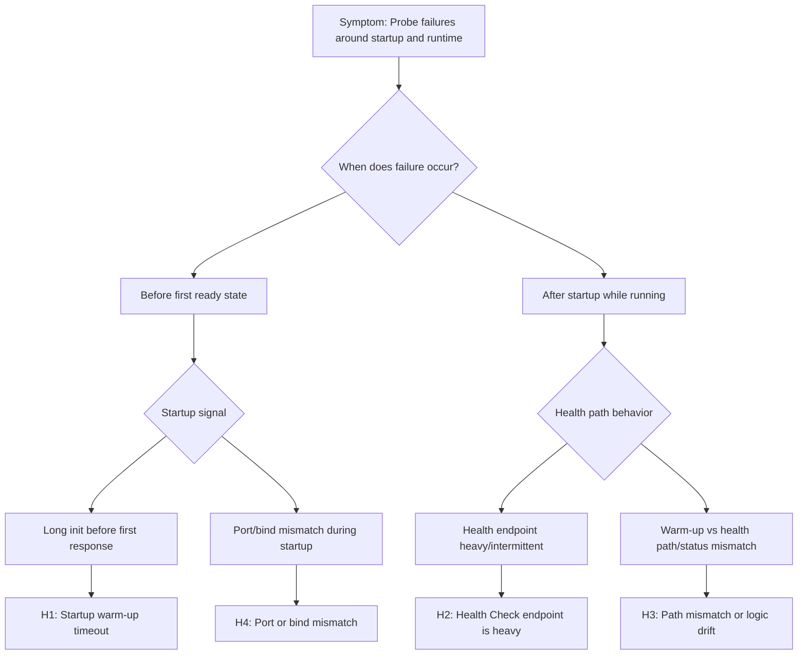

---
hide:
  - toc
content_sources:
  diagrams:
    - id: warmup-vs-health-check-flow
      type: flowchart
      source: self-generated
      justification: "Synthesized startup warm-up versus runtime health-check branches from Microsoft Learn guidance on App Service warm-up settings and Health check behavior."
      based_on:
        - https://learn.microsoft.com/en-us/azure/app-service/reference-app-settings
        - https://learn.microsoft.com/en-us/azure/app-service/monitor-instances-health-check
        - https://learn.microsoft.com/en-us/troubleshoot/azure/app-service/faqs-app-service-linux-new
content_validation:
  status: verified
  last_reviewed: "2026-04-12"
  reviewer: ai-agent
  core_claims:
    - claim: "Health Check evaluates already-running instances."
      source: "https://learn.microsoft.com/azure/app-service/monitor-instances-health-check"
      verified: true
    - claim: "Health Check removes unhealthy instances from the load balancer."
      source: "https://learn.microsoft.com/azure/app-service/monitor-instances-health-check"
      verified: true
    - claim: "When selecting the Health Check path, you should choose a path that returns 200 only when the app is fully warmed up."
      source: "https://learn.microsoft.com/azure/app-service/monitor-instances-health-check"
      verified: true
---

# Warm-up vs Health Check (Azure App Service Linux)

## 1. Summary

### Symptom
On Azure App Service Linux, the app either never becomes ready after restart or becomes ready and then instances get removed from rotation. Teams see HTTP probe failures and treat all failures as one problem.

### Why this scenario is confusing
Warm-up and Health Check both use HTTP but serve different phases:
- Startup warm-up (platform startup pings) validates initial container readiness.
- Health Check (feature configuration) evaluates already-running instances.
Wrong mental model leads to wrong mitigations (for example tuning Health Check when startup timeout is the actual issue).

### Troubleshooting decision flow
<!-- diagram-id: warmup-vs-health-check-flow -->


### Investigation Notes

- Startup warm-up answers: "Can this new instance serve HTTP yet?"
- Health Check answers: "Should this already-running instance stay in load balancing?"
- If startup fails, tune startup path and timeout-related settings.
- If runtime health fails, tune endpoint behavior and dependency strategy.
- During scale-out, both mechanisms can appear close in time; use log timeline correlation.
- `WEBSITE_WARMUP_PATH` lets you specify a custom path for the startup warm-up probe instead of `/`. `WEBSITE_WARMUP_STATUSES` defines which HTTP status codes count as a successful warm-up (e.g., `200,202`). These are distinct from the Health Check path and apply only during initial startup validation.

### 11. Related Queries

- [`../../kql/console/startup-errors.md`](../../kql/console/startup-errors.md)
- [`../../kql/console/container-binding-errors.md`](../../kql/console/container-binding-errors.md)
- [`../../kql/restarts/repeated-startup-attempts.md`](../../kql/restarts/repeated-startup-attempts.md)
- [`../../kql/http/latency-trend-by-status-code.md`](../../kql/http/latency-trend-by-status-code.md)

### 12. Related Checklists

- [`../../first-10-minutes/startup-availability.md`](../../first-10-minutes/startup-availability.md)

### 13. Related Labs

- [Lab: Slot Swap Config Drift](../../lab-guides/slot-swap-config-drift.md)

### Limitations

- Linux/OSS scope only; Windows-specific behavior is excluded.
- Queries assume App Service logs are routed to Log Analytics.
- Table/column names may vary slightly by workspace configuration.

### Quick Conclusion

Do not treat warm-up and Health Check as one signal. First isolate startup readiness failure vs runtime health eviction, then apply targeted fixes: startup timing/port/bind for warm-up issues, and lightweight deterministic endpoint design for Health Check issues.

## 2. Common Misreadings

- "Health Check failed, so startup failed" (startup can fail with Health Check disabled).
- "Raising Health Check threshold will fix startup timeout" (it does not change startup probe behavior).
- "`/health` is fast locally, so platform warm-up is fine" (warm-up timing/path behavior can still fail).
- "Any HTTP 5xx during deploy means bad code" (could be probe path design or startup timing).

### Common Misdiagnoses

- "Health Check path is green, so warm-up cannot fail." (warm-up has independent policy and timing)
- "Any probe issue should be solved by raising Health Check failures threshold." (does not address startup cancellation)
- "Gunicorn boot logs in `Error` level prove startup failure." (message body shows INFO bootstrap)
- "If `/config` returns 200 once, readiness contract is complete." (swap/startup acceptance may still fail)
- "Only code changes cause these incidents." (setting drift between warm-up and health paths is common)

## 3. Competing Hypotheses

- H1: Startup warm-up timeout caused by slow initialization before first HTTP response.
- H2: Health Check endpoint is heavy and intermittently fails after startup.
- H3: Path mismatch or logic drift between warm-up expectations and configured Health Check path.
- H4: Port or bind mismatch (process alive but unreachable to startup pings).

## 4. What to Check First

### Metrics
- Restart count and instance churn during deployment.
- 5xx and latency spikes around cold starts and scale-out.
- Sudden instance drops after initially becoming ready.

### Logs
- `AppServicePlatformLogs` for startup lifecycle and ping outcomes.
- `AppServiceConsoleLogs` for bind/listen timestamps and startup errors.
- `AppServiceHTTPLogs` for health-path status/latency patterns.

### Platform Signals
- `WEBSITES_CONTAINER_START_TIME_LIMIT`, `WEBSITES_PORT`, `PORT`.
- Health Check enabled state and configured path.
- Startup command, image tag, and recent deployment change window.
- `WEBSITE_WARMUP_PATH` and `WEBSITE_WARMUP_STATUSES` for custom warm-up probe behavior.

## 5. Evidence to Collect

### Required Evidence
- Platform log slice covering deployment to failure/success transition.
- Console log slice showing app boot and first listen event.
- Current app settings for startup timeout and port values.
- Current Health Check path configuration.
- HTTP logs for `/`, `/health`, `/ready`, or equivalent path.

### Useful Context
- Recent changes to health handler logic or middleware/auth rules.
- Dependency checks executed by health handler (database/cache/external APIs).
- Whether failures happen on cold start only or also during steady state.
- Any migration/model-loading work executed in startup or health route.

### Sample Log Patterns

### AppServiceHTTPLogs (slot-swap lab)

```text
[AppServiceHTTPLogs]
2026-04-04T11:23:03Z  GET  /diag/env    200  9
2026-04-04T11:23:03Z  GET  /diag/stats  200  31
2026-04-04T11:21:57Z  GET  /config      200  63
```

### AppServiceConsoleLogs (slot-swap lab)

```text
[AppServiceConsoleLogs]
2026-04-04T11:14:20Z  Error  [2026-04-04 11:14:20 +0000] [1894] [INFO] Starting gunicorn 25.3.0
2026-04-04T11:14:20Z  Error  [2026-04-04 11:14:20 +0000] [1894] [INFO] Listening at: http://0.0.0.0:8000 (1894)
2026-04-04T11:14:20Z  Error  [2026-04-04 11:14:20 +0000] [1894] [INFO] Using worker: sync
2026-04-04T11:14:20Z  Error  [2026-04-04 11:14:20 +0000] [1895] [INFO] Booting worker with pid: 1895
2026-04-04T11:14:20Z  Error  [2026-04-04 11:14:20 +0000] [1896] [INFO] Booting worker with pid: 1896
2026-04-04T11:14:21Z  Error  [2026-04-04 11:14:21 +0000] [1894] [INFO] Control socket listening at /root/.gunicorn/gunicorn.ctl
```

### AppServicePlatformLogs (slot-swap lab)

```text
[AppServicePlatformLogs]
2026-04-04T11:14:44Z  Informational  State: Stopping, Action: StoppingSiteContainers, LastError: ContainerTimeout, LastErrorTimestamp: 04/04/2026 10:53:28
2026-04-04T11:14:44Z  Informational  Stopping container: fc8f0627a0c0_<app-name>.
2026-04-04T11:14:50Z  Informational  Container is terminated. Total time elapsed: 6367 ms.
2026-04-04T11:14:50Z  Informational  Site: <app-name> stopped.
```

!!! tip "How to Read This"
    In this lab, app startup evidence exists and diagnostic routes return `200`, yet platform still stops the site with `ContainerTimeout`. This is the signature of startup warm-up contract failure, not a generic runtime Health Check eviction.

### KQL Queries with Example Output

### Query 1: Distinguish startup readiness from route responsiveness

```kusto
AppServiceHTTPLogs
| where TimeGenerated between (datetime(2026-04-04 11:21:50) .. datetime(2026-04-04 11:23:10))
| where CsUriStem in ("/diag/env", "/diag/stats", "/config")
| project TimeGenerated, CsMethod, CsUriStem, ScStatus, TimeTaken
| order by TimeGenerated desc
```

**Example Output:**

| TimeGenerated | CsMethod | CsUriStem | ScStatus | TimeTaken |
|---|---|---|---|---|
| 2026-04-04 11:23:03 | GET | /diag/env | 200 | 9 |
| 2026-04-04 11:23:03 | GET | /diag/stats | 200 | 31 |
| 2026-04-04 11:21:57 | GET | /config | 200 | 63 |

!!! tip "How to Read This"
    Healthy point-in-time route responses do not prove startup warm-up succeeded for swap/start lifecycle. Use this query with platform lifecycle logs before concluding Health Check is at fault.

### Query 2: Confirm listener and worker startup happened

```kusto
AppServiceConsoleLogs
| where TimeGenerated between (datetime(2026-04-04 11:14:18) .. datetime(2026-04-04 11:14:25))
| where ResultDescription has_any ("Starting gunicorn", "Listening at", "Using worker", "Booting worker")
| project TimeGenerated, Level, ResultDescription
| order by TimeGenerated asc
```

**Example Output:**

| TimeGenerated | Level | ResultDescription |
|---|---|---|
| 2026-04-04 11:14:20 | Error | [2026-04-04 11:14:20 +0000] [1894] [INFO] Starting gunicorn 25.3.0 |
| 2026-04-04 11:14:20 | Error | [2026-04-04 11:14:20 +0000] [1894] [INFO] Listening at: http://0.0.0.0:8000 (1894) |
| 2026-04-04 11:14:20 | Error | [2026-04-04 11:14:20 +0000] [1894] [INFO] Using worker: sync |
| 2026-04-04 11:14:20 | Error | [2026-04-04 11:14:20 +0000] [1895] [INFO] Booting worker with pid: 1895 |
| 2026-04-04 11:14:20 | Error | [2026-04-04 11:14:20 +0000] [1896] [INFO] Booting worker with pid: 1896 |

!!! tip "How to Read This"
    This confirms process boot and bind. If failures still occur, prioritize policy/path mismatch (H3) or warm-up timing (H1) before tuning Health Check thresholds.

### Query 3: Identify startup lifecycle cancellation events

```kusto
AppServicePlatformLogs
| where TimeGenerated between (datetime(2026-04-04 11:14:40) .. datetime(2026-04-04 11:14:55))
| where Message has_any ("StoppingSiteContainers", "ContainerTimeout", "Container is terminated", "Site:")
| project TimeGenerated, Level, Message
| order by TimeGenerated asc
```

**Example Output:**

| TimeGenerated | Level | Message |
|---|---|---|
| 2026-04-04 11:14:44 | Informational | State: Stopping, Action: StoppingSiteContainers, LastError: ContainerTimeout, LastErrorTimestamp: 04/04/2026 10:53:28 |
| 2026-04-04 11:14:44 | Informational | Stopping container: fc8f0627a0c0_<app-name>. |
| 2026-04-04 11:14:50 | Informational | Container is terminated. Total time elapsed: 6367 ms. |
| 2026-04-04 11:14:50 | Informational | Site: <app-name> stopped. |

!!! tip "How to Read This"
    This table is the strongest discriminator: startup lifecycle cancellation is a warm-up problem. Health Check problems usually appear after instance is already in rotation.

### CLI Investigation Commands

```bash
# Validate warm-up and health-related settings side by side
az webapp config appsettings list --resource-group <resource-group> --name <app-name> --slot <staging-slot> --query "[?name=='WEBSITE_WARMUP_PATH' || name=='WEBSITE_WARMUP_STATUSES' || name=='WEBSITE_SWAP_WARMUP_PING_PATH' || name=='WEBSITE_SWAP_WARMUP_PING_STATUSES' || name=='WEBSITES_CONTAINER_START_TIME_LIMIT'].{name:name,value:value}" --output table

# Check configured Health Check path on staging slot
az webapp config show --resource-group <resource-group> --name <app-name> --slot <staging-slot> --query "{healthCheckPath:healthCheckPath,linuxFxVersion:linuxFxVersion,appCommandLine:appCommandLine}" --output table

# Set explicit warm-up path/status and retest slot behavior
az webapp config appsettings set --resource-group <resource-group> --name <app-name> --slot <staging-slot> --settings WEBSITE_SWAP_WARMUP_PING_PATH=/ready WEBSITE_SWAP_WARMUP_PING_STATUSES=200,202
az webapp deployment slot swap --resource-group <resource-group> --name <app-name> --slot <staging-slot> --target-slot production
```

**Example Output:**

```text
Name                               Value
---------------------------------  ----------------
WEBSITE_WARMUP_PATH                /
WEBSITE_WARMUP_STATUSES            200,202
WEBSITE_SWAP_WARMUP_PING_PATH      /ready
WEBSITE_SWAP_WARMUP_PING_STATUSES  200,202
WEBSITES_CONTAINER_START_TIME_LIMIT 230

HealthCheckPath    LinuxFxVersion  AppCommandLine
-----------------  --------------  -------------------------------------------
/health            PYTHON|3.11     gunicorn --bind 0.0.0.0:8000 src.app:app

{
  "slotSwapStatus": "initiated",
  "message": "Swap started; monitor warm-up acceptance in platform logs"
}
```

!!! tip "How to Read This"
    Keep warm-up and Health Check settings intentionally separate. If warm-up settings and lifecycle events are failing, changing Health Check threshold alone is unlikely to fix startup incidents.

## 6. Validation and Disproof by Hypothesis

### H1: Startup warm-up timeout
**Support signals**
- Platform shows startup ping timeout before app is marked ready.
- Console shows long init before server binds.

**Weakening signals**
- Startup consistently succeeds quickly; failures occur later.

**KQL**
```kusto
let startTime = ago(6h);
AppServicePlatformLogs
| where TimeGenerated >= startTime
| where ResultDescription has_any ("startup", "warmup", "didn't respond", "failed to start")
| project TimeGenerated, ContainerId, OperationName, ResultDescription
| order by TimeGenerated desc
```

**CLI (long flags)**
```bash
az webapp config appsettings list --resource-group <resource-group> --name <app-name>
az webapp log tail --resource-group <resource-group> --name <app-name>
az webapp config appsettings set --resource-group <resource-group> --name <app-name> --settings WEBSITES_CONTAINER_START_TIME_LIMIT=600
```

### H2: Health Check endpoint is heavy
**Support signals**
- Startup succeeds but running instances later fail health checks.
- Health path has high latency or intermittent 5xx.

**Weakening signals**
- Health path is constant-time and stable across instances.

**KQL**
```kusto
let startTime = ago(6h);
AppServiceHTTPLogs
| where TimeGenerated >= startTime
| where CsUriStem in ("/health", "/healthz", "/ready")
| summarize requests=count(), failures=countif(ScStatus >= 500), p95=percentile(TimeTaken, 95) by CsUriStem, bin(TimeGenerated, 5m)
| order by TimeGenerated desc
```

**CLI (long flags)**
```bash
az monitor log-analytics query --workspace <workspace-id> --analytics-query "AppServiceHTTPLogs | where CsUriStem == '/health' | summarize count() by ScStatus"
az webapp config set --resource-group <resource-group> --name <app-name> --generic-configurations "{\"healthCheckPath\":\"/health/light\"}"
az webapp restart --resource-group <resource-group> --name <app-name>
```

### H3: Path mismatch between warm-up behavior and Health Check
**Support signals**
- `/` succeeds but configured health path fails under same time window.
- Different middleware/auth/dependency behavior on health route.

**Weakening signals**
- Same lightweight handler behavior for readiness-related routes.

**KQL**
```kusto
let startTime = ago(6h);
AppServiceHTTPLogs
| where TimeGenerated >= startTime
| where CsUriStem in ("/", "/health", "/healthz", "/ready")
| summarize total=count(), failures=countif(ScStatus >= 500), p95=percentile(TimeTaken, 95) by CsUriStem, bin(TimeGenerated, 10m)
| order by TimeGenerated desc
```

**CLI (long flags)**
```bash
az webapp show --resource-group <resource-group> --name <app-name>
az webapp config set --resource-group <resource-group> --name <app-name> --generic-configurations "{\"healthCheckPath\":\"/health\"}"
az webapp restart --resource-group <resource-group> --name <app-name>
```

### H4: Port or bind mismatch during startup
**Support signals**
- Console shows bind to `127.0.0.1` or non-expected port.
- Startup ping failure appears while process is running.

**Weakening signals**
- Explicit bind `0.0.0.0` and stable startup success.

**KQL**
```kusto
let startTime = ago(6h);
AppServiceConsoleLogs
| where TimeGenerated >= startTime
| where ResultDescription has_any ("0.0.0.0", "127.0.0.1", "Listening on", "Now listening")
| project TimeGenerated, ContainerId, ResultDescription
| order by TimeGenerated desc
```

**CLI (long flags)**
```bash
az webapp config appsettings list --resource-group <resource-group> --name <app-name>
az webapp config appsettings set --resource-group <resource-group> --name <app-name> --settings WEBSITES_PORT=8000 PORT=8000
az webapp restart --resource-group <resource-group> --name <app-name>
```

### Normal vs Abnormal Comparison

| Signal | Normal Warm-up + Health Behavior | Warm-up vs Health Confusion Case |
|---|---|---|
| Startup lifecycle | Instance reaches ready state and remains running | Platform cancels startup with `ContainerTimeout` |
| Route behavior | `/ready` and `/health` both stable under startup budgets | Some routes show `200`, but startup lifecycle still fails |
| Console evidence | Listener and workers start, no immediate stop sequence | Listener appears, followed by forced platform stop |
| Mitigation that works | Tune endpoint semantics separately and keep both lightweight | Health threshold tuning alone does not resolve startup failure |
| Interpretation | Two-phase model is respected | Startup and runtime checks are conflated |

## 7. Likely Root Cause Patterns

- Pattern A: Health endpoint performs deep dependency checks and times out.
- Pattern B: App boot path is too heavy; first HTTP response misses startup window.
- Pattern C: Health path drifted from lightweight readiness to business-logic path.
- Pattern D: Runtime bind/port differs from local development assumptions.

## 8. Immediate Mitigations

- Use a lightweight Health Check path that avoids expensive downstream calls. **Risk:** reduced depth of dependency visibility.
- Temporarily increase `WEBSITES_CONTAINER_START_TIME_LIMIT` while collecting evidence. **Risk:** slower failure detection.
- Move migrations/model load out of request startup path and out of health handler. **Risk:** requires pipeline/process updates.
- Enforce `0.0.0.0` binding and consistent `PORT`/`WEBSITES_PORT`. **Risk:** low, generally safe.
- Add tight timeouts/circuit behavior for dependency checks in health route. **Risk:** potential false unhealthy signals if thresholds are too strict.

## 9. Prevention

- Document a two-phase availability model: startup readiness vs runtime health.
- Implement separate `/live` and `/ready` endpoints with explicit semantics.
- Keep health logic deterministic, fast, and observable.
- Standardize Linux/OSS startup commands (production server, not dev server).
- Add CI checks for startup budget and health latency budget regressions.

## See Also

### Related Labs

- [Lab: Slot Swap Config Drift](../../lab-guides/slot-swap-config-drift.md)

- [Startup Availability (First 10 Minutes)](../../first-10-minutes/startup-availability.md)
- [Slot Swap Failed During Warmup](slot-swap-failed-during-warmup.md)

## Sources

- [Monitor App Service instances using Health check](https://learn.microsoft.com/en-us/azure/app-service/monitor-instances-health-check)
- [Set up staging environments in Azure App Service](https://learn.microsoft.com/en-us/azure/app-service/deploy-staging-slots)
- [Configure an App Service app](https://learn.microsoft.com/en-us/azure/app-service/configure-common)
- [Azure App Service diagnostics overview](https://learn.microsoft.com/en-us/azure/app-service/overview-diagnostics)
