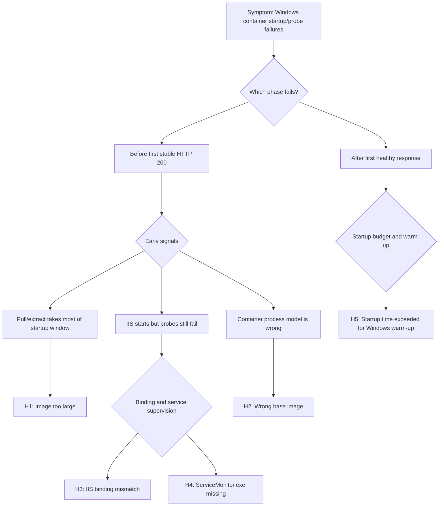

# Windows Container Startup and Health Probes (Azure App Service Windows)

## 1. Summary
### Symptom
Windows custom containers on App Service restart during boot, stay unavailable after deployment, or oscillate between brief `200` responses and repeated `503`/timeout events. Platform startup probes fail even when local container tests look healthy.

### Why this scenario is confusing
- Windows images are usually much larger than Linux images (often 4-8 GB vs about 200 MB), so pull/extract time can consume startup budget.
- Windows IIS-based containers rely on `ServiceMonitor.exe`, unlike Kestrel-only or single-process Linux container patterns.
- Teams often apply Linux probe assumptions directly and misclassify startup failures as runtime health check failures.
- Port assumptions differ: IIS commonly binds to port `80`, while many Linux app samples assume explicit app port mapping.

### Troubleshooting decision flow (mermaid diagram)
<!-- diagram-id: windows-container-health-probes-flow -->


### Limitations
- Scope is Windows custom containers on Azure App Service.
- Linux behavior appears only in contrast notes to prevent misdiagnosis.
- Log schema names can vary by workspace ingestion settings.
- This playbook does not replace deep framework-specific tuning guidance.

### Quick Conclusion
Treat Windows container startup as a full timeline: image pull/extract -> IIS/process initialization -> first stable healthy response. The most common causes are oversized image, incorrect Windows base image family, IIS port binding mismatch, missing `ServiceMonitor.exe`, and startup budget set too low for normal Windows warm-up.

## 2. Common Misreadings
- "If it works on Linux container docs, it should behave the same on Windows".
- "Startup timeout means app crash".
- "IIS installed means IIS healthy".
- "`WEBSITES_PORT` should always be tuned exactly like Linux".
- "Kudu diagnostics are identical between Windows and Linux custom containers".
- "One successful response means startup problem is solved".

## 3. Competing Hypotheses
- H1: Container image too large (pull timeout).
- H2: Wrong base image (servercore vs nanoserver incompatibility).
- H3: IIS binding mismatch (port 80 vs `WEBSITES_PORT`).
- H4: `ServiceMonitor.exe` not running (IIS won't start).
- H5: Startup time exceeded (Windows containers inherently slower to start).

## 4. What to Check First
### Platform and app settings snapshot
```bash
az webapp show --resource-group <resource-group> --name <app-name> --query "{name:name,state:state,kind:kind}" --output table

az webapp config container show --resource-group <resource-group> --name <app-name> --query "{windowsFxVersion:windowsFxVersion,linuxFxVersion:linuxFxVersion}" --output table

az webapp config appsettings list --resource-group <resource-group> --name <app-name> --query "[?name=='WEBSITES_CONTAINER_START_TIME_LIMIT' || name=='WEBSITES_PORT' || name=='WEBSITE_HEALTHCHECK_PATH' || name=='WEBSITE_HEALTHCHECK_MAXPINGFAILURES'].{name:name,value:value}" --output table
```

### Fast triage checklist
- Confirm `windowsFxVersion` is populated and `linuxFxVersion` is null/empty.
- Confirm `WEBSITES_CONTAINER_START_TIME_LIMIT` is explicitly set for large Windows images.
- Confirm serving model: IIS (`ServiceMonitor.exe`) or self-hosted app server.
- Confirm IIS binding target, usually `*:80:` unless intentionally changed.
- Confirm whether failures occur before first healthy probe success.

### Startup behavior differences to account for
- Windows image pull/extract is materially longer than common Linux images.
- IIS container startup includes service bootstrap, app pool spin-up, and optional app initialization.
- Windows container runtime is platform-isolated on App Service; process-isolation tuning is not user-configurable.

## 5. Evidence to Collect
### Required Evidence
- App settings at incident time (`WEBSITES_CONTAINER_START_TIME_LIMIT`, `WEBSITES_PORT`, health settings).
- Platform logs covering pull/start/stop lifecycle.
- Console logs showing IIS startup or app process startup.
- HTTP logs for probe path and root path during startup window.
- Dockerfile entrypoint, base image, and image size metadata.

### Useful Context
- Recent base image change (`servercore`, `nanoserver`, or generic Windows base).
- Startup command overrides in portal or pipeline.
- Slot config drift between staging and production.
- Scale-out events that trigger fresh image pull on new workers.

### Sample Log Patterns
### AppServicePlatformLogs (pull + timeout)
```text
[AppServicePlatformLogs]
2026-04-09T03:10:02Z  Informational  Pulling image: myregistry.azurecr.io/payments-win:ltsc2022
2026-04-09T03:15:11Z  Informational  Image pull completed. ElapsedMs=309403
2026-04-09T03:15:53Z  Warning        Startup probe has not received healthy response.
2026-04-09T03:16:42Z  Error          Startup limit exceeded for container initialization.
2026-04-09T03:16:42Z  Informational  State: Stopping, Action: StoppingSiteContainers, LastError: ContainerTimeout
```

### AppServiceConsoleLogs (IIS + ServiceMonitor)
```text
[AppServiceConsoleLogs]
2026-04-09T03:15:20Z  Informational  ServiceMonitor.exe starting service 'w3svc'
2026-04-09T03:15:24Z  Informational  IIS configuration loaded from C:\inetpub\wwwroot
2026-04-09T03:16:03Z  Warning        Application initialization still in progress
2026-04-09T03:16:42Z  Error          Container terminated due to startup timeout
```

### AppServiceHTTPLogs (probe path instability)
```text
[AppServiceHTTPLogs]
2026-04-09T03:15:56Z  GET  /          503  420
2026-04-09T03:16:03Z  GET  /          503  401
2026-04-09T03:16:11Z  GET  /          200   52
2026-04-09T03:16:20Z  GET  /healthz   500   90
```

!!! tip "How to Read This"
    If pull duration is long and first `200` appears near timeout, prioritize H1/H5. If IIS starts but healthy response stays unstable, validate H3/H4 before changing health check thresholds.

### KQL Queries with Example Output
### Query 1: Pull duration + timeout correlation
```kusto
AppServicePlatformLogs
| where TimeGenerated > ago(24h)
| where Message has_any ("Pulling image", "Image pull completed", "Startup limit", "ContainerTimeout", "StoppingSiteContainers")
| project TimeGenerated, Level, Message
| order by TimeGenerated asc
```

**Example Output:**

| TimeGenerated | Level | Message |
|---|---|---|
| 2026-04-09 03:10:02 | Informational | Pulling image: myregistry.azurecr.io/payments-win:ltsc2022 |
| 2026-04-09 03:15:11 | Informational | Image pull completed. ElapsedMs=309403 |
| 2026-04-09 03:16:42 | Error | Startup limit exceeded for container initialization. |
| 2026-04-09 03:16:42 | Informational | State: Stopping, Action: StoppingSiteContainers, LastError: ContainerTimeout |

!!! tip "How to Read This"
    The key signal is elapsed pull + warm-up approaching the configured startup limit.

### Query 2: IIS and ServiceMonitor signatures
```kusto
AppServiceConsoleLogs
| where TimeGenerated > ago(24h)
| where ResultDescription has_any ("ServiceMonitor.exe", "w3svc", "IIS", "application initialization")
| project TimeGenerated, Level, ResultDescription
| order by TimeGenerated asc
```

**Example Output:**

| TimeGenerated | Level | ResultDescription |
|---|---|---|
| 2026-04-09 03:15:20 | Informational | ServiceMonitor.exe starting service 'w3svc' |
| 2026-04-09 03:15:24 | Informational | IIS configuration loaded from C:\inetpub\wwwroot |
| 2026-04-09 03:16:03 | Warning | Application initialization still in progress |

!!! tip "How to Read This"
    IIS container without `ServiceMonitor.exe` evidence is a strong H4 indicator.

### Query 3: Probe stability in first startup window
```kusto
AppServiceHTTPLogs
| where TimeGenerated > ago(24h)
| where CsUriStem in ("/", "/health", "/healthz")
| summarize requests=count(), failures=countif(ScStatus >= 500), p95=percentile(TimeTaken, 95) by CsUriStem, bin(TimeGenerated, 5m)
| order by TimeGenerated asc
```

**Example Output:**

| TimeGenerated | CsUriStem | requests | failures | p95 |
|---|---|---:|---:|---:|
| 2026-04-09 03:15:00 | / | 15 | 12 | 430 |
| 2026-04-09 03:15:00 | /healthz | 6 | 4 | 111 |

!!! tip "How to Read This"
    Early high failure counts with eventual success generally indicate startup readiness timing, not necessarily persistent runtime outage.

### CLI Investigation Commands
```bash
# Check startup and probe app settings
az webapp config appsettings list --resource-group <resource-group> --name <app-name> --query "[?name=='WEBSITES_CONTAINER_START_TIME_LIMIT' || name=='WEBSITES_PORT' || name=='WEBSITE_HEALTHCHECK_PATH' || name=='WEBSITE_HEALTHCHECK_MAXPINGFAILURES'].{name:name,value:value}" --output table

# Check health path and runtime model
az webapp config show --resource-group <resource-group> --name <app-name> --query "{healthCheckPath:healthCheckPath,windowsFxVersion:windowsFxVersion,alwaysOn:alwaysOn}" --output table

# Stream logs while reproducing issue
az webapp log tail --resource-group <resource-group> --name <app-name>

# Temporarily increase startup budget for validation
az webapp config appsettings set --resource-group <resource-group> --name <app-name> --settings WEBSITES_CONTAINER_START_TIME_LIMIT=900

# Restart after setting change
az webapp restart --resource-group <resource-group> --name <app-name>
```

**Example Output:**

```text
Name                                  Value
------------------------------------  -----------------
WEBSITES_CONTAINER_START_TIME_LIMIT   900
WEBSITES_PORT                         80
WEBSITE_HEALTHCHECK_PATH              /healthz

HealthCheckPath   WindowsFxVersion                                       AlwaysOn
----------------  -----------------------------------------------------  --------
/healthz          DOCKER|myregistry.azurecr.io/payments-win:ltsc2022     True
```

!!! tip "How to Read This"
    For IIS-based Windows images, keep port `80` unless you intentionally changed IIS bindings and validated probe routing.

## 6. Validation and Disproof by Hypothesis
### H1: Container image too large (pull timeout)
**Support signals**
- Pull and extract consumes most of startup window.
- Image layers are large and numerous.
- Timeout happens before sustained successful responses.

**Weakening signals**
- Pull step is short and cached.
- Failures persist after image optimization.

**Validation steps**

1. Measure pull duration from platform logs.
2. Compare with startup limit.
3. Re-test with higher startup limit and optimized image.

### H2: Wrong base image (servercore vs nanoserver incompatibility)
**Support signals**
- Runtime dependencies unavailable in selected base image.
- IIS or framework startup errors mention missing Windows components.
- Image runs inconsistently across environments.

**Weakening signals**
- Base family is aligned to app host model.
- Same image starts reliably on repeated deployments.

**Validation steps**

1. Confirm host model requirements (IIS vs self-hosted).
2. Match base image accordingly: `servercore` for IIS/full-framework style compatibility, `nanoserver` for lighter compatible runtimes.
3. Rebuild with validated base and retest.

!!! warning "Base Image Rule"
    If IIS is part of the hosting model, avoid `nanoserver` and use a compatible IIS-enabled `servercore` lineage image.

### H3: IIS binding mismatch (port 80 vs WEBSITES_PORT)
**Support signals**
- IIS listens on port `80` but probe expectation is configured for another port.
- Probes fail while IIS logs indicate service started.
- Root path or health path shows inconsistent availability.

**Weakening signals**
- IIS binding and app settings are explicitly aligned.
- Probe failures disappear after non-port fixes.

**Validation steps**

1. Inspect IIS site binding (`*:80:` by default).
2. Verify `WEBSITES_PORT` only if using non-default port.
3. Confirm health path serves from bound endpoint without redirects/auth blocks.

### H4: ServiceMonitor.exe not running (IIS won't start)
**Support signals**
- Entrypoint does not run `ServiceMonitor.exe w3svc`.
- IIS service appears briefly then exits/unmanaged.
- Startup probes fail despite otherwise valid image artifacts.

**Weakening signals**
- Canonical IIS entrypoint is present and stable.
- Logs show sustained `w3svc` lifecycle.

**Validation steps**

1. Inspect Dockerfile `ENTRYPOINT` and startup command.
2. Remove scripts that bypass service monitor process.
3. Rebuild/redeploy and verify stable probe responses.

### H5: Startup time exceeded (Windows containers inherently slower)
**Support signals**
- First stable `200` arrives near timeout threshold.
- Cold start includes heavy module/JIT/app initialization.
- Increasing startup limit significantly improves availability.

**Weakening signals**
- Failures remain identical with generous startup budget.
- Logs show deterministic config/runtime errors instead of slow warm-up.

**Validation steps**

1. Build full timeline from pull to first stable healthy response.
2. Temporarily increase startup limit.
3. Reduce image/startup work and set a justified steady-state limit.

### Normal vs Abnormal Comparison
| Signal | Normal Windows startup | Abnormal Windows startup |
|---|---|---|
| Image pull | Predictable and inside budget | Long pull consumes startup budget |
| IIS supervision | `ServiceMonitor.exe` stable | Service monitor absent/bypassed |
| Port binding | IIS serves on expected binding | Probe target and binding diverge |
| Probe sequence | Brief initial failures then stable `200` | No sustained healthy response |
| Lifecycle | Single boot to steady state | Start/stop loop with timeout |

### Contrast Notes (Windows vs Linux)
| Aspect | Windows containers | Linux containers |
|---|---|---|
| Typical image footprint | Often 4-8 GB | Often a few hundred MB |
| Common process model | IIS + `ServiceMonitor.exe` | Single process (Kestrel/Gunicorn/Node) |
| Startup baseline | Longer warm-up expected | Faster startup commonly observed |
| Common probe pitfall | IIS/service supervision + binding mismatch | App bind/port mismatch |

## 7. Likely Root Cause Patterns
- Pattern A: Image size and layer structure push cold start over budget.
- Pattern B: Incompatible Windows base image family for chosen runtime/host model.
- Pattern C: IIS binding left at default while probe settings changed.
- Pattern D: `ServiceMonitor.exe` removed or bypassed by custom startup scripts.
- Pattern E: Startup timeout tuned for Linux-like behavior, not Windows warm-up.
- Pattern F: Kudu-first triage delays resolution because key startup evidence is in platform/console logs.

## 8. Immediate Mitigations
- Temporarily raise `WEBSITES_CONTAINER_START_TIME_LIMIT` to validate timing hypothesis.
- Reduce image size and avoid unnecessary Windows layers.
- Use explicit IIS entrypoint with `ServiceMonitor.exe w3svc`.
- Keep IIS on port `80` unless intentionally customizing full binding path.
- Make health endpoint lightweight and startup-safe.
- Separate expensive initialization from first-request startup path.

!!! note "Hyper-V vs Process Isolation"
    Azure App Service manages Windows container isolation at the platform layer (Hyper-V-isolated multi-tenant model). Process-isolation mode is not an app-level toggle here, so remediation should focus on image compatibility, startup timing, and probe readiness instead of isolation-mode switching.

## 9. Prevention
- Set Windows-specific startup SLOs that include pull, IIS boot, and app warm-up.
- Enforce base image policy (`servercore`/`nanoserver`) in CI with documented compatibility rules.
- Track image size regressions and fail builds beyond threshold.
- Run cold-start validation before production slot swap.
- Keep clear runbook guidance for Windows container probe behavior differences.
- Document Kudu limitations and prioritize logs-first diagnostics.

### Windows container Kudu limitations
- Kudu is helpful but less comprehensive for Windows container startup troubleshooting than many Linux workflows.
- Interactive runtime inspection can be limited during unstable startup loops.
- Platform and console logs should be the primary evidence source.
- Treat Kudu checks as supplemental confirmation, not first-line diagnosis.

## See Also
- [Container Didn't Respond to HTTP Pings](container-didnt-respond-to-http-pings.md)
- [Deployment Succeeded, Startup Failed](deployment-succeeded-startup-failed.md)
- [Warm-up vs Health Check](warmup-vs-health-check.md)
- [Startup Availability (First 10 Minutes)](../../first-10-minutes/startup-availability.md)

## Sources
- [Configure a custom container for Azure App Service](https://learn.microsoft.com/en-us/azure/app-service/configure-custom-container)
- [Quickstart: Run a custom container in App Service](https://learn.microsoft.com/en-us/azure/app-service/quickstart-custom-container)
- [Tutorial: Migrate custom software to App Service using a custom container](https://learn.microsoft.com/en-us/azure/app-service/tutorial-custom-container)
