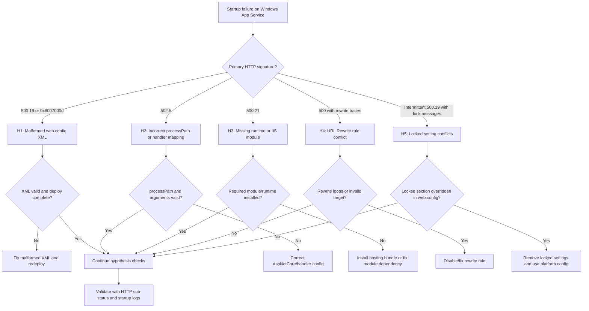

---
hide:
  - toc
title: Windows IIS web.config Startup Failures
slug: windows-iis-webconfig-startup
doc_type: playbook
section: troubleshooting
topics:
  - startup
  - windows
  - iis
  - webconfig
products:
  - azure-app-service
status: stable
last_reviewed: 2026-04-09
summary: Diagnose IIS web.config misconfigurations causing App Service Windows startup failures.
content_sources:
  diagrams:
    - id: windows-iis-webconfig-startup-flow
      type: flowchart
      source: self-generated
      justification: "Synthesized IIS startup failure branches from Microsoft Learn guidance on troubleshooting ASP.NET Core on Azure App Service and IIS plus general 502/503 App Service troubleshooting."
      based_on:
        - https://learn.microsoft.com/en-us/aspnet/core/test/troubleshoot-azure-iis?view=aspnetcore-10.0
        - https://learn.microsoft.com/en-us/azure/app-service/troubleshoot-http-502-http-503
---
# Windows IIS web.config Startup Failures (Azure App Service Windows)

## 1. Summary

### Symptom

After deployment, the Windows App Service site fails during startup or serves only 500-class failures from IIS. Common signatures include HTTP `500.19`, `500.21`, `502.5`, and HRESULTs like `0x8007000d` in startup traces.

### Why this scenario is confusing

`web.config` is evaluated by IIS before your application code is fully available. A single XML, handler, module, rewrite, or locked-setting mismatch can surface as an app outage even though deployment succeeded and binaries are present. Teams often misread this as an application regression instead of an IIS pipeline/configuration failure.

### Troubleshooting decision flow (mermaid diagram)

<!-- diagram-id: windows-iis-webconfig-startup-flow -->


### Limitations

- This playbook is only for native Windows App Service running IIS-managed workloads.
- It does not cover Linux, custom containers, or Kubernetes-hosted runtimes.
- Framework-level logic bugs after successful IIS startup are out of scope.

### Quick Conclusion

Classify first by IIS sub-status code, then verify whether failure is XML parse, handler/process bootstrap, missing module/runtime, rewrite conflict, or locked-setting precedence. For fast recovery, revert to a known-good `web.config`, remove risky overrides, and confirm stable startup with `AppServiceHTTPLogs` sub-status trends.

## 2. Common Misreadings

- "Deployment passed so startup is healthy" (deployment success does not validate IIS runtime configuration).
- "500 means app code threw" (for startup incidents, IIS often fails before application code executes).
- "502.5 is networking" (`502.5` is commonly ASP.NET Core process startup failure behind IIS).
- "500.21 means URL Rewrite syntax" (`500.21` usually indicates missing/invalid module registration).
- "If local IIS works, App Service must behave the same" (platform-level `applicationHost.config` locks and module availability can differ).

## 3. Competing Hypotheses

- H1: Malformed `web.config` XML (parse error) causes IIS to fail config load (`500.19`, `0x8007000d`).
- H2: Incorrect `processPath` or handler mapping prevents ASP.NET Core bootstrap (`502.5` or startup crash signatures).
- H3: Missing runtime/module dependency (for example URL Rewrite module or ASP.NET Core hosting bundle mismatch) triggers module/handler failures (`500.21`).
- H4: URL Rewrite rule conflict causes startup-time request failures or redirect/rewriting loops yielding `500.xx`.
- H5: `web.config` locked settings conflict with App Service `applicationHost.config` precedence, producing configuration load failures (`500.19`, section lock messages).

## 4. What to Check First

### Metrics

- Availability drop aligned with deployment or configuration change timestamp.
- Surge of `5xx` requests and failed requests in App Service HTTP metrics.
- Restart spikes for the worker process after config updates.

### Logs

- `AppServiceHTTPLogs`: confirm `ScStatus` + `ScSubStatus` signatures (`500.19`, `500.21`, `502.5`).
- Application/Event pipeline logs via Log Stream and Kudu diagnostics.
- Windows Event Log snippets for IIS/ASP.NET Core module startup errors.

### Platform Signals

- Current `web.config` content and most recent deployment artifact version.
- App stack/runtime configuration in App Service (`.NET` version and bitness where applicable).
- Effective site-level behavior when `applicationHost.config` restrictions apply.

## 5. Evidence to Collect

### Required Evidence

- The exact failing `web.config` from deployed `wwwroot`.
- `AppServiceHTTPLogs` rows including status and sub-status in incident window.
- Kudu log stream and Windows Event Log excerpts during failed startup.
- Timestamped deployment history and last known-good deployment ID.
- Current App Service runtime configuration (`az webapp config show`).

### Useful Context

- Whether failure started immediately after adding rewrite/handler/error sections.
- Whether startup fails on all instances or only after recycle/scale-out.
- Whether the same package starts when reverting only `web.config`.
- Any manual IIS-oriented changes copied from on-prem docs without App Service validation.
- Whether `httpErrors` in `web.config` masks App Service detailed error pages during incident triage.

### CLI Investigation Commands (with expected output)

```bash
# App state and host metadata
az webapp show --resource-group <resource-group> --name <app-name> --query "{state:state,enabled:enabled,defaultHostName:defaultHostName}" --output table

# Runtime and site-level configuration snapshot
az webapp config show --resource-group <resource-group> --name <app-name> --query "{windowsFxVersion:windowsFxVersion,netFrameworkVersion:netFrameworkVersion,use32BitWorkerProcess:use32BitWorkerProcess,alwaysOn:alwaysOn}" --output table

# Turn on and inspect web server/application logs if needed
az webapp log config --resource-group <resource-group> --name <app-name> --web-server-logging filesystem --detailed-error-messages true --failed-request-tracing true --application-logging filesystem
az webapp log tail --resource-group <resource-group> --name <app-name>

# Deployment events for startup correlation
az webapp log deployment show --resource-group <resource-group> --name <app-name> --output table
```

**Example Output:**

```text
State    Enabled    DefaultHostName
-------  ---------  -------------------------------------------
Running  True       <app-name>.azurewebsites.net

WindowsFxVersion    NetFrameworkVersion    Use32BitWorkerProcess    AlwaysOn
------------------  ---------------------  -----------------------  --------
DOTNET|8.0          v4.0                   False                    True

Time                  Id     Status     Author
-------------------   -----  ---------  ----------------------
2026-04-09T05:42:10Z  1021   Success    ci-pipeline
2026-04-09T06:01:34Z  1022   Success    ci-pipeline
```

!!! tip "How to Read This"
    Success in deployment history does not disprove IIS startup failure. Treat deployment and startup as separate checkpoints, then correlate by timestamp.

### Sample Log Patterns (with real-looking log output)

### Windows Event Log / ANCM (malformed XML and process failures)

```text
[Windows Event Log]
2026-04-09T06:03:11Z  Error  IIS AspNetCore Module V2  EventId=1012
Application '/LM/W3SVC/123456789/ROOT' with physical root 'D:\home\site\wwwroot\' failed to load coreclr.
Exception message:
Could not find a part of the path 'D:\home\site\wwwroot\MyApi.dll'.

2026-04-09T06:03:12Z  Error  IIS-W3SVC-WP  EventId=2307
Configuration file is not well-formed XML.
File: \\?\D:\home\site\wwwroot\web.config
Line: 27
Error: 0x8007000d
```

### IIS HTTP Log pattern (sub-status signatures)

```text
[IIS HTTP Logs]
2026-04-09 06:03:12 GET / 500 19 0 15
2026-04-09 06:03:18 GET / 500 21 0 2
2026-04-09 06:03:24 GET / 502 5 32 101
```

### Kudu diagnostic stream pattern (rewrite and lock hints)

```text
[Kudu / Diagnostic Stream]
2026-04-09T06:05:42.231Z ERROR - Failed to read configuration section 'system.webServer/rewrite/rules'.
2026-04-09T06:05:42.231Z ERROR - This configuration section cannot be used at this path.
2026-04-09T06:05:42.231Z ERROR - Lock violation inherited from higher-level configuration.
2026-04-09T06:05:44.114Z ERROR - Rewrite rule 'ForceHttpsAndCanonicalHost' rewritten URL to itself.
```

!!! tip "How to Read This"
    `500.19` + `0x8007000d` strongly indicates malformed XML or invalid configuration syntax. `500.21` points to module/handler problems. `502.5` usually indicates process bootstrap failure behind ANCM.

### KQL Queries with Example Output

### Query 1: Detect IIS startup failures by sub-status

```kusto
// Startup-phase 500/502 failures with sub-status focus
AppServiceHTTPLogs
| where TimeGenerated > ago(6h)
| where ScStatus in (500, 502)
| summarize Requests=count() by ScStatus, ScSubStatus
| order by Requests desc
```

**Example Output:**

| ScStatus | ScSubStatus | Requests |
|---|---|---|
| 500 | 19 | 84 |
| 500 | 21 | 31 |
| 502 | 5 | 19 |

!!! tip "How to Read This"
    Prioritize hypotheses by count. Highest `500.19` volume generally means parse/locked-setting path before module/process debugging.

### Query 2: Timeline around deployment and startup failures

```kusto
// Build timeline for incident window
AppServiceHTTPLogs
| where TimeGenerated between (datetime(2026-04-09 06:00:00) .. datetime(2026-04-09 06:15:00))
| where ScStatus in (500, 502)
| project TimeGenerated, CsMethod, CsUriStem, ScStatus, ScSubStatus, ScWin32Status, TimeTaken
| order by TimeGenerated asc
```

**Example Output:**

| TimeGenerated | CsMethod | CsUriStem | ScStatus | ScSubStatus | ScWin32Status | TimeTaken |
|---|---|---|---|---|---|---|
| 2026-04-09 06:03:12 | GET | / | 500 | 19 | 0 | 15 |
| 2026-04-09 06:03:18 | GET | / | 500 | 21 | 0 | 2 |
| 2026-04-09 06:03:24 | GET | / | 502 | 5 | 32 | 101 |

## 6. Validation and Disproof by Hypothesis

### H1: Malformed web.config XML (parse error)

**Evidence FOR**

- IIS/Event logs show `0x8007000d`, line/position parse errors, or malformed XML messages.
- `AppServiceHTTPLogs` dominated by `500.19` immediately after deployment.
- Site fails before application-specific startup logs appear.

**Evidence AGAINST**

- XML validates cleanly and no line-level parse errors are present.
- Failures are primarily `500.21` or `502.5` with module/process signatures.

**CLI/KQL to test**

```bash
# Download and inspect deployed web.config from Kudu (manual check in SCM site)
az webapp deployment list-publishing-profiles --resource-group <resource-group> --name <app-name>

# Reconfirm startup failure signature in live logs
az webapp log tail --resource-group <resource-group> --name <app-name>
```

```kusto
AppServiceHTTPLogs
| where TimeGenerated > ago(2h)
| where ScStatus == 500 and ScSubStatus == 19
| project TimeGenerated, CsUriStem, ScStatus, ScSubStatus, ScWin32Status
| order by TimeGenerated desc
```

**Expected results for normal vs abnormal**

| State | Expected |
|---|---|
| Normal | No sustained `500.19`; startup reaches `200/302` shortly after recycle. |
| Abnormal | Repeated `500.19`; parse/format error hints (including `0x8007000d`) in logs. |

### H2: Incorrect processPath or handler mapping

**Evidence FOR**

- `502.5` appears with ANCM startup errors indicating target executable or DLL path mismatch.
- `aspNetCore` `processPath` points to wrong file (for example stale DLL name).
- Handler mapping references unsupported/incorrect module declaration for current app stack.

**Evidence AGAINST**

- Process path exists and launches correctly under current deployment output.
- No ANCM startup exceptions; failures center on rewrite or locked sections.

**CLI/KQL to test**

```bash
# Verify runtime stack and startup-relevant configuration
az webapp config show --resource-group <resource-group> --name <app-name> --query "{windowsFxVersion:windowsFxVersion,netFrameworkVersion:netFrameworkVersion}" --output table

# Stream logs while recycling to catch process bootstrap errors
az webapp restart --resource-group <resource-group> --name <app-name>
az webapp log tail --resource-group <resource-group> --name <app-name>
```

```kusto
AppServiceHTTPLogs
| where TimeGenerated > ago(2h)
| where ScStatus == 502 and ScSubStatus == 5
| summarize Requests=count(), FirstSeen=min(TimeGenerated), LastSeen=max(TimeGenerated)
```

**Expected results for normal vs abnormal**

| State | Expected |
|---|---|
| Normal | `502.5` absent; startup logs show process launched and responding. |
| Abnormal | `502.5` spikes after recycle; ANCM errors report invalid executable/DLL path or bootstrap failure. |

### H3: Missing runtime/module dependency

**Evidence FOR**

- `500.21` responses indicating unrecognized module/handler configuration.
- Handler config references `HttpPlatformHandler` or another module not available for the deployed app/runtime model.
- Logs indicate missing URL Rewrite module or ASP.NET Core hosting bundle/runtime mismatch.
- Existing `web.config` works in one environment but fails in App Service due to unavailable module assumptions.

**Evidence AGAINST**

- Required runtime and modules are present and matched to app target framework.
- No module resolution errors appear in IIS/Kudu diagnostics.

**CLI/KQL to test**

```bash
# Capture effective site configuration and logging for module diagnostics
az webapp config show --resource-group <resource-group> --name <app-name> --output json
az webapp log config --resource-group <resource-group> --name <app-name> --web-server-logging filesystem --failed-request-tracing true --detailed-error-messages true --application-logging filesystem
az webapp log tail --resource-group <resource-group> --name <app-name>
```

```kusto
AppServiceHTTPLogs
| where TimeGenerated > ago(2h)
| where ScStatus == 500 and ScSubStatus == 21
| project TimeGenerated, CsMethod, CsUriStem, ScStatus, ScSubStatus, ScWin32Status
| order by TimeGenerated desc
```

**Expected results for normal vs abnormal**

| State | Expected |
|---|---|
| Normal | No `500.21` trend; routes return app-generated responses. |
| Abnormal | Persistent `500.21`; diagnostics show module not recognized or dependency absent. |

### H4: URL Rewrite rule conflict

**Evidence FOR**

- Startup or first requests produce `500.xx` with rewrite evaluation errors.
- Kudu stream shows rewrite loop, invalid back-reference, or destination path conflict.
- Recent rewrite updates (HTTPS/host canonicalization rules) coincide with outage start.

**Evidence AGAINST**

- Rewrite section disabled/removed and failure signature unchanged.
- `500.19` parse errors exist before rewrite processing.

**CLI/KQL to test**

```bash
# Reproduce quickly after restart and watch diagnostics
az webapp restart --resource-group <resource-group> --name <app-name>
az webapp log tail --resource-group <resource-group> --name <app-name>
```

```kusto
AppServiceHTTPLogs
| where TimeGenerated > ago(2h)
| where ScStatus == 500
| summarize Requests=count() by ScSubStatus
| order by Requests desc
```

**Expected results for normal vs abnormal**

| State | Expected |
|---|---|
| Normal | Rewrite rules resolve once per request with no loop/error signals. |
| Abnormal | Repeated startup/initial-request `500` with rewrite loop or rule parse diagnostics. |

### H5: web.config locked settings conflict with applicationHost.config

**Evidence FOR**

- Error states configuration section cannot be used at this path or is locked at parent level.
- `500.19` appears when `web.config` attempts to override locked `system.webServer` sections.
- Incident starts after adding on-prem IIS settings not permitted in App Service tenant-level config.

**Evidence AGAINST**

- No lock violation messages in diagnostics.
- Removing suspect locked sections has no impact on failure pattern.

**CLI/KQL to test**

```bash
# Capture current site settings, then tail for lock violations during restart
az webapp config show --resource-group <resource-group> --name <app-name> --output table
az webapp restart --resource-group <resource-group> --name <app-name>
az webapp log tail --resource-group <resource-group> --name <app-name>
```

```kusto
AppServiceHTTPLogs
| where TimeGenerated > ago(2h)
| where ScStatus == 500 and ScSubStatus == 19
| summarize Requests=count(), Win32StatusSet=make_set(ScWin32Status, 5)
```

**Expected results for normal vs abnormal**

| State | Expected |
|---|---|
| Normal | No lock violations; site-level config accepted and app starts. |
| Abnormal | `500.19` persists with lock/path violation messages tied to `system.webServer` overrides. |

### Normal vs Abnormal Comparison

| Signal | Normal Startup | IIS web.config Startup Failure |
|---|---|---|
| HTTP status mix | Mostly `200/301/302` after warm-up | Sustained `500.19`, `500.21`, or `502.5` |
| Sub-status trend | No stable 500 sub-status cluster | One or more dominant sub-status signatures |
| Event/Kudu diagnostics | No parse/module/lock errors | XML parse, missing module, rewrite loop, or locked section errors |
| Startup progression | Worker reaches ready state quickly | IIS blocks request pipeline before stable readiness |
| Recovery action | Standard restart succeeds | Requires config correction or rollback |

## 7. Likely Root Cause Patterns

- Pattern A: Manual `web.config` edits introduced malformed XML, invalid escaping, or unclosed elements.
- Pattern B: ASP.NET Core deployment changed assembly name/output path but `processPath`/`arguments` remained stale.
- Pattern C: `web.config` includes module declarations unsupported in the active App Service Windows environment.
- Pattern D: Rewrite rule migrated from on-prem IIS creates self-rewrite or conflicting redirect logic.
- Pattern E: Locked configuration sections are overridden in `web.config` even though parent-level `applicationHost.config` disallows them.
- Pattern F: `httpErrors` customization hides useful diagnostics and masks platform-generated error behavior during incident response.

## 8. Immediate Mitigations

- Roll back to last known-good deployment that includes a previously working `web.config`.
- Temporarily remove non-essential `rewrite`, custom `handlers`, and aggressive `httpErrors` overrides to restore startup.
- Correct ASP.NET Core `aspNetCore` `processPath` and `arguments` to match current deployed artifacts.
- Remove or simplify module registrations until `500.21` is eliminated.
- If lock violations appear, delete conflicting sections and rely on App Service-supported configuration.

!!! warning "Production Safety"
    Apply one mitigation at a time and validate with sub-status trends. Bundling multiple edits makes root cause confirmation harder and increases rollback risk.

## 9. Prevention

- Add CI validation for `web.config` XML schema and well-formedness before deployment.
- Keep `web.config` minimal; avoid carrying full on-prem IIS templates into App Service Windows.
- Validate rewrite rules with loop-safe conditions and explicit exclusions.
- Version-control and review any change to `handlers`, `modules`, and `aspNetCore` `processPath`.
- Avoid overriding `httpErrors` unless explicitly required, and document impact on troubleshooting visibility.
- Maintain a startup smoke test that checks first-request success and alerts on `500.19`, `500.21`, and `502.5` spikes.

## See Also

### Related Queries

- [`../../kql/http/5xx-trend-over-time.md`](../../kql/http/5xx-trend-over-time.md)
- [`../../kql/console/startup-errors.md`](../../kql/console/startup-errors.md)
- [`../../kql/restarts/repeated-startup-attempts.md`](../../kql/restarts/repeated-startup-attempts.md)

### Related Checklists

- [`../../first-10-minutes/startup-availability.md`](../../first-10-minutes/startup-availability.md)
- [`../../decision-tree.md`](../../decision-tree.md)
- [`../../quick-diagnosis-cards.md`](../../quick-diagnosis-cards.md)

## Sources

- [Configure ASP.NET Core for Azure App Service](https://learn.microsoft.com/en-us/azure/app-service/configure-language-dotnetcore)
- [Enable diagnostic logging for apps in Azure App Service](https://learn.microsoft.com/en-us/azure/app-service/troubleshoot-diagnostic-logs)
- [Troubleshoot ASP.NET Core on IIS and Azure App Service](https://learn.microsoft.com/en-us/aspnet/core/host-and-deploy/iis/troubleshoot)
- [Azure App Service diagnostics overview](https://learn.microsoft.com/en-us/azure/app-service/overview-diagnostics)
- [IIS 7 and above HTTP status codes](https://learn.microsoft.com/en-us/troubleshoot/developer/webapps/iis/site-behavior-performance/http-error-500-19-webpage)
