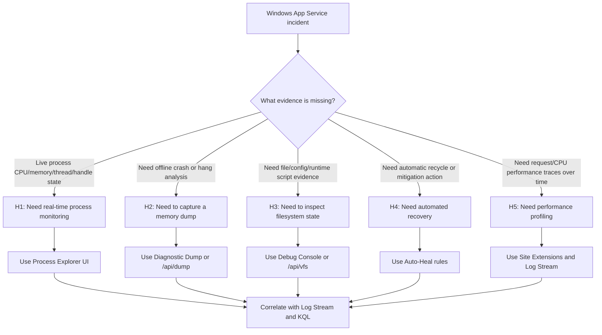

---
hide:
  - toc
title: Windows Kudu and Diagnostic Tools
slug: windows-kudu-diagnostics
doc_type: playbook
section: troubleshooting
topics:
  - diagnostics
  - windows
  - kudu
  - tools
products:
  - azure-app-service
status: stable
last_reviewed: 2026-04-09
summary: Use Windows-specific Kudu SCM tools, Process Explorer, Debug Console, and diagnostic dumps for App Service troubleshooting.
content_sources:
  diagrams:
    - id: windows-kudu-diagnostics-flow
      type: flowchart
      source: self-generated
      justification: "Synthesized Windows diagnostic tool-selection logic from Microsoft Learn guidance on Kudu capabilities and App Service performance troubleshooting."
      based_on:
        - https://learn.microsoft.com/en-us/azure/app-service/resources-kudu
        - https://learn.microsoft.com/en-us/troubleshoot/azure/app-service/troubleshoot-performance-degradation
        - https://learn.microsoft.com/en-us/azure/app-service/troubleshoot-http-502-http-503
content_validation:
  status: verified
  last_reviewed: "2026-04-12"
  reviewer: ai-agent
  core_claims:
    - claim: "Kudu tools require the SCM endpoint at `https://<app-name>.scm.azurewebsites.net`."
      source: "https://learn.microsoft.com/azure/app-service/resources-kudu"
      verified: true
    - claim: "Kudu gives you information about your App Service app, including app settings, connection strings, environment variables, server variables, and HTTP headers."
      source: "https://learn.microsoft.com/azure/app-service/resources-kudu"
      verified: true
    - claim: "Kudu allows access with a REST API."
      source: "https://learn.microsoft.com/azure/app-service/resources-kudu"
      verified: true
---

# Windows Kudu and Diagnostic Tools (Azure App Service Windows)

## 1. Summary

### Symptom (when to use this playbook -- "I need to diagnose but don't know which tool")

On Azure App Service Windows, an incident is active (startup delay, intermittent 5xx, memory pressure, hung worker, background job issue), but responders are unsure whether to start with Process Explorer, Debug Console, dump capture, Log Stream, Site Extensions, WebJobs views, or Kudu REST endpoints.

### Why this scenario is confusing (so many tools, unclear which to use when)

Windows App Service exposes overlapping diagnostics in the Kudu SCM site. Multiple tools appear to solve the same problem, but each tool provides a different evidence type:

- Process state and thread/memory internals (Process Explorer).
- File and runtime shell access (Debug Console CMD/PowerShell).
- Point-in-time crash/hang state capture (Diagnostic Dump).
- Live operational signals during reproduction (Log Stream).
- Extended agents/profilers (Site Extensions).

Without a selection model, teams collect noisy data, miss the first reproducible failure window, and delay mitigation.

### Tool selection decision flow (mermaid diagram)

<!-- diagram-id: windows-kudu-diagnostics-flow -->


### Limitations

- This playbook is Windows-focused; Linux tooling differs.
- Linux contrast:
    - Linux typically uses SSH console; Windows uses Kudu Debug Console (CMD/PowerShell).
    - Linux supports `/api/processes` but does not provide the Process Explorer UI.
    - Linux does not support Site Extensions in the same model used by Windows App Service.
    - Windows supports `web.config` Auto-Heal rules; Linux uses a different mechanism.
- Kudu tools require SCM endpoint reachability (`https://<app-name>.scm.azurewebsites.net`).
- Dump capture and profiling can increase CPU, I/O, and storage usage during incident handling.
- Some actions require contributor-level permissions and deployment credentials or Microsoft Entra-authenticated session.

### Quick Conclusion

Choose tool by missing evidence, not by familiarity: Process Explorer for live process internals, Diagnostic Dump for offline root-cause analysis, Debug Console for file/runtime validation, Auto-Heal for immediate platform-side mitigation, and Site Extensions for deeper profiling. Always correlate with Log Stream and KQL timeline before concluding root cause.

## 2. Common Misreadings

- "Kudu is only for deployment." (Kudu is also a diagnostic control plane on Windows.)
- "Log Stream is enough for hangs." (Hangs often require process/thread visibility or dumps.)
- "Process Explorer replaces dump analysis." (Explorer is live state; dumps preserve forensic state for offline debugging.)
- "Debug Console edits are safe long-term fixes." (Manual edits can drift from IaC/source-controlled config.)
- "Auto-Heal proves app bug is fixed." (Auto-Heal can mask symptoms by recycling without removing root cause.)

## 3. Competing Hypotheses (which tool is the right one)

- **H1: Need real-time process monitoring -> Process Explorer**
    - Use when symptom requires immediate per-process visibility (`w3wp.exe`, `DotNetCore.exe`, `node.exe`), thread count changes, memory growth, or handle leaks.
- **H2: Need to capture a memory dump -> Diagnostic Dump / REST API**
    - Use when process hangs, crashes, deadlocks, or intermittent high CPU cannot be explained from logs alone.
- **H3: Need to inspect filesystem state -> Debug Console**
    - Use when startup files, `web.config`, deployment artifacts, temp files, or generated content must be verified directly.
- **H4: Need automated recovery -> Auto-Heal configuration**
    - Use when recurring failure conditions should trigger recycle/actions automatically to reduce impact while investigation continues.
- **H5: Need performance profiling -> Site Extensions (Application Insights Profiler, Crash Diagnoser)**
    - Use when request latency and code-level hot paths must be profiled beyond standard platform logs.

## 4. What to Check First

### Metrics

- `Http5xx` and `Requests` trend around incident time.
- Memory working set trend for worker processes.
- CPU percentage and request latency percentile spikes.
- Restart count and instance recycle frequency.

### Logs

- `AppServiceHTTPLogs` for request status and latency windows.
- Application logs from Log Stream for real-time failure signatures.
- Windows EventLog and application diagnostics streams where enabled.
- Deployment and startup logs around regression windows.

### Platform Signals

- Current process list (`w3wp.exe`, `DotNetCore.exe`, `node.exe`) and parent-child relationships.
- Presence of stale temp artifacts under `D:\home\LogFiles` and `D:\home\site\wwwroot`.
- Existing Auto-Heal settings and trigger history.
- Installed Site Extensions and their operational status.

### Core Commands (long flags)

```bash
az webapp show --resource-group <resource-group> --name <app-name> --output json
az webapp config show --resource-group <resource-group> --name <app-name> --output json
az webapp log config --resource-group <resource-group> --name <app-name> --web-server-logging filesystem --detailed-error-messages true --failed-request-tracing true
az webapp log tail --resource-group <resource-group> --name <app-name>
```

## 5. Evidence to Collect

### Required Evidence

- Process snapshot from Process Explorer showing worker process CPU/memory/thread/handle state.
- Dump capture metadata (timestamp, process ID, process name, symptom at capture time).
- Debug Console directory listing and key file evidence (`web.config`, startup scripts, generated logs).
- Log Stream segment covering reproduction window.
- Site Extensions inventory and profiler/diagnoser output where used.
- WebJobs status (continuous/triggered runs, failures, queue delays).
- Kudu REST API response artifacts for `/api/processes`, `/api/dump`, `/api/vfs`.

### Windows Kudu Tool Map

| Tool | URL / Path | Primary Evidence | Typical Trigger |
|---|---|---|---|
| Process Explorer | `https://<app-name>.scm.azurewebsites.net/ProcessExplorer/` | Live process/thread/memory/handles | CPU spike, memory leak suspicion, hung worker |
| Debug Console | `https://<app-name>.scm.azurewebsites.net/DebugConsole` | Filesystem + command output (CMD/PowerShell) | Config drift, file missing, startup script mismatch |
| Diagnostic Dump | Kudu Process UI or `/api/dump` | Full process dump for offline analysis | Crash/hang/deadlock, unresponsive request pipeline |
| Log Stream | App Service Log Stream | Real-time app + web server logs | Reproduce issue and timestamp correlation |
| Site Extensions | App Service > Extensions | Profiling and crash diagnostics | Latency hotspot, recurring crash diagnostics |
| WebJobs Dashboard | Kudu WebJobs view | Background job execution state | Startup dependency jobs failing |
| REST API | `/api/processes`, `/api/dump`, `/api/vfs` | Scriptable collection and automation | Repeatable incident collection runbook |
| Auto-Heal | `web.config` / platform settings | Triggered recycle and mitigation actions | Recurring threshold-based failures |

### Kudu REST API calls (curl examples)

```bash
# List running processes (Windows worker inspection)
curl --silent --show-error --user "<deployment-user>:<deployment-password>" "https://<app-name>.scm.azurewebsites.net/api/processes"

# Trigger a dump for a specific process ID (example PID 1234)
curl --silent --show-error --request POST --user "<deployment-user>:<deployment-password>" "https://<app-name>.scm.azurewebsites.net/api/dump?processId=1234"

# Read web.config through virtual file system endpoint
curl --silent --show-error --user "<deployment-user>:<deployment-password>" "https://<app-name>.scm.azurewebsites.net/api/vfs/site/wwwroot/web.config"
```

**Example Output (illustrative):**

```json
[
  {
    "id": 1234,
    "name": "w3wp.exe",
    "href": "https://<app-name>.scm.azurewebsites.net/api/processes/1234"
  },
  {
    "id": 5678,
    "name": "DotNetCore.exe",
    "href": "https://<app-name>.scm.azurewebsites.net/api/processes/5678"
  }
]
```

!!! tip "How to Read This"
    Use `/api/processes` first to discover the current worker PID before invoking `/api/dump`. Capturing a dump on the wrong process wastes the incident window.

### Process Explorer checklist

- Validate expected worker process exists and is stable over time.
- Capture CPU, private bytes, thread count, and handle count during symptom window.
- Compare process count with expected worker model (single vs multiple workers).
- Record process start time to correlate with recycle events.

### Debug Console checklist (CMD and PowerShell)

- Confirm deployment artifact presence under `D:\home\site\wwwroot`.
- Validate runtime-generated files under `D:\home\LogFiles`.
- Inspect `web.config` and startup scripts for drift from source control.
- Validate directory permissions and writable paths used by the app.
- Execute minimal diagnostics commands (PowerShell and CMD) and preserve output.

```powershell
# PowerShell in Kudu Debug Console
Get-ChildItem -Path "D:\home\site\wwwroot" | Select-Object Name,Length,LastWriteTime
Get-Content -Path "D:\home\site\wwwroot\web.config"
Get-ChildItem -Path "D:\home\LogFiles" -Recurse | Sort-Object LastWriteTime -Descending | Select-Object -First 20 FullName,LastWriteTime
```

### Auto-Heal sample (Windows web.config)

```xml
<?xml version="1.0" encoding="utf-8"?>
<configuration>
  <system.webServer>
    <healthMonitoring enabled="true" />
    <autoHeal enabled="true">
      <triggers>
        <privateBytesInKB>2097152</privateBytesInKB>
        <requests count="1500" timeInterval="00:01:00" />
        <statusCodes>
          <add statusCode="500" subStatus="0" win32Status="0" count="20" timeInterval="00:02:00" />
        </statusCodes>
      </triggers>
      <actions>
        <action type="Recycle" />
      </actions>
    </autoHeal>
  </system.webServer>
</configuration>
```

!!! warning "Auto-Heal Scope"
    Auto-Heal provides rapid mitigation by recycling worker processes when thresholds are exceeded. It does not replace root-cause analysis; always pair Auto-Heal actions with dump and log evidence collection.

### KQL Queries with Example Output

### Query 1: Identify request failure burst before recycle

```kusto
AppServiceHTTPLogs
| where TimeGenerated > ago(6h)
| summarize requests=count(), failures=countif(ScStatus >= 500), p95=percentile(TimeTaken, 95) by bin(TimeGenerated, 5m)
| order by TimeGenerated asc
```

**Example Output (illustrative):**

| TimeGenerated | requests | failures | p95 |
|---|---|---|---|
| 2026-04-09 09:35:00 | 1250 | 12 | 410 |
| 2026-04-09 09:40:00 | 1328 | 96 | 1510 |
| 2026-04-09 09:45:00 | 1189 | 104 | 1720 |

!!! tip "How to Read This"
    Rising failure count with latency inflation just before recycle supports H1/H2/H5 and can justify immediate dump capture.

### Query 2: Correlate recycle windows with process instability

```kusto
AppServicePlatformLogs
| where TimeGenerated > ago(6h)
| where Message has_any ("Recycle", "Stopping", "Worker", "AutoHeal")
| project TimeGenerated, Level, Message
| order by TimeGenerated asc
```

**Example Output (illustrative):**

| TimeGenerated | Level | Message |
|---|---|---|
| 2026-04-09 09:43:12 | Informational | AutoHeal trigger matched: private bytes exceeded threshold |
| 2026-04-09 09:43:13 | Informational | Recycling worker process for site `<app-name>` |

!!! tip "How to Read This"
    If Auto-Heal events align with memory growth in Process Explorer, H4 is valid as mitigation and H1/H2 remains open for underlying cause.

### Query 3: Confirm background job impact (WebJobs)

```kusto
AppServiceConsoleLogs
| where TimeGenerated > ago(6h)
| where ResultDescription has_any ("WebJob", "Queue", "Retry", "Unhandled", "Exception")
| project TimeGenerated, Level, ResultDescription
| order by TimeGenerated desc
```

**Example Output (illustrative):**

| TimeGenerated | Level | ResultDescription |
|---|---|---|
| 2026-04-09 09:44:08 | Error | WebJob `queue-worker` exceeded retry threshold for message `<message-id>` |
| 2026-04-09 09:44:11 | Warning | Queue processing delay exceeded expected SLA window |

!!! tip "How to Read This"
    Startup and availability incidents can be amplified by failing background jobs. Use WebJobs dashboard and logs to isolate whether job failures are cause, effect, or unrelated noise.

### CLI Investigation Commands (long flags)

```bash
# Confirm runtime and plan context
az webapp show --resource-group <resource-group> --name <app-name> --query "{kind:kind,reserved:reserved,defaultHostName:defaultHostName}" --output json

# Stream logs while reproducing incident
az webapp log tail --resource-group <resource-group> --name <app-name>

# Enable detailed log settings for temporary diagnostics window
az webapp log config --resource-group <resource-group> --name <app-name> --application-logging filesystem --detailed-error-messages true --failed-request-tracing true --level information
```

## 6. Validation and Disproof by Hypothesis (tool selection matrix)

### Tool Selection Matrix

| Hypothesis | Primary tool | Secondary tool | Supports hypothesis | Weakens hypothesis |
|---|---|---|---|---|
| H1 real-time process monitoring | Process Explorer | Log Stream + `/api/processes` | Live CPU/private-bytes/threads/handles abnormal | Process metrics remain flat during failure |
| H2 memory dump needed | Diagnostic Dump / `/api/dump` | Process Explorer + logs | Hang/crash captured in dump with matching timestamp | No reproducible hang/crash state to capture |
| H3 filesystem state inspection | Debug Console / `/api/vfs` | Deployment logs | Missing/corrupt config/artifact evidence | Files/config identical to known-good baseline |
| H4 automated recovery | Auto-Heal rules | Platform logs | Triggered recycle reduces immediate impact | Recycles occur without symptom improvement |
| H5 performance profiling | Site Extensions profiler | Log Stream + KQL | Hot path/blocking dependency identified | Profiler shows no hotspot during incident window |

### H1: Need real-time process monitoring -> Process Explorer

- **Signals that support**
    - `w3wp.exe` or runtime process shows sustained CPU or memory growth.
    - Thread or handle count increases continuously without release.
    - Symptom reproduces while process remains alive but unhealthy.
- **Signals that weaken**
    - Process metrics are stable while failures persist.
    - Errors are clearly configuration/file related with no resource pressure.
- **What to verify**
    1. Capture at least two snapshots: baseline and incident peak.
    2. Confirm process identity and start time align with failure timeline.

### H2: Need to capture a memory dump -> Diagnostic Dump / REST API

- **Signals that support**
    - Requests stall while process appears alive.
    - Crash loops occur with insufficient stack traces in application logs.
    - Deadlock suspicion from blocked threads and no forward progress.
- **Signals that weaken**
    - Issue is deterministic config error visible immediately in logs.
    - Incident is purely dependency timeout without worker hang/crash.
- **What to verify**
    1. Capture dump at symptom peak and preserve process metadata.
    2. Correlate dump timestamp with Log Stream and KQL evidence.

### H3: Need to inspect filesystem state -> Debug Console

- **Signals that support**
    - Startup references missing file, path mismatch, or malformed config.
    - Runtime cannot write/read expected directories.
    - Slot swap or deployment drift suspected.
- **Signals that weaken**
    - Filesystem and config match known-good commit and generated state.
    - Failures occur despite no file change across reproduction attempts.
- **What to verify**
    1. Validate `web.config`, binaries/scripts, and generated artifacts.
    2. Compare incident slot file state with source-controlled artifact manifest.

### H4: Need automated recovery -> Auto-Heal configuration

- **Signals that support**
    - Recurring threshold breach (memory, request burst, status code spikes).
    - Controlled recycle reduces outage duration.
    - Trigger condition is measurable and repeatable.
- **Signals that weaken**
    - Recycle has no effect or causes additional instability.
    - Trigger thresholds do not correlate with actual user impact.
- **What to verify**
    1. Confirm trigger-action pair and observed event timeline.
    2. Ensure Auto-Heal is treated as mitigation while root-cause work continues.

### H5: Need performance profiling -> Site Extensions (Application Insights Profiler)

- **Signals that support**
    - High latency without obvious errors from standard logs.
    - CPU usage is high but stack-level hot path is unknown.
    - Incident reproduces under load and requires code-path attribution.
- **Signals that weaken**
    - Latency is dominated by external dependency with clear timeout logs.
    - Profiler data is insufficient due non-reproducible workload.
- **What to verify**
    1. Install/enable the correct extension and confirm data ingestion.
    2. Correlate profiler hotspots with request traces and failure windows.

### Normal vs Abnormal Comparison

| Signal | Normal diagnostics flow | Tool-selection failure pattern |
|---|---|---|
| Tool choice | Evidence-driven (symptom -> tool) | Habit-driven (same tool for every issue) |
| Process analysis | Process Explorer used for live internals | Only logs reviewed; resource leak missed |
| Hang/crash analysis | Dump captured at peak symptom | No dump captured; incident not reproducible later |
| File/config verification | Debug Console validates deployed state | Assumes deployment is correct without verification |
| Mitigation strategy | Auto-Heal used with explicit trigger rationale | Recycle loops added without threshold evidence |

## 7. Likely Root Cause Patterns

- **Pattern A: Memory growth in worker process**
    - Process Explorer shows private bytes growth until recycle.
    - Auto-Heal trigger confirms symptom but not root cause.
- **Pattern B: Hung request pipeline**
    - Log Stream shows request starts with no completions.
    - Dump analysis reveals blocked threads or deadlock.
- **Pattern C: Filesystem/config drift**
    - Debug Console reveals missing startup artifact or divergent `web.config`.
    - `/api/vfs` confirms state mismatch across slots/instances.
- **Pattern D: Background job contention**
    - WebJobs failures coincide with frontend latency and error spikes.
    - Queue backlog or retry storms reduce app responsiveness.
- **Pattern E: Invisible performance hotspot**
    - Basic logs show slow requests without explicit exception.
    - Site Extensions profiler identifies expensive code path/dependency.

## 8. Immediate Mitigations

- Activate targeted Auto-Heal rules to reduce incident duration while deeper analysis runs.
- Capture one high-value dump during peak failure before recycling wipes evidence.
- Use Debug Console to revert obvious config/file drift to known-good baseline.
- Temporarily reduce background job concurrency when WebJobs amplify startup pressure.
- Enable focused logging window (application + failed request tracing) and stop after incident to limit noise/cost.

!!! warning "Mitigation Safety"
    Do not apply broad recycle loops, blanket restarts, or uncontrolled file edits without preserving evidence first. Preserve one complete evidence chain (logs + process state + config snapshot + optional dump) before aggressive mitigation.

## 9. Prevention

- Standardize an incident runbook mapping symptom classes to Kudu tools and required artifacts.
- Keep `web.config` and Auto-Heal policy source-controlled and validated in pre-production slots.
- Add recurring checks for Site Extensions currency and diagnostic agent health.
- Document Windows-vs-Linux diagnostic differences in operational onboarding to avoid tool mismatch.

## See Also

- [Deployment Succeeded, Startup Failed](deployment-succeeded-startup-failed.md)
- [Failed to Forward Request](failed-to-forward-request.md)
- [Warm-up vs Health Check](warmup-vs-health-check.md)
- [Troubleshooting KQL](../../kql/index.md)
- [Diagnostics Decision Guide](../../methodology/troubleshooting-method.md)

## Sources

- [Kudu service for Azure App Service](https://learn.microsoft.com/en-us/azure/app-service/resources-kudu)
- [Azure App Service diagnostics overview](https://learn.microsoft.com/en-us/azure/app-service/overview-diagnostics)
- [Enable diagnostic logging for apps in Azure App Service](https://learn.microsoft.com/en-us/azure/app-service/troubleshoot-diagnostic-logs)
- [Auto-Heal in Azure App Service](https://learn.microsoft.com/en-us/azure/app-service/overview-auto-heal)
