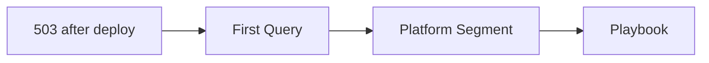

# Quick Diagnosis Cards

One-page reference cards for rapid incident triage. Each card maps: **Symptom → First Query → Platform Segment → Playbook**.

Use these when you have 60 seconds to identify the failure category.

---

## Card 1: App Returns 503 After Deployment



| Step | Action |
|---|---|
| **Symptom** | All requests return 503 immediately after deployment or restart |
| **First Query** | `AppServiceConsoleLogs \| where TimeGenerated > ago(15m) \| where ResultDescription has_any ("failed", "error", "exception", "listening") \| take 50` |
| **What to Look For** | Missing startup logs = startup command issue. `Listening at 127.0.0.1` = wrong bind. Traceback = app crash. |
| **Platform Segment** | Startup / Availability |
| **Playbook** | [Deployment Succeeded but Startup Failed](playbooks/startup-availability/deployment-succeeded-startup-failed.md) |

**Quick CLI Check:**

```bash
az webapp log tail --resource-group <resource-group> --name <app-name>
```

---

## Card 2: Intermittent 5xx Under Load

| Step | Action |
|---|---|
| **Symptom** | 5xx errors appear during traffic spikes, recover when load drops |
| **First Query** | `AppServiceHTTPLogs \| where TimeGenerated > ago(1h) \| summarize total=count(), err5xx=countif(ScStatus >= 500) by bin(TimeGenerated, 5m) \| order by TimeGenerated asc` |
| **What to Look For** | 5xx spikes correlating with request volume. High `TimeTaken` on failed requests. |
| **Platform Segment** | Performance |
| **Playbook** | [Intermittent 5xx Under Load](playbooks/performance/intermittent-5xx-under-load.md) |

**Quick CLI Check:**

```bash
az monitor metrics list --resource <app-resource-id> --metric "Http5xx,Requests,CpuPercentage" --interval PT1M
```

---

## Card 3: Outbound Connection Timeouts

| Step | Action |
|---|---|
| **Symptom** | Requests to external APIs/databases time out intermittently |
| **First Query** | `AppServiceConsoleLogs \| where TimeGenerated > ago(1h) \| where ResultDescription has_any ("connect timed out", "ReadTimeout", "ConnectTimeout", "ECONNRESET") \| summarize count() by bin(TimeGenerated, 5m)` |
| **What to Look For** | Connection errors increasing over time. Correlation with high outbound request volume. |
| **Platform Segment** | Outbound / Network |
| **Playbook** | [SNAT or Application Issue](playbooks/outbound-network/snat-or-application-issue.md) |

**Quick CLI Check (Linux):**

```bash
# Check for connection patterns in logs
az webapp log tail --resource-group <resource-group> --name <app-name> | grep -i "timeout\|reset\|refused"
```

---

## Card 4: DNS Resolution Failures (VNet)

| Step | Action |
|---|---|
| **Symptom** | App cannot resolve private endpoint FQDNs or custom DNS names |
| **First Query** | `AppServiceConsoleLogs \| where TimeGenerated > ago(1h) \| where ResultDescription has_any ("Name or service not known", "getaddrinfo", "DNS", "NXDOMAIN") \| take 50` |
| **What to Look For** | Resolution failures for `*.privatelink.*` domains. Public IP returned instead of private. |
| **Platform Segment** | Outbound / Network |
| **Playbook** | [DNS Resolution VNet-Integrated](playbooks/outbound-network/dns-resolution-vnet-integrated-app-service.md) |

**Quick SSH Check (Linux):**

```bash
# SSH into container and test resolution
az webapp ssh --resource-group <resource-group> --name <app-name>
# Then run: nslookup <private-endpoint-fqdn>
```

---

## Card 5: Slow First Request (Cold Start)

| Step | Action |
|---|---|
| **Symptom** | First request after deploy or idle period takes 10-60+ seconds |
| **First Query** | `AppServiceHTTPLogs \| where TimeGenerated > ago(1h) \| where TimeTaken > 10000 \| project TimeGenerated, CsUriStem, TimeTaken, ScStatus \| order by TimeTaken desc` |
| **What to Look For** | High `TimeTaken` on first requests only. Subsequent requests normal. |
| **Platform Segment** | Performance |
| **Playbook** | [Slow Start / Cold Start](playbooks/performance/slow-start-cold-start.md) |

**Quick CLI Check (Linux):**

```bash
# Stream logs to see startup sequence
az webapp log tail --resource-group <resource-group> --name <app-name>
```

---

## Card 6: Memory Pressure / Worker Restarts

| Step | Action |
|---|---|
| **Symptom** | App becomes slow, then restarts. Pattern repeats. |
| **First Query** | `AppServicePlatformLogs \| where TimeGenerated > ago(6h) \| where ResultDescription has_any ("OOM", "killed", "memory", "SIGKILL", "recycle") \| project TimeGenerated, ResultDescription` |
| **What to Look For** | OOM kill messages. Restart timing correlating with memory growth. |
| **Platform Segment** | Performance |
| **Playbook** | [Memory Pressure and Worker Degradation](playbooks/performance/memory-pressure-and-worker-degradation.md) |

**Quick CLI Check:**

```bash
az monitor metrics list --resource <app-resource-id> --metric "MemoryWorkingSet" --interval PT5M
```

---

## Card 7: Slot Swap Broke the App

| Step | Action |
|---|---|
| **Symptom** | App worked in staging slot, fails after swap to production |
| **First Query** | `AppServicePlatformLogs \| where TimeGenerated > ago(6h) \| where ResultDescription has_any ("swap", "slot", "warm-up") \| project TimeGenerated, ResultDescription` |
| **What to Look For** | Config values that should have stayed in production slot. Connection strings pointing to wrong environment. |
| **Platform Segment** | Startup / Availability |
| **Playbook** | [Slot Swap Config Drift](playbooks/startup-availability/slot-swap-config-drift.md) |

**Quick CLI Check:**

```bash
# Compare app settings between slots
az webapp config appsettings list --resource-group <resource-group> --name <app-name> --slot staging
az webapp config appsettings list --resource-group <resource-group> --name <app-name>
```

---

## Card 8: Disk Full / No Space Left

| Step | Action |
|---|---|
| **Symptom** | Errors include "No space left on device" or ENOSPC |
| **First Query** | `AppServiceConsoleLogs \| where TimeGenerated > ago(24h) \| where ResultDescription has_any ("No space left", "ENOSPC", "disk full") \| take 50` |
| **What to Look For** | Temp file accumulation. Log rotation not working. Large uploads filling `/tmp`. |
| **Platform Segment** | Performance |
| **Playbook** | [No Space Left on Device](playbooks/performance/no-space-left-on-device.md) |

**Quick SSH Check (Linux):**

```bash
# SSH into container
az webapp ssh --resource-group <resource-group> --name <app-name>
# Then run:
df -h
du -sh /tmp/* | sort -h | tail -20
```

---

## Universal First 3 Queries

When you don't know where to start, run these three queries to establish baseline:

### Query 1: HTTP Error Trend

```kusto
AppServiceHTTPLogs
| where TimeGenerated > ago(2h)
| summarize total=count(), err5xx=countif(ScStatus >= 500), p95=percentile(TimeTaken, 95) by bin(TimeGenerated, 5m)
| order by TimeGenerated asc
```

### Query 2: Platform Events

```kusto
AppServicePlatformLogs
| where TimeGenerated > ago(24h)
| where ResultDescription has_any ("restart", "recycle", "health", "swap", "deploy", "container", "OOM", "killed")
| project TimeGenerated, OperationName, ResultDescription
| order by TimeGenerated desc
```

### Query 3: Console Error Signatures

```kusto
AppServiceConsoleLogs
| where TimeGenerated > ago(6h)
| where ResultDescription has_any ("timeout", "failed", "error", "exception", "could not", "DNS", "connect")
| project TimeGenerated, ResultDescription
| order by TimeGenerated desc
| take 100
```

---

## Decision Matrix

| Observation | Most Likely Card | Confidence |
|---|---|---|
| 503 + no console output | Card 1 (Startup) | High |
| 5xx spikes with traffic | Card 2 (Load) | High |
| Outbound timeout errors | Card 3 (SNAT) | Medium-High |
| DNS resolution errors | Card 4 (VNet DNS) | High |
| First request slow, rest fast | Card 5 (Cold Start) | High |
| Gradual slowdown → restart | Card 6 (Memory) | High |
| Broken after slot swap | Card 7 (Config Drift) | High |
| ENOSPC errors | Card 8 (Disk) | High |

## See Also

- [Decision Tree](decision-tree.md)
- [Evidence Map](evidence-map.md)
- [First 10 Minutes Checklists](first-10-minutes/index.md)
- [KQL Query Library](kql/index.md)

## Sources

- [Azure App Service diagnostics overview](https://learn.microsoft.com/en-us/azure/app-service/overview-diagnostics)
- [Monitor Azure App Service](https://learn.microsoft.com/en-us/azure/app-service/monitor-app-service)
- [Enable diagnostic logging for apps in Azure App Service](https://learn.microsoft.com/en-us/azure/app-service/troubleshoot-diagnostic-logs)
