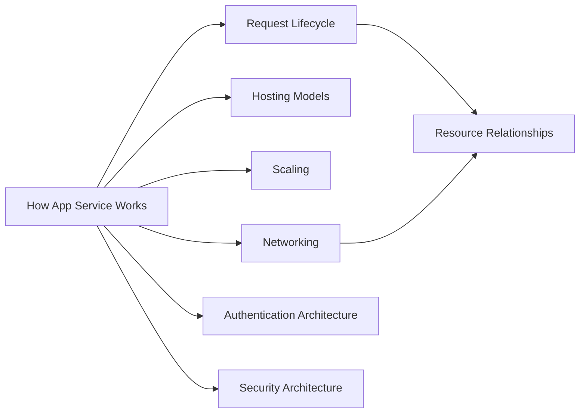
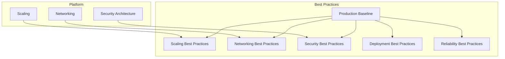
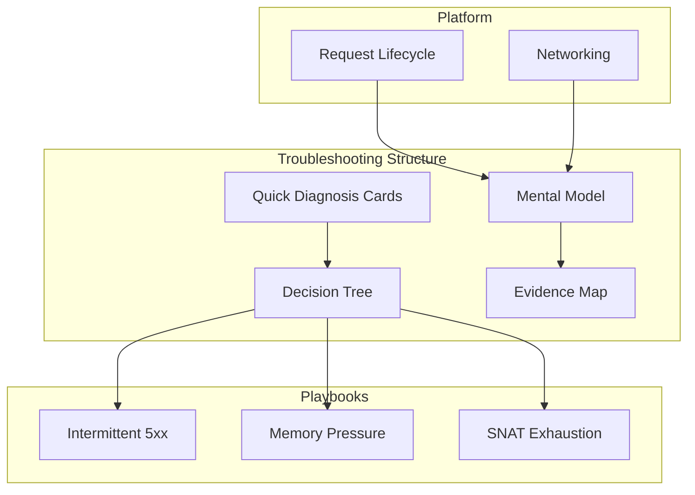

# Core Knowledge Graph

The Core Knowledge Graph provides a bird's-eye view of the entire Azure App Service Practical Guide. It shows how platform concepts, best practices, troubleshooting playbooks, and reference materials interconnect.

<div id="core-graph-container">
  <div id="graph-controls">
    <input type="text" id="graph-search" placeholder="Search nodes..." />
    <select id="graph-filter">
      <option value="all">All Types</option>
      <option value="concept">Concepts</option>
      <option value="best_practice">Best Practices</option>
      <option value="playbook">Playbooks</option>
      <option value="lab">Labs</option>
      <option value="kql">KQL Queries</option>
      <option value="map">Maps</option>
      <option value="reference">Reference</option>
    </select>
    <button id="graph-reset">Reset View</button>
  </div>
  <div id="core-graph" style="width: 100%; height: 600px; border: 1px solid var(--md-default-fg-color--lightest); border-radius: 4px;"></div>
  <div id="graph-info">
    <p><strong>Selected:</strong> <span id="selected-node">None</span></p>
    <p><strong>Connections:</strong> <span id="node-connections">-</span></p>
  </div>
</div>

<script>
document.addEventListener('DOMContentLoaded', function() {
  if (typeof initCoreKnowledgeGraph === 'function') {
    // Resolve path relative to site base using MkDocs Material's __md_scope
    var basePath = typeof __md_scope !== 'undefined' ? __md_scope.href : '/';
    var dataUrl = new URL('assets/graph/core-knowledge.json', basePath).href;
    initCoreKnowledgeGraph('core-graph', dataUrl);
  }
});
</script>

## Graph Structure

### Foundation Layer: Platform Concepts

The platform concepts form the foundation of the knowledge graph:



These documents explain **what App Service is and how it works**. Understanding them is prerequisite to most other content.

### Guidance Layer: Best Practices

Best practices build on platform concepts and provide operational guidance:



### Application Layer: Troubleshooting

Troubleshooting content connects platform knowledge to real-world problem-solving:



## Key Relationships

### Prerequisite Chains

Understanding these prerequisite chains helps you learn in the right order:

| Document | Prerequisites |
|----------|--------------|
| Request Lifecycle | How App Service Works |
| Scaling Best Practices | Platform Scaling |
| Troubleshooting Mental Model | How App Service Works, Request Lifecycle |
| Intermittent 5xx Playbook | Mental Model, Evidence Map |

### Cross-Section Links

Documents frequently reference across sections:

| From | To | Relationship |
|------|-----|-------------|
| Production Baseline | All Best Practices | Aggregates |
| Common Anti-Patterns | Multiple Playbooks | troubleshooting_for |
| Evidence Map | All KQL Queries | references |
| Lab Guides | Corresponding Playbooks | validated_by_lab |

## Using the Graph

### Finding Learning Paths

1. Start at a **concept node** (blue)
2. Follow `prerequisite` edges backward to find what you need to learn first
3. Follow `deep_dive_for` edges forward to find detailed coverage

### Finding Troubleshooting Paths

1. Start at the **Decision Tree** or **Quick Diagnosis Cards**
2. Follow edges to relevant **playbooks** (orange)
3. Check connected **labs** (red) for hands-on verification
4. Use connected **KQL queries** (purple) for data collection

### Exploring Connections

1. Click any node to see its direct connections
2. Use the filter dropdown to show only specific document types
3. Use search to find documents by name
4. Click "Reset View" to return to the default layout

## Data Source

The graph data is generated from document frontmatter by `tools/build_doc_graph.py`. The JSON file is located at:

```
docs/assets/graph/core-knowledge.json
```

To regenerate after adding new documents or updating relationships:

```bash
python tools/build_doc_graph.py
```
