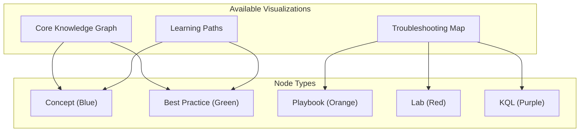

# Visualization

Explore the Azure App Service Practical Guide through interactive knowledge graphs and visual maps.

<!-- diagram-id: visualization-index-diagram-1 -->


## Why Visual Navigation?

Traditional documentation navigation relies on hierarchical menus and search. Visual graphs offer:

- **Relationship Discovery**: See how concepts connect to playbooks, labs, and KQL queries
- **Learning Path Clarity**: Understand prerequisites and progression at a glance
- **Troubleshooting Context**: Navigate from symptoms to solutions through evidence chains

## Available Visualizations

<div class="grid cards" markdown>

-   :material-graph-outline:{ .lg .middle } __Core Knowledge Graph__

    ---

    The complete site structure showing how Platform concepts, Best Practices, and Troubleshooting documents interconnect.

    [:octicons-arrow-right-24: Explore the Knowledge Graph](core-knowledge-graph.md)

-   :material-sitemap:{ .lg .middle } __Troubleshooting Map__

    ---

    Navigate troubleshooting workflows visually. See how playbooks connect to labs, KQL queries, and evidence patterns.

    [:octicons-arrow-right-24: Open Troubleshooting Map](troubleshooting-map.md)

-   :material-road-variant:{ .lg .middle } __Learning Paths__

    ---

    Visual learning progressions for Python, Node.js, Java, and .NET development on App Service.

    [:octicons-arrow-right-24: View Learning Paths](learning-paths.md)

</div>

## Graph Legend

Understanding the node types and edge relationships used across all visualizations:

### Node Types

| Type | Color | Description |
|------|-------|-------------|
| `concept` | Blue | Platform concepts and architecture (How App Service Works, Request Lifecycle) |
| `best_practice` | Green | Operational guidance (Production Baseline, Security Best Practices) |
| `playbook` | Orange | Troubleshooting procedures (Intermittent 5xx, Memory Pressure) |
| `lab` | Red | Hands-on reproducible experiments |
| `kql` | Purple | KQL query patterns for diagnostics |
| `map` | Teal | Decision trees, evidence maps, mental models |
| `reference` | Gray | CLI cheatsheets, platform limits |

### Edge Types

| Relationship | Meaning |
|-------------|---------|
| `prerequisite` | Must understand A before B |
| `related` | Conceptually connected |
| `used_in` | A is used within B |
| `deep_dive_for` | A provides detailed coverage of B |
| `troubleshooting_for` | Playbook addresses issues in concept |
| `validated_by_lab` | Playbook hypothesis tested by lab |
| `investigated_with_kql` | Playbook uses this KQL query |

## How Graphs Are Built

The knowledge graphs are automatically generated from document frontmatter:

```yaml
---
title: Memory Pressure and Worker Degradation
slug: memory-pressure-and-worker-degradation
doc_type: playbook
section: troubleshooting
topics:
  - performance
  - memory
  - worker
products:
  - azure-app-service
related:
  - intermittent-5xx-under-load
  - slow-response-but-low-cpu
prerequisites:
  - how-app-service-works
  - request-lifecycle
used_in:
  - first-10-minutes-performance
evidence:
  - kql
  - detector
  - lab
---
```

The build pipeline (`tools/build_doc_graph.py`) extracts these relationships to generate the graph JSON.

## Technical Implementation

The visualizations use [Cytoscape.js](https://js.cytoscape.org/) for interactive 2D graph rendering:

- **Click to Navigate**: Click any node to open the corresponding documentation page
- **Search/Filter**: Use the search box to highlight matching nodes
- **Zoom/Pan**: Mouse wheel to zoom, drag to pan
- **Layout**: Automatic force-directed layout with manual adjustment support

## Contributing to Visualizations

To add a document to the knowledge graph:

1. Add standardized frontmatter to your markdown file
2. Include `related`, `prerequisites`, or `used_in` fields as appropriate
3. Run `python tools/build_doc_graph.py` to regenerate the graph
4. Run `python tools/validate_frontmatter.py` to check for broken links

See the [Taxonomy](../meta/taxonomy.md) for complete frontmatter schema documentation.
