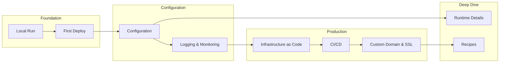
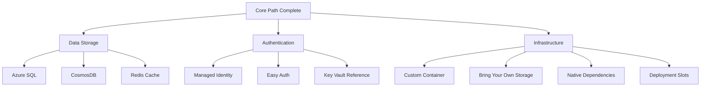
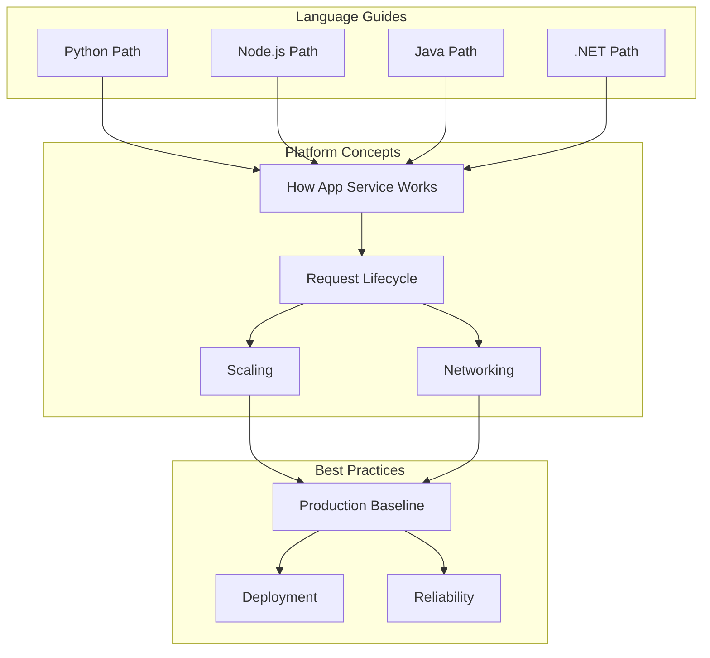

# Learning Paths

Visual representations of the recommended learning progressions for each language guide. These graphs show how tutorials build on each other and connect to platform concepts and recipes.

## Overview

Each language guide follows a consistent structure from local development to production deployment:



## Python Learning Path

<div id="python-path-container">
  <div id="python-graph" style="width: 100%; height: 400px; border: 1px solid var(--md-default-fg-color--lightest); border-radius: 4px;"></div>
</div>

### Core Progression

| Step | Document | Prerequisites | Time |
|------|----------|---------------|------|
| 1 | [Local Run](../language-guides/python/01-local-run.md) | Python basics | 15 min |
| 2 | [First Deploy](../language-guides/python/02-first-deploy.md) | Local Run | 30 min |
| 3 | [Configuration](../language-guides/python/03-configuration.md) | First Deploy | 20 min |
| 4 | [Logging & Monitoring](../language-guides/python/04-logging-monitoring.md) | Configuration | 25 min |
| 5 | [Infrastructure as Code](../language-guides/python/05-infrastructure-as-code.md) | Logging | 30 min |
| 6 | [CI/CD](../language-guides/python/06-ci-cd.md) | IaC | 30 min |
| 7 | [Custom Domain & SSL](../language-guides/python/07-custom-domain-ssl.md) | CI/CD | 20 min |

### Recipe Extensions

After completing the core path, explore recipes based on your needs:



---

## Node.js Learning Path

<div id="nodejs-path-container">
  <div id="nodejs-graph" style="width: 100%; height: 400px; border: 1px solid var(--md-default-fg-color--lightest); border-radius: 4px;"></div>
</div>

### Core Progression

| Step | Document | Prerequisites | Time |
|------|----------|---------------|------|
| 1 | [Local Run](../language-guides/nodejs/01-local-run.md) | Node.js basics | 15 min |
| 2 | [First Deploy](../language-guides/nodejs/02-first-deploy.md) | Local Run | 30 min |
| 3 | [Configuration](../language-guides/nodejs/03-configuration.md) | First Deploy | 20 min |
| 4 | [Logging & Monitoring](../language-guides/nodejs/04-logging-monitoring.md) | Configuration | 25 min |
| 5 | [Infrastructure as Code](../language-guides/nodejs/05-infrastructure-as-code.md) | Logging | 30 min |
| 6 | [CI/CD](../language-guides/nodejs/06-ci-cd.md) | IaC | 30 min |
| 7 | [Custom Domain & SSL](../language-guides/nodejs/07-custom-domain-ssl.md) | CI/CD | 20 min |

### Node.js-Specific Recipes

- **Next.js**: Server-side rendering with Next.js on App Service
- **Native Dependencies**: Handling native npm packages

---

## Java Learning Path

<div id="java-path-container">
  <div id="java-graph" style="width: 100%; height: 400px; border: 1px solid var(--md-default-fg-color--lightest); border-radius: 4px;"></div>
</div>

### Core Progression

| Step | Document | Prerequisites | Time |
|------|----------|---------------|------|
| 1 | [Local Run](../language-guides/java/01-local-run.md) | Java/Maven basics | 15 min |
| 2 | [First Deploy](../language-guides/java/02-first-deploy.md) | Local Run | 30 min |
| 3 | [Configuration](../language-guides/java/03-configuration.md) | First Deploy | 20 min |
| 4 | [Logging & Monitoring](../language-guides/java/04-logging-monitoring.md) | Configuration | 25 min |
| 5 | [Infrastructure as Code](../language-guides/java/05-infrastructure-as-code.md) | Logging | 30 min |
| 6 | [CI/CD](../language-guides/java/06-ci-cd.md) | IaC | 30 min |
| 7 | [Custom Domain & SSL](../language-guides/java/07-custom-domain-ssl.md) | CI/CD | 20 min |

### Java-Specific Recipes

- **Zero-Downtime Deployment**: Blue-green deployments with slots
- **Private Endpoints**: Secure connectivity to Azure services
- **VNet Integration**: Outbound networking configuration

---

## .NET Learning Path

<div id="dotnet-path-container">
  <div id="dotnet-graph" style="width: 100%; height: 400px; border: 1px solid var(--md-default-fg-color--lightest); border-radius: 4px;"></div>
</div>

### Core Progression

| Step | Document | Prerequisites | Time |
|------|----------|---------------|------|
| 1 | [Local Run](../language-guides/dotnet/01-local-run.md) | .NET basics | 15 min |
| 2 | [First Deploy](../language-guides/dotnet/02-first-deploy.md) | Local Run | 30 min |
| 3 | [Configuration](../language-guides/dotnet/03-configuration.md) | First Deploy | 20 min |
| 4 | [Logging & Monitoring](../language-guides/dotnet/04-logging-monitoring.md) | Configuration | 25 min |
| 5 | [Infrastructure as Code](../language-guides/dotnet/05-infrastructure-as-code.md) | Logging | 30 min |
| 6 | [CI/CD](../language-guides/dotnet/06-ci-cd.md) | IaC | 30 min |
| 7 | [Custom Domain & SSL](../language-guides/dotnet/07-custom-domain-ssl.md) | CI/CD | 20 min |

### .NET-Specific Features

- Native integration with Azure SDK
- Application Insights automatic instrumentation
- Windows and Linux hosting options

---

## Cross-Language Concepts

Regardless of language, all paths connect to these platform concepts:



## Recommended Learning Order

### For Beginners

1. **Start Here**: [Overview](../start-here/overview.md)
2. **Platform**: [How App Service Works](../platform/how-app-service-works.md)
3. **Your Language Guide**: Complete steps 1-3 (Local Run → Configuration)
4. **Platform**: [Request Lifecycle](../platform/request-lifecycle.md)
5. **Your Language Guide**: Complete steps 4-7 (Logging → SSL)

### For Experienced Developers

1. **Platform**: Quick scan of [How App Service Works](../platform/how-app-service-works.md)
2. **Best Practices**: [Production Baseline](../best-practices/production-baseline.md)
3. **Your Language Guide**: Skim core path, focus on recipes
4. **Troubleshooting**: [Quick Diagnosis Cards](../troubleshooting/quick-diagnosis-cards.md)

### For Operations/SRE

1. **Platform**: All platform documents
2. **Best Practices**: All best practices
3. **Operations**: All operations guides
4. **Troubleshooting**: Mental Model → Decision Tree → Playbooks

## Data Source

Learning path data is extracted from language guide frontmatter. To regenerate:

```bash
python tools/build_doc_graph.py --learning-paths
```
