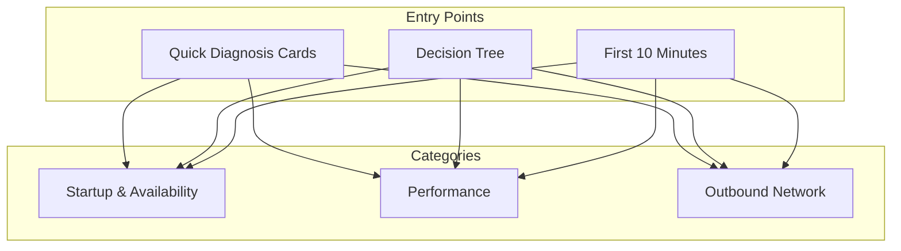
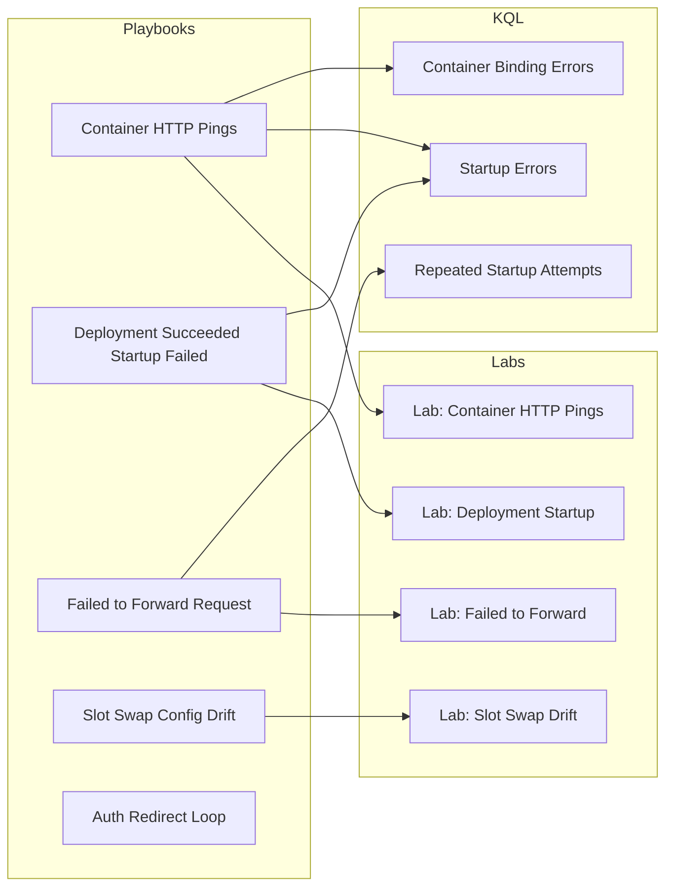
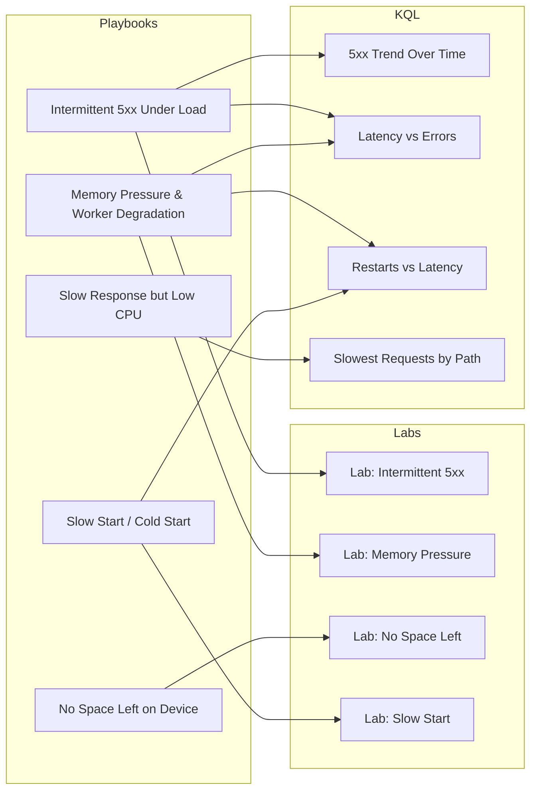
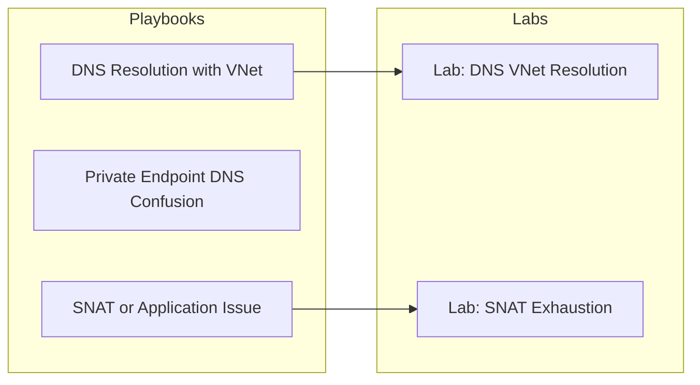
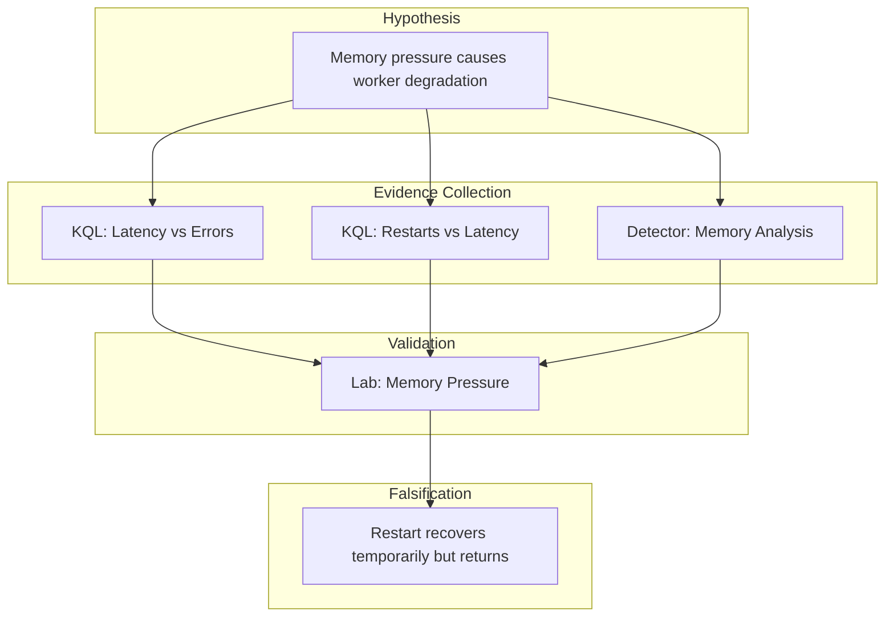

# Troubleshooting Map

Navigate the troubleshooting documentation visually. This map shows how symptoms lead to playbooks, how playbooks connect to labs and KQL queries, and how evidence patterns validate hypotheses.

<div id="troubleshooting-map-container">
  <div id="ts-controls">
    <input type="text" id="ts-search" placeholder="Search by symptom or topic..." />
    <select id="ts-category">
      <option value="all">All Categories</option>
      <option value="startup">Startup & Availability</option>
      <option value="performance">Performance</option>
      <option value="network">Outbound Network</option>
    </select>
    <select id="ts-type">
      <option value="all">All Types</option>
      <option value="playbook">Playbooks</option>
      <option value="lab">Labs</option>
      <option value="kql">KQL Queries</option>
      <option value="map">Maps & Guides</option>
    </select>
    <button id="ts-reset">Reset View</button>
  </div>
  <div id="troubleshooting-graph" style="width: 100%; height: 700px; border: 1px solid var(--md-default-fg-color--lightest); border-radius: 4px;"></div>
  <div id="ts-info">
    <p><strong>Selected:</strong> <span id="ts-selected-node">None</span></p>
    <p><strong>Category:</strong> <span id="ts-node-category">-</span></p>
    <p><strong>Evidence:</strong> <span id="ts-node-evidence">-</span></p>
  </div>
</div>

<script>
document.addEventListener('DOMContentLoaded', function() {
  if (typeof initTroubleshootingMap === 'function') {
    // Resolve path relative to site base using MkDocs Material's __md_scope
    var basePath = typeof __md_scope !== 'undefined' ? __md_scope.href : '/';
    var dataUrl = new URL('assets/graph/troubleshooting-map.json', basePath).href;
    initTroubleshootingMap('troubleshooting-graph', dataUrl);
  }
});
</script>

## Troubleshooting Structure

### Entry Points

Start your troubleshooting journey from these entry points:

<!-- diagram-id: visualization-troubleshooting-map-diagram-1 -->


### Startup & Availability

<!-- diagram-id: visualization-troubleshooting-map-diagram-2 -->


### Performance

<!-- diagram-id: visualization-troubleshooting-map-diagram-3 -->


### Outbound Network

<!-- diagram-id: visualization-troubleshooting-map-diagram-4 -->


## Evidence Validation Chain

Each playbook hypothesis is validated through a chain of evidence:

<!-- diagram-id: visualization-troubleshooting-map-diagram-5 -->


## Relationship Types

| Edge Type | Visual | Meaning |
|-----------|--------|---------|
| `validated_by_lab` | Solid green | Playbook hypothesis tested by this lab |
| `investigated_with_kql` | Dashed purple | KQL query used to gather evidence |
| `guided_by_map` | Dotted teal | Methodology document guides investigation |
| `symptom_to_playbook` | Thick orange | Symptom points to likely playbook |
| `prerequisite` | Thin gray | Understanding A helps with B |

## Using the Map

### Symptom-Based Navigation

1. **Identify your symptom** (e.g., "5xx errors under load")
2. **Search** using the search box or start from Quick Diagnosis Cards
3. **Follow edges** to find the relevant playbook
4. **Explore connected nodes** to find:
   - Labs for hands-on verification
   - KQL queries for data collection
   - Related playbooks for similar issues

### Evidence-Based Navigation

1. **Start from the Evidence Map**
2. **Find your available evidence** (logs, metrics, detectors)
3. **Follow edges** to playbooks that use this evidence
4. **Verify** using connected labs

### Category-Based Navigation

Use the category filter to focus on specific problem domains:

- **Startup & Availability**: App won't start, 503 errors, deployment issues
- **Performance**: Slow responses, timeouts, memory/CPU issues
- **Outbound Network**: Connection failures, DNS issues, SNAT exhaustion

## Data Source

The troubleshooting map is generated from document frontmatter by `tools/build_troubleshooting_map.py`. The JSON file is located at:

```
docs/assets/graph/troubleshooting-map.json
```

To regenerate:

```bash
python tools/build_troubleshooting_map.py
```

## Integration with Other Tools

The troubleshooting map connects to other navigation tools:

| Tool | Purpose | Link |
|------|---------|------|
| Quick Diagnosis Cards | Rapid symptom identification | [Quick Diagnosis Cards](../troubleshooting/quick-diagnosis-cards.md) |
| Decision Tree | Step-by-step diagnostic flow | [Decision Tree](../troubleshooting/decision-tree.md) |
| Evidence Map | Evidence-to-playbook mapping | [Evidence Map](../troubleshooting/evidence-map.md) |
| Mental Model | Conceptual framework | [Mental Model](../troubleshooting/mental-model.md) |
